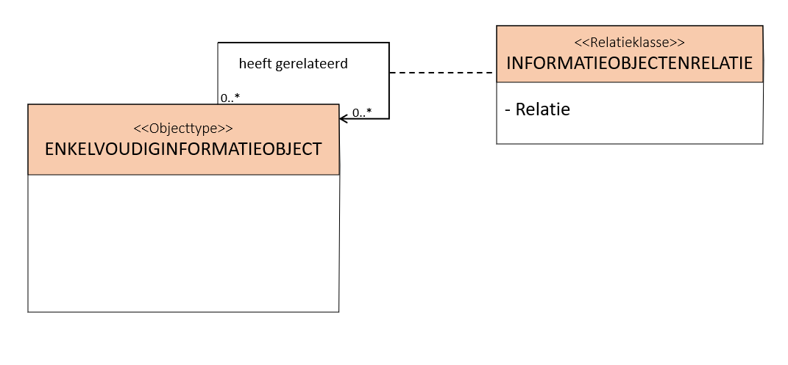

Naar aanleiding van gesprekken die gevoerd zijn in Nieuwegein  en voortschrijdend inzicht heb ik het API-ontwerp voor het relateren van informatieobjecten aangepast, zie [redoc](https://redocly.github.io/redoc/?url=https://raw.githubusercontent.com/VNG-Realisatie/gemma-zaken/Documenten-relateren-aan-andere-relevante-documenten/api-specificatie/drc/current_version/openapi.yaml#tag/informatieobjectenrelaties/operation/informatieobjectrelatie_create). 

De naamgeving in deze nieuwe versie is consistent gemaakt met de naamgeving van het RGBZ waarin zaken aan elkaar gerelateerd kunnen worden met de relatie "heeft relevante andere".


Op dezelfde manier modelleren we de relatie "heeft relevante andere" tussen informatieobjecten:



De relatieklasse `INFORMATIEOBJECTENRELATIE` is vertaald naar het REST-endpoint `informatieobjectenrelaties` (in meervoud).

In de aanvullende specificatie van de standaard leggen we vast dat het attribuut "relatie" de volgende waarden mag hebben.

| | Waarde attribuut "relatie"| Beschrijving | Inverse | Read-only |
| --- | --- | --- | --- | --- |
| 1 | `is_een_geanonimiseerde_variant_van`      | Informatieobject A is een geanonimiseerde variant van informatieobject B. | 3 | Nee |
| 2 | `is_een_vervanger_van`                    | Informatieobject A is een vervanger van informatieobject B.               | 4 | Nee |
| 3 | `heeft_als_geanonimiseerde_variant`       | Informatieobject A heeft als geanonimiseerde variant informatieobject B.  | 1 |  Ja |
| 4 | `is_vervangen_door`                       | Informatieobject A is vervangen door informatieobject B                   | 2 |  Ja |

In de toekomst kan deze tabel eventueel worden uitgebreid met nieuwe waarden als daar behoefte aan is.

In het volgende voorbeeld leggen we vast dat `<doc2>` een geanonimiseerde variant is van `<doc1>`.

`POST /informatieobjectenrelaties`

```text
{
  "informatieobjectA": "<doc2>",
  "informatieobjectB": "<doc1>",
  "relatie": "is_een_geanonimiseerde_variant_van"
}
```

De notatie `<doc>` staat voor de de URL-referentie naar het informatieobject `doc`.

Deze relatie wordt als conveniance ook zichtbaar gemaakt in de resource `/enkelvoudiginformatieobject`:

`GET /enkelvoudiginformatieobjecten/<<doc2>>`

```text
{
  ...,
  "gerelateerdeInformatieobjecten": [
    {
      "informatieobject": "<doc1>",
      "rol": "is_een_geanonimiseerde_versie_van"
    }
  ],
}
```

De notatie `<<doc>>` staat voor de uuid van het informatieobject `doc`.

`GET /enkelvoudiginformatieobjecten/<<doc1>>`

```text
{
  ...,
  "gerelateerdeInformatieobjecten": [
    {
      "informatieobject": "<doc2>",
      "relatie": "heeft_als_geanonimiseerde_variant"
    }
  ],
}
```

Samenvattend zijn dit de verschillen:

- In het informatiemodel is het objecttype INFORMATIEOBJECT hernoemd naar ENKELVOUDIGINFORMATIEOBJECT voor consistentie met het RGBZ.
- Attribuut "aardRelatie" in het informatiemodel is hernoemd naar "relatie".
- De relatie "heeft relevante andere" in het informatiemodel is henoemd naar "heeft gerelateerd".
- We maken expliciet gebruik van inverse relaties in plaats van het attribuut "richtingRelatie" om de richting van de relatie aan te duiden.
- In de resource `/informatieobjectenrelaties` is het attribuut "informatieobject" hernoemd naar "informatieobjectA" en het attribuut "relevantAnderInformatieobject" hernoemd naar "informatieobjectB".
- De relatie `heeft_als_publiceerbare_variant` is hernoemd naar de (inverse) relaties `is_een_geanonimiseerde_variant_van` en  `heeft_als_geanonimiseerde_variant`.
- De (inverse) relaties  `is_een_vervanger_van` en `is_vervangen_door` zijn toegevoegd.
- De relatie `ongespecificeerd` is verwijderd om wildgroei te voorkomen.

