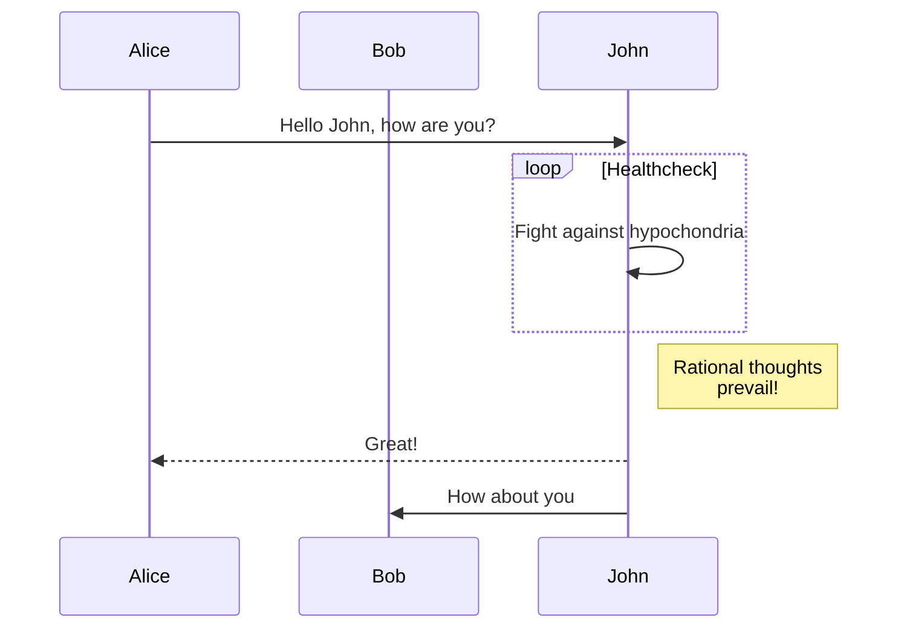

# Tutorial Intro

Dit is hallo vanuit de API's.

```mermaid
   graph TD;
        A-->B;
        A-->C;
        B-->D;
        C-->D;

```

```mermaid
  sequenceDiagram
        participant Alice
        participant Bob
        Alice->>John: Hello John, how are you?
        loop Healthcheck
            John->>John: Fight against hypochondria
        end
        Note right of John: Rational thoughts <br/>prevail!
        John-->>Alice: Great!
        John->>Bob: How about you

```
