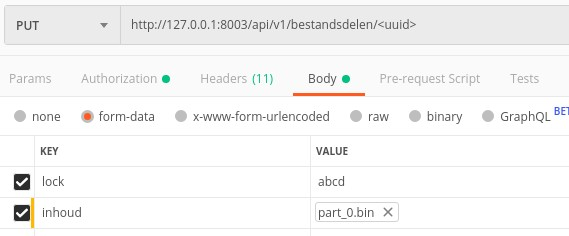

<span style="padding: 0.2em 0.5em; border: solid 1px #EEEEEE; border-radius: 3px; background: #DDDFFF;">
    <strong>Added in version 1.1.0</strong>
</span>

In this tutorial we explore the ways to upload files to the Documenten API,
depending on the file size.

The most relevant component for this tutorial:

* Documenten API: for creating documents and uploading files ([OAS][drc-oas])

[drc-oas]: https://documenten-api.test.vng.cloud/api/v1/schema/


## The requirements for this tutorial

* `docker` and `docker-compose` to host the components locally on your development machine.
  See [installatie en configuratie](./installatie-en-configuratie) for a detailed description.
* The [eenmalige setup](./eenmalige-setup) has been carried out.

## Overview of the file upload process in the Documenten API

The main resource of DRC API is `EnkelvoudigInformatieObject` which supports
creating and editing documents. Its content can be divided into metadata
(`identificatie`, `creatiedatum`, `titel` and etc) and file content. The main
metadata of file content used by the DRC is the file size derived from the
`bestandsomvang` attribute. The process of uploading files is determined based
on the comparison of the value of `bestandsomvang` and the maximum file size.

The maximum file size is the size of request bodies that must be supported,
currently defined around 4GB.

There are three options:

* file size = 0, i.e. `EnkelvoudigInformatieObject` contains only metadata
  without file content. The `EnkelvoudigInformatieObject` is created using a
  single request to Documenten API.
* file size <= maximum size. In this case the file content is expected to be
  in the `inhoud` attribute, using a single request.
* file size > maximum size. Here, the file content should be split into parts
  and each part should be uploaded in a separate request.

## Let's get to work

In this tutorial we will consider all three ways to create an
`EnkelvoudigInformatieObject`, based on the file sizes.

### Configure maximum file size

The process choice depends on the maximum file size.
The default value of this parameter is 4GB (or 4294967296 Bytes).

### Configure ZTC

Creation of `EnkelvoudigInformatieObject` requires the link to
`informatieobjecttype`, therefore we need to set up an `InformatieobjectType`
first.

Open `http://<ztc-ip>:8002/admin/` in your browser and log in with your
username and password. The API address is from the
['installatie en configuratie'](./installatie-en-configuratie) tutorial.

#### Create Catalogus

A `Catalogus` represents the collection of `InformatieobjectType`s and other
objects.

1. Navigate to **Catalogussen** and click on **Toevoegen**.
2. Fill in all the required fields.
3. Click on **Opslaan en opnieuw bewerken**.

#### Create Informatieobjecttype

1. Navigate to **Informatieobjecttypen** and click on **Toevoegen**.
2. Fill in all the required fields.
3. Click on **Opslaan en opnieuw bewerken**.

#### Request Informatieobjecttype

In the previous part we have created an `InformatieobjectType`. We retrieve it
now to obtain the resource url.

   Get `Catalogussen`:

   ```http
   GET http://<ztc-ip>:8002/api/v1/catalogussen HTTP/1.0
   Authorization: Bearer abcd1234
   ```

   Example response:

   ```json
   [
      {
          "url": "<catalogus url>",
          "domein": "DEMO",
          "rsin": "123456782",
          "contactpersoonBeheerNaam": "VNG API-lab",
          "contactpersoonBeheerTelefoonnummer": "+31 (0)20 123 45 67",
          "contactpersoonBeheerEmailadres": "vngapilab@example.com",
          "zaaktypen": [],
          "besluittypen": [],
          "informatieobjecttypen": [
              "<informatieobjecttype url>"
          ]
      }
   ]
   ```

Now we have found a `informatieobjecttype url`, which we will use in the next step.

### Create document

Now we will create `EnkelvoudigInformatieObject`, using all three different ways
to upload the file data.

#### Create `EnkelvoudigInformatieObject` without file.

To create an `EnkelvoudigInformatieObject` only with metadata we need:

* leave `inhoud` field empty
* `bestandsomvang` = 0

    Example request:

    ```http
    POST http://<drc-ip>:8000/api/v1/enkelvoudiginformatieobjecten HTTP/1.0
    Authorization: Bearer abcd1234
    Content-Type: application/json

    {
        "identificatie": "12345",
        "bronorganisatie": "123456782",
        "creatiedatum": "2019-06-27",
        "titel": "detailed summary",
        "auteur": "document auteur",
        "taal": "eng",
        "bestandsomvang": 0,
        "bestandsnaam": "file_name",
        "informatieobjecttype": "<informatieobjecttype url>",
        "vertrouwelijkheidaanduiding": "openbaar"
    }
    ```

The response contains the created document without lock.

#### Create `EnkelvoudigInformatieObject` with small file

To create the `EnkelvoudigInformatieObject` with a file size less or equal to
the maximum file size we need to:

* encode file content to Base64 and place it into `inhoud` attribute.
* set `bestandsomvang` = the actual size of file, _before_ base64-encoding.

    Example request:

    ```http
    POST http://<drc-ip>:8000/api/v1/enkelvoudiginformatieobjecten HTTP/1.0
    Authorization: Bearer abcd1234
    Content-Type: application/json

    {
        "identificatie": "12345",
        "bronorganisatie": "123456782",
        "creatiedatum": "2019-06-27",
        "titel": "detailed summary",
        "auteur": "document auteur",
        "taal": "eng",
        "bestandsomvang": 17,
        "bestandsnaam": "file_name",
        "inhoud": "c29tZSBmaWxlIGNvbnRlbnQ=",
        "informatieobjecttype": "<informatieobjecttype url>",
        "vertrouwelijkheidaanduiding": "openbaar"
    }
    ```

The `EnkelvoudigInformatieObject` is created without lock.

Note that the response contains the download-url of the file in the `inhoud`
attribute.

#### Create `EnkelvoudigInformatieObject` with a large file

To create the `EnkelvoudigInformatieObject` with a file size larger than the
maximum file size we need to perform several requests.

1. Create `EnkelvoudigInformatieObject` with specified file size

    * leave the `inhoud` field empty
    * set `bestandsomvang` = total file size

    ```http
    POST http://<drc-ip>:8000/api/v1/enkelvoudiginformatieobjecten HTTP/1.0
    Authorization: Bearer abcd1234
    Content-Type: application/json

    {
        "identificatie": "12345",
        "bronorganisatie": "123456782",
        "creatiedatum": "2019-06-27",
        "titel": "detailed summary",
        "auteur": "document auteur",
        "taal": "eng",
        "bestandsomvang": 5000000000,
        "bestandsnaam": "file_name",
        "informatieobjecttype": "<informatieobjecttype url>",
        "vertrouwelijkheidaanduiding": "openbaar"
    }
    ```

    The created `EnkelvoudigInformatieObject` is locked by the API, which means
    that only users with the correct lock ID can change it. The response
    contains this lock ID and an array of `bestandsdelen` objects.

    Part of example response:

    ```json
    {
        "url": "http://<drc-ip>:8000/api/v1/enkelvoudiginformatieobjecten/<uuid>",
        "bestandsomvang": 5000000000,
        "locked": true,
        "bestandsdelen": [
            {
                "url": "http://<drc-ip>:8000/api/v1/bestandsdelen/<uuid1>",
                "volgnummer": 1,
                "omvang": 4294967296,
                "voltooid": false
            },
            {
                "url": "http://<drc-ip>:8000/api/v1/bestandsdelen/<uuid2>",
                "volgnummer": 2,
                "omvang": 705032704,
                "voltooid": false
            }
        ],
        "lock": "abcd"
    }
    ```

    Each of the `BestandsDeel` objects includes information necessary for the
    upload of the file parts:

    * `url`: the URL to upload the file part to
    * `volgnummer`: the sequence number of this part. The order of merging file
      parts after their upload depends on this attribute.
    * `omvang`: the size of the file part in Bytes
    * `voltooid`: boolean that indicates if this file part is completely
      uploaded or not.

2. Upload file parts

    Now we need to split our file into file parts so that their size matches
    the sizes of the `BestandsDeel` objects.

    After splitting the file we need to upload each file part in a separate
    request. Each request must have `Content-Type: multipart/form-data` and
    contain the following data:

    * `lock`: lock ID, which was received in the previous step
    * `inhoud`: file part content in binary format

    The example request in Postman:

    

    In the result `voltooid` should change to "true".

3. Unlock the `EnkelvoudigInformatieObject`

    After uploading all the parts it is time to unlock the
    `EnkelvoudigInformatieObject`. By unlocking, the user indicates that the
    uploading process is finished and the file can be merged together from the
    individual uploadeded file parts.

    ```http
    POST http://<drc-ip>:8000/api/v1/enkelvoudiginformatieobjecten/<uuid>/unlock HTTP/1.0
    Authorization: Bearer abcd1234
    Content-Type: application/json

    {
        "lock": "abcd"
    }
    ```

    During unlock, the following happens:

    * all file parts are merged into the resultinng file
    * all temporary file parts are cleaned up
    * the related `BestandsDeel` resources are removed

4. Request the `EnkelvoudigInformatieObject` to verify the result

    We can request the created `EnkelvoudigInformatieObject` to see the changes.

    ```http
    GET http://<drc-ip>:8000/api/v1/enkelvoudiginformatieobjecten/<uuid> HTTP/1.0
    Authorization: Bearer abcd1234
    Content-Type: application/json
    ```

    Part of the example response:

    ```json
    {
        "url": "http://<drc-ip>:8000/api/v1/enkelvoudiginformatieobjecten/<uuid>",
        "inhoud": "http://<drc-ip>:8000/api/v1/enkelvoudiginformatieobjecten/<uuid>/download?versie=1",
        "locked": false,
        "bestandsdelen": []
    }
    ```

    Now the `EnkelvoudigInformatieObject` is unlocked, all `bestandsdelen` are
    removed and the file content can be downloaded via the `inhoud` url.

### Summary

In this tutorial, we performed some actions in the Catalogus API:

* created `Catalogus`;
* created `Informatieobjecttype`

After that we explored 3 strategies to create a `EnkelvoudigInformatieObject`
in the Documenten API:

* metadata only (without a file)
* with a small file
* with a large file (multiple step approach)
