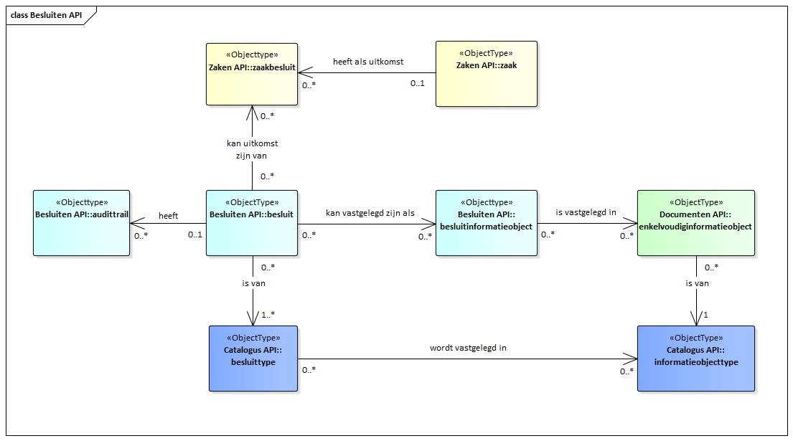

API voor opslag en ontsluiting van besluiten en daarbij behorende metadata.

De API ondersteunt het opslaan en het naar andere applicaties ontsluiten
van gegevens over alle gemeentelijke besluiten, van elk type. Opslag vindt plaats
conform het RGBZ waarin objecten, gegevens daarvan en onderlinge relaties zijn
beschreven. Het bevat echter niet alle gegevens uit het RGBZ: documenten worden
opgeslagen in de documentenregistratiecomponent, medewerkergegevens in de
medewerkerregistratiecomponent, etc.

Terzijde: In de toekomst kan de Besluiten API ook voor andere domeinen worden ingezet. Mogelijk moeten er dan aanpassingen of uitbreidingen op de API worden gedaan. Een goed voorbeeld is Open Raadsinformatie waarin ook een besluiten entiteit is geidentificeerd.


## Gegevensmodel

Een besluit is een na overweging of beraadslaging vastgestelde beslissing voor een individueel of concreet geval.

Deze API ondersteunt het verwerken van gegevens van besluiten inclusief de relatie met de eventuele zaak en/of informatieobject.

### Relatie met documenten en zaken

Een besluit wordt veelal schriftelijk vastgelegd maar dit is niet noodzakelijk. Omgekeerd kan het voorkomen dat in één informatieobject meerdere besluiten vastgelegd zijn.

De relatie tussen besluit en informatieobject is vastgelegd in besluitinformatieobject (Besluiten API) en objectinformatieobject (Documenten API), waarbij besluitinformatieobject leidend is.
Een besluit kan een uitkomst zijn van een zaak van de zaakbehandelende organisatie. Besluit heeft dan ook een optionele relatie met de zaak waarvan het een uitkomst is.

Indien het besluit een beschikking is, is er een beschikkinghouder, bijvoorbeeld degene aan wie de vergunning verleend is. Dit is één van de betrokkenen met een van toepassing zijnde rol bij de zaak waartoe het besluit behoort.

[{:width="1200px"}](Besluiten API.png "Besluiten gegevensmodel - klik voor groot")


## Specificatie van de Besluiten API

* [Referentie-implementatie Besluiten API](https://besluiten-api.vng.cloud)
* API specificatie (OAS3) in
  [ReDoc](https://besluiten-api.vng.cloud/api/v1/schema/),
  [Swagger](https://petstore.swagger.io/?url=https://besluiten-api.vng.cloud/api/v1/schema/openapi.yaml),
  [YAML](https://besluiten-api.vng.cloud/api/v1/schema/openapi.yaml) of
  [JSON](https://besluiten-api.vng.cloud/api/v1/schema/openapi.json)


## Specificatie van gedrag

Besluitregistratiecomponenten (BRC) MOETEN aan twee aspecten voldoen:

* de BRC `openapi.yaml` MOET volledig geïmplementeerd zijn.

* het run-time gedrag beschreven in deze standaard MOET correct geïmplementeerd
  zijn.

### OpenAPI specificatie

Alle operaties beschreven in [`openapi.yaml`](../../../api-specificatie/brc/1.0.x/openapi.yaml) 
MOETEN ondersteund worden en tot hetzelfde resultaat leiden als de
referentie-implementatie van het BRC.

Het is NIET TOEGESTAAN om gebruik te maken van operaties die niet beschreven
staan in deze OAS spec, of om uitbreidingen op operaties in welke vorm dan ook
toe te voegen.

### Run-time gedrag

Bepaalde gedrageningen kunnen niet in een OAS spec uitgedrukt worden omdat ze
businesslogica bevatten. Deze gedragingen zijn hieronder beschreven en MOETEN
zoals beschreven geïmplementeerd worden.

#### **<a name="brc-001">Valideren `besluittype` op de `Besluit`-resource ([brc-001](#brc-001))</a>**

Bij het aanmaken (`besluit_create`) MOET de URL-referentie naar het `besluittype` gevalideerd
worden op het bestaan. Indien het ophalen van het besluittype niet (uiteindelijk)
resulteert in een `HTTP 200` status code, MOET het BRC antwoorden met een
`HTTP 400` foutbericht.

De provider MOET tevens valideren dat het opgehaalde besluittype een besluittype
is conform de 1.0.x Catalogi API specificatie.

Als er geprobeerd wordt om het `besluittype` van een bestaand `Besluit`
bij te werken (`besluit_update`, `besluit_partial_update`),
dan MOET het ZRC antwoorden met een `HTTP 400` foutbericht.

#### **<a name="brc-002">Garanderen uniciteit `verantwoordelijke_organisatie` en `identificatie` op de `Besluit`-resource ([brc-002](#brc-002))</a>**

Bij het aanmaken (`besluit_create`) MOET gevalideerd worden dat de combinatie
`identificatie` en `verantwoordelijke_organisatie` uniek is, indien de
`identificatie` door de consumer meegestuurd wordt.

Indien de identificatie niet door de consumer gestuurd wordt, dan MOET het BRC
de identificatie genereren op een manier die garandeert dat de identificatie
uniek is binnen de verantwoordelijke_organisatie.

Bij het bijwerken (`besluit_update` en `besluit_partial_update`) is het NIET
TOEGESTAAN om `identificatie` en `verantwoordelijke_organisatie` te wijzingen.

#### **<a name="brc-003">Valideren `informatieobject` op de `BesluitInformatieObject`-resource ([brc-003](#brc-003))</a>**

Bij het aanmaken (`besluitinformatieobject_create`) MOET de URL-referentie naar
het `informatieobject` gevalideerd worden op het bestaan. Indien het ophalen
van het informatieobject niet (uiteindelijk) resulteert in een `HTTP 200`
status code, MOET het BRC antwoorden met een `HTTP 400` foutbericht.

#### **<a name="brc-004">Zetten van relatieinformatie op `BesluitInformatieObject`-resource ([brc-004](#brc-004))</a>**

Op basis van het `objectType` MOET de `aardRelatie` gezet worden conform het
RGBZ. Omdat het `objectType` `besluit` is, moet `aardRelatie` gelijk zijn aan
`"legt_vast"`.

#### **<a name="brc-005">Synchroniseren relaties met informatieobjecten ([brc-005](#brc-005))</a>**

Wanneer een relatie tussen een `INFORMATIEOBJECT` en een `BESLUIT` gemaakt
of bijgewerkt wordt, dan MOET het BRC in het DRC ook deze relatie
aanmaken/bijwerken.

Een voorbeeld:

1. Een informatieobject wordt gerelateerd aan een besluit door een consumer:

    ```http
    POST https://brc.nl/api/v1/besluitinformatieobjecten HTTP/1.0

    {
        "informatieobject": "https://drc.nl/api/v1/enkelvoudigeinformatieobjecten/1234",
        "besluit": "https://brc.nl/api/v1/besluiten/456789"
    }
    ```

2. Het BRC MOET de relatie spiegelen in het DRC:

    ```http
    POST https://drc.nl/api/v1/objectinformatieobjecten HTTP/1.0

    {
        "informatieobject": "https://drc.nl/api/v1/enkelvoudigeinformatieobjecten/1234",
        "object": "https://brc.nl/api/v1/besluiten/456789",
        "objectType": "besluit",

    }
    ```

Merk op dat het aanmaken van de relatie niet gelimiteerd is tot het aanmaken
via de API. Indien elders (bijvoorbeeld via een admininterface) een relatie tot
stand kan komen, dan MOET deze ook gesynchroniseerd worden.

#### **Valideren tegen de catalogus en bijhorende typen**

Het besluittype van een besluit legt vast wat de mogelijke waarden zijn voor
gerelateerde resources aan besluiten. Dit MOET gevalideerd worden door een
provider.

**<a name="brc-006">Valideren dat het `besluittype` van een `Besluit` bij het `Zaak.zaaktype` hoort ([brc-006](#brc-006))</a>**

<span style="padding: 0.2em 0.5em; border: solid 1px #FF6600; border-radius: 3px; background: #FFFF99;">
    <strong>Documentatie toegevoegd in patch 1.0.1</strong>
</span>

Wanneer een `Besluit` bij een zaak hoort (`Besluit.zaak` is gezet), dan MOET
`Besluit.besluittype` voorkomen in de `Besluit.zaak.zaaktype.besluittypen`.


**<a name="brc-007">Valideren dat het `informatieobjecttype` van een `BesluitInformatieObject` bij het `Besluit.besluittype` hoort ([brc-007](#brc-007))</a>**

<span style="padding: 0.2em 0.5em; border: solid 1px #FF6600; border-radius: 3px; background: #FFFF99;">
    <strong>Documentatie toegevoegd in patch 1.0.1</strong>
</span>

Wanneer een `BesluitInformatieObject` toegevoegd wordt, dan MOET het
`BesluitInformatieObject.informatieobject.informatieobjecttype` voorkomen in
`BesluitInformatieObject.besluit.besluittype.informatieobjecttypen`.

#### Archiveren

**<a name="brc-008">Vernietigen van besluiten ([brc-008](#brc-008))</a>**

Bij het verwijderen van een `Besluit` MOETEN het `Besluit` en gerelateerde
objecten daadwerkelijk uit de opslag verwijderd worden. Zogenaamde
"soft-deletes" zijn NIET TOEGESTAAN. Onder gerelateerde objecten wordt
begrepen:

- `besluitinformatieobject` - relatie naar enkelvoudige informatieobjecten \*
- `audittrail` - de geschiedenis van het object

\* Het verwijderen van een `besluitinformatieobject` in het BRC leidt er toe
dat het `objectinformatieobject` in het DRC ook verwijdert wordt indien dit kan.

#### HTTP-Caching

<span style="padding: 0.2em 0.5em; border: solid 1px #EEEEEE; border-radius: 3px; background: #DDDFFF;">
    <strong>Nieuw in versie 1.1.0</strong>
</span>

De Besluiten API moet HTTP-Caching ondersteunen op basis van de `ETag` header. In
de API spec staat beschreven voor welke resources dit van toepassing is.

De `ETag` MOET worden berekend op de JSON-weergave van de resource.
Verschillende, maar equivalente weergaves (bijvoorbeeld dezelfde API ontsloten
wel/niet via NLX) MOETEN verschillende waarden voor de `ETag` hebben.

Indien de consumer een `HEAD` verzoek uitvooert op deze resources, dan MOET de
provider antwoorden met dezelfde headers als bij een normale `GET`, dus
inclusief de `ETag` header. Er MAG GEEN response body voorkomen.

Indien de consumer gebruik maakt van de `If-None-Match` header, met één of
meerdere waarden voor de `ETag`, dan MOET de provider antwoorden met een
`HTTP 304` bericht indien de huidige `ETag` waarde van de resource hierin
voorkomt. Als de huidige `ETag` waarde hier niet in voorkomt, dan MOET de
provider een normale `HTTP 200` response sturen.

## Overige documentatie

* [Informatiemodel Zaaktypen (ImZTC)](https://www.gemmaonline.nl/index.php/Informatiemodel_Zaaktypen_(ImZTC))
* [Open Raadsinformatie 1.0](https://www.vngrealisatie.nl/producten/open-raadsinformatie)
