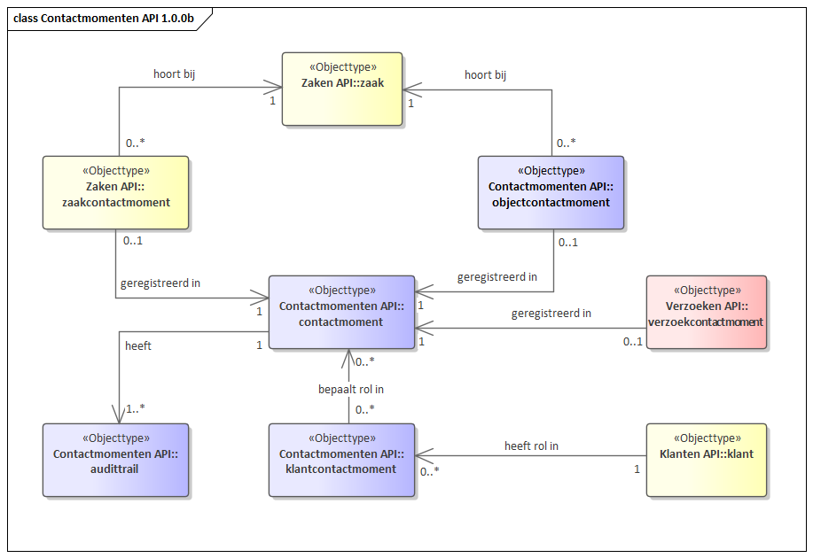

API voor opslag en ontsluiting van contactmomenten en daarbij behorende metadata.

Deze API ondersteunt het verwerken van gegevens van contactmomenten inclusief de relatie met eventuele za(a)k(en), klant(en) en/of verzoek(en).

Een contactmoment is een aaneengesloten periode waarbij interactief informatie wordt uitgewisseld tussen (minimaal) 2 partijen. Eén van deze partijen is een Medewerker van de gemeente of een samenwerkingsverband en de andere partij is tenminste één Natuurlijk Persoon, eventueel in de rol van medewerker of vertegenwoordiger van (een Vestiging van) een Niet-Natuurlijk Persoon. De gegevens van deze vertegenwoordiger worden in eerste instantie overgenomen van de contactpersoon van de Vestiging uit het NHR. Deze mogen echter worden overschreven.

Voorbeelden van een Contactmoment zijn een baliebezoek en een telefonisch contact over een onderhanden zijnde Zaak. Twee telefoongesprekken over hetzelfde verzoek om informatie zijn 2 contactmomenten. De Contactmomenten API bevat resources voor Contactmoment, Klantcontactmoment en Objectcontactmoment.

# Informatie- en gegevensmodel

RGBZ bevat een resource/objecttype voor Klantcontact. Omdat de Contactmomenten API is opgezet in de bredere context van Klantinteractie, is voor dit domein een apart informatiemodel gemaakt, wederom geinsireerd op RGBZ. De gebruikte resources/objecttypen en attributen zijn (voor een deel) te herleiden naar RGBZ.

[{:width="1200px"}](IM Contactmomenten.png "Informatiemodel contactmomenten - klik voor groot")

Het gegevensmodel is een weergave van de implementatie van het informatiemodel in de API specificatie.

[{:width="1200px"}](Contactmomenten API 1.0.0b.png "Contactmomenten gegevensmodel - klik voor groot")

## Relatie met zaken

Een contactmoment kan leiden tot één of meer zaken. Daarnaast kan een contactmoment betrekking hebben op één of meer zaken en bij één zaak kunnen één of meer contactmomenten geregistreerd zijn. Deze relatie is vastgelegd in `zaakcontactmoment` (Zaken API) en `objectcontactmoment` (Contactmomenten API).

## Relatie met klanten

Eén of meer klanten kunnen een rol hebben bij een contactmoment. Vooralsnog zijn deze rollen `Belanghebbende` en `Gesprekspartner`.  

De relatie is vastgelegd in `klantcontactmoment`.

## Relatie met verzoeken

Een contactmoment kan leiden tot één of meer verzoeken. Daarnaast kan een contactmoment betrekking hebben op één of meer verzoeken en bij één verzoek kunnen één of meer contactmomenten geregistreerd zijn. Deze relatie is vastgelegd in `verzoekcontactmoment` (Verzoeken API).

## Relatie met contactmoment

Een contactmoment kan een vervolg zijn op een eerder contactmoment. Deze relatie is vastgelegd in de attributen `vorigContactmoment` en `volgendContactmoment`.

# Specificatie van de Contactmomenten API

* [Referentie-implementatie Contactmomenten API](https://contactmomenten-api.vng.cloud)
* API specificatie (OAS3) in
  [ReDoc](https://contactmomenten-api.vng.cloud/api/v1/schema/),
  [Swagger](https://petstore.swagger.io/?url=https://contactmomenten-api.vng.cloud/api/v1/schema/openapi.yaml),
  [YAML](https://contactmomenten-api.vng.cloud/api/v1/schema/openapi.yaml) of
  [JSON](https://contactmomenten-api.vng.cloud/api/v1/schema/openapi.json)

# Specificatie van gedrag

De Contactmomenten API MOET aan twee aspecten voldoen:

* de OAS-specificatie `openapi.yaml` MOET volledig geïmplementeerd zijn.

* het run-time gedrag hieronder beschreven MOET correct geïmplementeerd zijn.

## OpenAPI specificatie

Alle operaties beschreven in [openapi.yaml](https://contactmomenten-api.vng.cloud/api/v1/schema/openapi.yaml) MOETEN ondersteund worden en tot hetzelfde resultaat leiden als de referentie-implementatie van de CRC.

Het is NIET TOEGESTAAN om gebruik te maken van operaties die niet beschreven staan in deze OAS spec, of om uitbreidingen op operaties in welke vorm dan ook toe te voegen.

## Run-time gedrag

Bepaalde gedrageningen kunnen niet in een OAS spec uitgedrukt worden omdat ze businesslogica bevatten. Deze gedragingen zijn hieronder beschreven en MOETEN zoals beschreven geïmplementeerd worden.

### **<a name="cm-001">Valideren attribuut `vorigContactmoment` bij aanmaken of bijwerken van een CONTACTMOMENT ([cm-001](#cm-001))</a>**

Bij het aanmaken (`contactmoment_create`) en bijwerken (`contactmoment_update` en `contactmoment_partial_update`) van een CONTACTMOMENT MOET de URL-referentie naar het vorige CONTACTMOMENT gevalideerd worden op het bestaan indien deze is meegegeven en niet leeg is. Als het ophalen van de objecten niet (uiteindelijk) resulteert in een `HTTP 200` status code, MOET er geantwoord worden met een `HTTP 400` foutbericht. 

### **<a name="cm-002">Automatisch zetten van het attribuut `volgendContactmoment`in het vorige CONTACTMOMENT ([cm-002](#cm-002))</a>**

Bij het aanmaken (`contactmoment_create`) en bijwerken (`contactmoment_update` en `contactmoment_partial_update`) van een CONTACTMOMENT MOET op basis van het veld `vorigContactmoment`, indien dit attribuut is meegegeven en niet leeg is, het veld `volgendContactmoment` van het vorige CONTACTMOMENT worden bewerkt zodat er een kruisverwijzing ontstaat.

### **<a name="cm-003">Valideren attribuut `medewerker` bij aanmaken of bijwerken van een CONTACTMOMENT ([cm-003](#cm-003))</a>**

Bij het aanmaken (`contactmoment_create`) en bijwerken (`contactmoment_update` en `contactmoment_partial_update`) van een CONTACTMOMENT MOET de URL-referentie naar de MEDEWERKER gevalideerd worden op het bestaan indien deze is meegegeven en niet leeg is. Als het ophalen van de objecten niet (uiteindelijk) resulteert in een `HTTP 200` status code, MOET er geantwoord worden met een `HTTP 400` foutbericht. 

### **<a name="cm-004">Valideren attributen `contactmoment`, `klant` en `rol` bij aanmaken van een KLANT-CONTACTMOMENT relatie ([cm-004](#cm-004))</a>**

Bij het aanmaken van een KLANT-CONTACTMOMENT-relatie (`klantcontactmoment_create`) MOETEN de URL-referenties naar KLANT en CONTACTMOMENT gevalideerd worden op het bestaan. Indien het ophalen van de objecten niet (uiteindelijk) resulteert in een `HTTP 200` status code, MOET er geantwoord worden met een `HTTP 400` foutbericht. Bovendien MOET de combinatie `contactmoment`, `klant` en `rol` uniek zijn. Als dit niet het geval is, MOET er geantwoord worden met een `HTTP 400` foutbericht.

### **<a name="cm-005">Valideren attributen `contactmoment` en `object` bij aanmaken van een OBJECT-CONTACTMOMENT relatie ([cm-005](#cm-005))</a>**

Bij het aanmaken van een OBJECT-CONTACTMOMENT-relatie (`objectcontactmoment_create`) MOETEN de URL-referenties naar OBJECT en CONTACTMOMENT gevalideerd worden op het bestaan. Indien het ophalen van de objecten niet (uiteindelijk) resulteert in een `HTTP 200` status code, MOET er geantwoord worden met een `HTTP 400` foutbericht. Bovendien MOET de combinatie `object` en `contactmoment` uniek zijn. Als dit niet het geval is, MOET er geantwoord worden met een `HTTP 400` foutbericht.

### **<a name="cm-006">Valideren bestaan relatie tussen OBJECT en CONTACTMOMENT in de bron ([cm-006](#cm-006))</a>**

Bij het aanmaken van een relatie tussen OBJECT en CONTACTMOMENT (`objectcontactmoment_create`) MOET gevalideerd worden dat de relatie tussen het OBJECT en het CONTACTMOMENT al bestaat in de bron van het OBJECT. De bron van het OBJECT is bekend door de eerdere validaties op deze URL. 

### HTTP-Caching

De Contactmomenten API moet HTTP-Caching ondersteunen op basis van de `ETag` header. In de API spec staat beschreven voor welke resources dit van toepassing is.

De `ETag` MOET worden berekend op de JSON-weergave van de resource. Verschillende, maar equivalente weergaves (bijvoorbeeld dezelfde API ontsloten wel/niet via NLX) MOETEN verschillende waarden voor de `ETag` hebben.

Indien de consumer een `HEAD` verzoek uitvoert op deze resources, dan MOET de provider antwoorden met dezelfde headers als bij een normale `GET`, dus inclusief de `ETag` header. Er MAG GEEN response body voorkomen.

Indien de consumer gebruik maakt van de `If-None-Match` header, met één of meerdere waarden voor de `ETag`, dan MOET de provider antwoorden met een `HTTP 304` bericht indien de huidige `ETag` waarde van de resource hierin voorkomt. Als de huidige `ETag` waarde hier niet in voorkomt, dan MOET de provider een normale `HTTP 200` response sturen.
