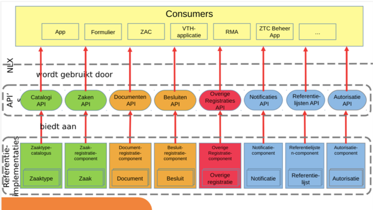
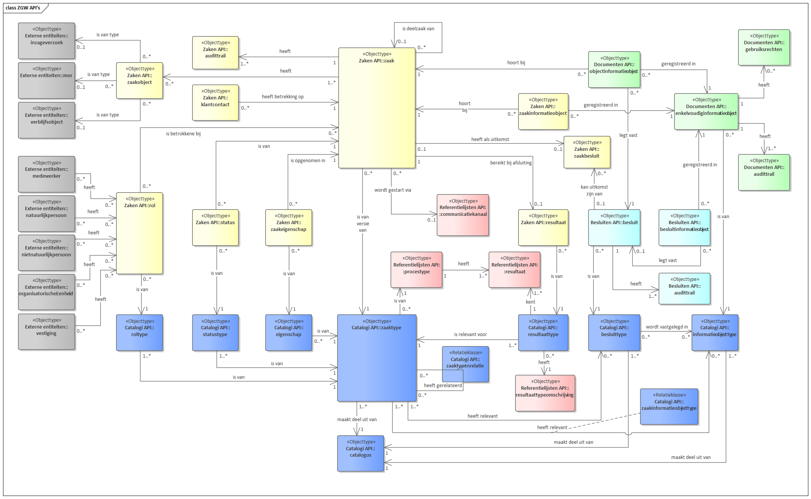

## API-specificaties

Hieronder de directe links naar de specificatie en documentatie van de API's:

* [Catalogi API specificatie](catalogi/index)
* [Zaken API specificatie](zaken/index)
* [Documenten API specificatie](documenten/index)
* [Besluiten API specificatie](besluiten/index)
* [Autorisaties API specificatie](autorisaties/index)
* [Notificaties API specificatie](notificaties/index)
* [Notificaties API specificatie voor consumers](notificaties-consumer/index)
* [Contactmomenten API specificatie](contactmomenten/index)
* [Klanten API specificatie](klanten/index)
* [Verzoeken API specificatie](verzoeken/index)

## Algemeen

De standaard "API's voor Zaakgericht Werken" bestaat uit een aantal API's. Per API is er een OAS3-specificatie en een beschrijving van het vereiste "run-time"-gedrag in zoverre dat niet kon worden vastgelegd in de API-specificatie. De OAS3-specificaties met beschrijvingen zijn normatief. De overige documentatie is ondersteunend en ter informatie.

Deze standaardisatie zorgt vervolgens voor gegarandeerde interoperabiliteit tussen registraties (providers) en consumers die van de API's gebruik maken.

We beschouwen de Notificaties en Autorisaties API als onderdeel van de standaard, maar verwachten een doorontwikkeling als generieke API's voor het gemeentelijk gegevenslandschap. Dat geldt ook voor de Documenten API en Besluiten API.

In de figuur hieronder is een overzicht weergegeven van de API's voor Zaakgericht werken. De Catalogi API en Zaken API zijn alleen voor zaakgericht werken bedoeld, en hebben geen functie daarbuiten. De Documenten API en Besluiten API zullen ook buiten zaakgericht werken toepassingen krijgen. Immers, niet alle documenten zijn zaakgericht en niet alle besluiten zullen in de context van een zaak worden genomen. Denk bij het laatste bijv. aan raadsbesluiten.

Naast deze API zijn er nog een aantal API’s ontwikkeld ter ondersteuning, t.w. Notificaties API, Autorisaties API en de Referentielijsten API.

{:width="700px"}

Voor meer informatie over de visie en achtergronden bij deze API's verwijzen we naar de [productvisie](../productvisie/index).


## Afhankelijkheden

Het is niet verplicht alle API's te implementeren, maar er zijn wel afhankelijkheden. Als je bijv. de Zaken API implementeert, heb je de Catalogi API nodig. Als je een van Documenten, Zaken, Catalogi, Besluiten implementeert, heb je een Notificaties en Autorisaties API nodig. etc. Die afhankelijkheden betekenen niet dat je het ook zelf moet implementeren, je kunt gebruik maken van API's van anderen.

De afhankelijkheden tussen de API's is als volgt (te lezen als rij is afhankelijk van kolom):

|                                | Catalogi | Zaken     | Documenten | Besluiten | Autorisaties | Notificaties | Notificaties  voor consumers | Contactmomenten | Klanten | Verzoeken | Gemeentelijke selectielijst API |
|--------------------------------|:----------:|:----------:|:------------:|:-----------:|:--------------:|:--------------:|:-----------------:|:---------------:|:-----:|:-------:|:-----------------------------:|
| Catalogi                       |          |           |            |           | X |   |  |           |           |           | X |
| Zaken                          |    X     |           | optioneel  | optioneel | X | X |  |           |           |           |   |
| Documenten                     |    X     | optioneel |            | optioneel | X | X |  | Optioneel |           | Optioneel |   |
| Besluiten                      |    X     |           | optioneel  | optioneel | X | X |  |           |           |           |   |
| Autorisaties                   |          |           |            |           | X | X |  |           |           |           |   |
| Notificaties                   |          |           |            |           | X |   |  |           |           |           |   |
| Notificaties   voor consumers  |          |           |            |           |   |   |  |           |           |           |   |
| Contactmomenten                |          | optioneel | Optioneel  |           | X | X |  |           | Optioneel | Optioneel |   |
| Klanten                        |          |           | Optioneel  |           | X | X |  | Optioneel |           | Optioneel |   |
| Verzoeken                      |          | optioneel |            |           | X | X |  | Optioneel | Optioneel |           |   |

Zie ook de [compatibiliteit](./api-compatibiliteit) tussen de API versies en de [API versies](./versions) die nu beschikbaar zijn.

## Overkoepelend gegevensmodel

Dit diagram toont alle objecten uit de API's voor Zaakgericht Werken inclusief de relaties ertussen.

Bij elk ObjectType is aangegeven uit welke API het afkomstig is.

De API’s zijn geïnspireerd op RGBZ en imZTC waarin objecten, gegevens en de onderlinge relaties zijn beschreven.

Het gegevensmodel voor de ZGW API’s benadert het totaalbeeld wat in RGBZ en imZTC wordt geschetst nog het meest. Daar waar in RGBZ resources uit verschillende bronnen en modellen samenkomen is dat in de API’s voor Zaakgericht Werken opgesplitst. Er is een Catalogus API voor de ZTC en Zaken API voor zaken een documenten API voor Document (Informatieobjecten) en een Besluiten API voor Besluiten.

Het diagram toont geen ObjectTypen uit de Autorisatie API en de Notificaties API omdat deze geen (modelleerbare) relaties hebben met ObjectTypen uit de ander API's.
[{:width="1200px"}](./ZGW API's.png "Gegevensmodel, klik voor grote versie")

TODO: Omdat individuele API's verschillende versies kunnen hebben en het overkopelende model niet, moet een andere weergave voor het overkoepelende model bedacht worden. 

Zie [hier](./gegevensmodel/index) voor meer informatie over het gegevensmodel.

## Eisen en uitgangspunten die voor alle API's gelden

### Definities

- OAS schema: een API definitie die de
  [OpenAPI-Specification](https://github.com/OAI/OpenAPI-Specification) volgt.
  **VNG-Realisatie** publiceert de schema's waaraan implementaties moeten voldoen
  op [github](https://github.com/VNG-Realisatie/gemma-zaken/tree/master/api-specificatie).

- Consumer: een technologie die van de API's gebruik maakt. Dit kan een
  taakapplicatie zijn, een andere service in service-naar-service communicatie,
  of eender welke (generieke) client-applicatie.

- 'Uiteindelijk resulteren' betekent dat redirects (`HTTP 301`, `HTTP 302`)
  toegestaan zijn, mits deze redirect-locatie resulteert in een `HTTP 200`.

- Autorisatie: het mechanisme om wel of niet toegang te verlenen tot operaties
  en/of gegevens in de API's. Niet te verwarren met authenticatie.

- Authenticatie: het mechanisme om de identiteit van een persoon of andere
  entiteit vast te stellen.

- Eindgebruiker: de persoon die gebruik maakt van een (taak)applicatie die
  communiceert via de ZGW API's.

- De codes bij business logica (zoals `zrc-001`) verwijzen naar de
  [Postman tests voor ZGW API's](https://github.com/VNG-Realisatie/gemma-postman-tests)

- Endpoint: een pad dat ontsloten wordt in de API, al dan niet met dynamische
  parameters. Bijvoorbeeld: `/api/v1/zaken/{uuid}`

- Operatie: de combinatie van een HTTP method zoals `POST`, `GET`, `PUT`,
  `PATCH` of `DELETE` en een endpoint.

### API- en URI-strategie

Er wordt zoveel mogelijk uitgegaan van de
[API strategie voor de Nederlandse overheid](https://docs.geostandaarden.nl/api/API-Strategie/) (15 juli 2019)
maar de API's zijn in eerste instantie ontwikkeld volgens de
[DSO API- en URI-strategie](https://aandeslagmetdeomgevingswet.nl/digitaal-stelsel/technisch-aansluiten/standaarden/api-uri-strategie/). Hier en daar kan worden afgeweken
om redenen van toepasselijkheid of omdat de strategie nog in ontwikkeling is.

[dso-strategie]: https://aandeslagmetdeomgevingswet.nl/digitaal-stelsel/technisch-aansluiten/standaarden/api-uri-strategie/

#### Versionering van de API

In overeenstemming met [API-20](https://docs.geostandaarden.nl/api/API-Strategie/#api-20-include-the-major-version-number-only-in-ihe-uri) MOET het `MAJOR` versienummer in
de URL van de `{API root URL}` zitten. Het versienummer MAG vooraf worden gegaan
door de letter "v", bijvoorbeeld: `https://example.com/api/v1/`.

<!Zie: achtergrond bij [versies en migraties](/themas/achtergronddocumentatie/versies-en-migraties)>
Zie: achtergrond bij [versies en migraties](../themas/achtergronddocumentatie/versies-en-migraties.md)

#### Paginering

In aanvulling op [API-42](https://docs.geostandaarden.nl/api/API-Strategie/#api-42-use-json-hal-with-media-type-application-hal-json-for-pagination) MOET er voor media-type `application/json` paginering worden gebruikt.

Ondersteuning voor media-type `application/json+hal` is geen onderdeel van de
API-specificatie maar MAG wel worden aangeboden naast media-type
`application/json`.

Paginering voor media-type `application/json` volgt een vaste structuur die
wordt afgedwongen middels de API-specificatie.

Het attribuut `count` MOET het totaal aantal resultaten weergeven. Het attribuut
`next` en `previous` geven respectievelijk de URL naar de volgende en vorige
pagina weer. Dit MOET dezelfde URL zijn als het opvragen van de eerste pagina,
gevolgd door een query-parameter `page` die het paginanummer bevat, of `null`
indien er geen volgende of vorige pagina is.

De eerste pagina MOET `1` zijn (en niet `0`). De URLs
`http://example.com/api/v1/resource` en
`http://example.com/api/v1/resource?page=1` MOETEN hetzelfde resultaat geven.

De objecten van deze gepagineerde resource zitten in het attribuut `results`.
Het aantal objecten per pagina MAG varieren maar 100 is gebruikelijk.

*Voorbeeld*

```http
GET /api/v1/resource  HTTP/1.0

{
  "count": 130,
  "next": "http://example.com/api/v1/resource?page=2",
  "previous": null,
  "results": [
    ...
  ]
}
```


### Migreren van de API root URL

Als een wijziging van de API root URL **geen** invloed heeft op de inhoud van
de API, ofwel, het betreft geen versiewijziging, dan MOET de API op de oude
`{API root URL}` en alle onderliggende URL's, een HTTP 301 (Definitief
verplaatst) teruggeven. Als `Location`-header MOET de URL staan naar de
resource op de nieuwe `{API root URL}`.

Als een wijziging van de API root URL **wel** invloed heeft op de inhoud van de
API, ofwel, het betreft een versiewijziging, dan MAG de API op de oude
`{API root URL}` GEEN HTTP 301 teruggeven naar de nieuwe `{API root URL}`.

Zie: achtergrond bij [versies en migraties](../themas/achtergronddocumentatie/versies-en-migraties) 

### Beschikbaar stellen van de OAS

Iedere component MOET het OAS schema serveren, onder
`{API root URL}/schema/openapi.yaml`.

Voorbeelden van geldige URLs:

- `https://ref.tst.vng.cloud/zrc/api/v1/schema/openapi.yaml`
- `https://zrc.nl/api/v1/schema/openapi.yaml`
- `https://api.zrc.nl/v1/schema/openapi.yaml`
- `https://v1.api.zrc.nl/schema/openapi.yaml`

De service-naar-service communicatie MOET het schema opvragen om operaties op
resources uit te voeren.

### Gegevensformaten

Een aantal formaten zijn nog niet formeel vastgelegd in OAS of
[JSON-Schema](https://json-schema.org/), echter deze worden wel binnen de API's voor
Zaakgericht werken gebruikt en opgelegd.

[json-schema]: https://json-schema.org/

#### Duur

Een duur MOET in [ISO-8601 durations](https://en.wikipedia.org/wiki/ISO_8601#Durations)
uitgedrukt worden.

### API-compatibiliteit

De API-specificaties hebben ieder hun eigen versie en doorontwikkeling. Echter, ze hebben ook afhankelijkheden, waardoor niet alle versies van de API's met elkaar kunnen samenwerken. [Hier](./api-compatibiliteit) vind je een overzicht van de API-versies die compatibel zijn met elkaar.

## Overige documentatie

* [API versies](./versions)
* [Achtergronddocumentatie](../themas/index)
* [Documentatie voor ontwikkelaars (handleidingen en tutorials)](../ontwikkelaars/index)
