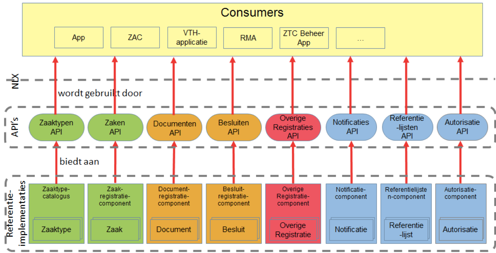

De ZGW API Standaard bestaat uit 2 delen:

* [Standaard ("in ontwikkeling")](standaard) als startpunt om de APIs te 
  implementeren of te gebruiken.
* [API specificaties](apis/index) met alle beschikbare resources en attributen.

Hieronder de directe links naar alle Open API specificaties (OAS):

* [Zaken API specificatie](https://ref.tst.vng.cloud/zrc/api/v1/schema/)
* [Catalogus API specificatie](https://ref.tst.vng.cloud/ztc/api/v1/schema/)
* [Documenten API specificatie](https://ref.tst.vng.cloud/drc/api/v1/schema/)
* [Besluiten API specificatie](https://ref.tst.vng.cloud/brc/api/v1/schema/)
* [Autorisaties API specificatie](https://ref.tst.vng.cloud/ac/api/v1/schema/)
* [Notificaties API specificatie](https://ref.tst.vng.cloud/nrc/api/v1/schema/)
  * [Notificaties API specificatie voor consumers](https://rebilly.github.io/ReDoc/?url=https://ref.tst.vng.cloud/api-specificatie/nrc/consumer-api/openapi.yaml)

