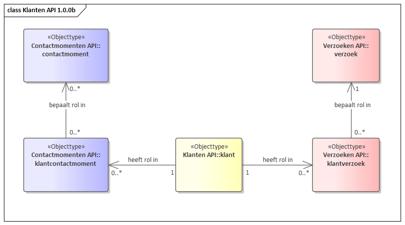

API voor opslag en ontsluiting van klanten en daarbij behorende metadata.

De API ondersteunt het opslaan en het naar andere applicaties ontsluiten van gegevens over klanten. 

Een Klant is een Natuurlijk Persoon, eventueel in de rol van medewerker of vertegenwoordiger van (een Vestiging van) een Niet-Natuurlijk Persoon. De gegevens van deze vertegenwoordiger worden in eerste instantie overgenomen van de contactpersoon van de Vestiging uit het NHR. Deze mogen echter worden overschreven.

Klanten zijn gerelateerd aan Contactmoment (in de Contactmomenten API) en Verzoek (in de Verzoeken API).

De Klanten API bevat resources voor Klant.

# Informatie- en gegevensmodel

RGBZ bevat geen resource/objecttype voor Klant. De Klanten API is opgezet in de bredere context van Klantinteractie. Vopor dit domein een apart informatiemodel gemaakt,  geinspireerd op RGBZ. Klant is hierin een nieuw(e) resource/objecttype.

[{:width="1200px"}](IM Klanten.png "Informatiemodel klanten - klik voor groot")

Het gegevensmodel is een weergave van de implementatie van het informatiemodel in de API specificatie.

[{:width="1200px"}](Klanten API 1.0.0b.png "Klanten gegevensmodel - klik voor groot")

### Relatie met contactmomenten

Een klant kan een rol hebben in een contactmoment. Vooralsnog zijn deze rollen `Belanghebbende` en `Gesprekspartner`. De relatie tussen klant en contactmoment is vastgelegd in `klantcontactmoment` in de Contactmomenten API.

### Relatie met verzoeken

Een klant kan een rol hebben bij een verzoek. Vooralsnog zijn deze rollen `Belanghebbende`, `Initiator` en `Mede-initiator`. De relatie tussen klant en contactmoment is vastgelegd in `klantverzoek` in de verzoeken API.

## Specificatie van de Contactmomenten API

* [Referentie-implementatie Klanten API](https://klanten-api.vng.cloud)
* API specificatie (OAS3) in
  [ReDoc](https://klanten-api.vng.cloud/api/v1/schema/),
  [Swagger](https://petstore.swagger.io/?url=https://klanten-api.vng.cloud/api/v1/schema/openapi.yaml),
  [YAML](https://klanten-api.vng.cloud/api/v1/schema/openapi.yaml) of
  [JSON](https://klanten-api.vng.cloud/api/v1/schema/openapi.json)

# Specificatie van gedrag

De Klanten API MOET aan twee aspecten voldoen:

* de OAS-specificatie `openapi.yaml` MOET volledig geïmplementeerd zijn.

* het run-time gedrag hieronder beschreven MOET correct geïmplementeerd zijn.

## OpenAPI specificatie

Alle operaties beschreven in [openapi.yaml](https://klanten-api.vng.cloud/api/v1/schema/openapi.yaml) MOETEN ondersteund worden en tot hetzelfde resultaat leiden als de referentie-implementatie van de KRC.

Het is NIET TOEGESTAAN om gebruik te maken van operaties die niet beschreven staan in deze OAS spec, of om uitbreidingen op operaties in welke vorm dan ook toe te voegen.

## Run-time gedrag

Bepaalde gedrageningen kunnen niet in een OAS spec uitgedrukt worden omdat ze businesslogica bevatten. Deze gedragingen zijn hieronder beschreven en MOETEN zoals beschreven geïmplementeerd worden.

### **<a name="kla-001">Garanderen uniciteit `bronorganisatie` en `klantnummer` van een KLANT ([kla-001](#kla-001))</a>**

Bij het aanmaken (`klant_create`) en bijwerken (`klant_update` en `klant_partial_update`) van een klant MOET gevalideerd worden dat de combinatie `bronorganisatie` en `klantnummer` uniek is, indien het `klantnummer` door de consumer meegestuurd wordt.

Indien het `klantnummer` niet door de consumer gestuurd wordt, dan MOET de Klanten API het nummer genereren op een manier die garandeert dat het uniek is binnen de bronorganisatie.

### **<a name="kla-002">Valideren attribuut `subject` bij aanmaken van een KLANT ([kla-002](#kla-002))</a>**

Bij het aanmaken van een KLANT (`klant_create`) MOET de URL-referentie naar SUBJECT gevalideerd worden op het bestaan indien deze is meegegeven en niet leeg is. Als het ophalen van de objecten niet (uiteindelijk) resulteert in een `HTTP 200` status code, MOET er geantwoord worden met een `HTTP 400` foutbericht. 

### HTTP-Caching

De Klanten API moet HTTP-Caching ondersteunen op basis van de `ETag` header. In de API spec staat beschreven voor welke resources dit van toepassing is. 

De `ETag` MOET worden berekend op de JSON-weergave van de resource. Verschillende, maar equivalente weergaves (bijvoorbeeld dezelfde API ontsloten wel/niet via NLX) MOETEN verschillende waarden voor de `ETag` hebben.

Indien de consumer een `HEAD` verzoek uitvoert op deze resources, dan MOET de provider antwoorden met dezelfde headers als bij een normale `GET`, dus inclusief de `ETag` header. Er MAG GEEN response body voorkomen.

Indien de consumer gebruik maakt van de `If-None-Match` header, met één of meerdere waarden voor de `ETag`, dan MOET de provider antwoorden met een `HTTP 304` bericht indien de huidige `ETag` waarde van de resource hierin voorkomt. Als de huidige `ETag` waarde hier niet in voorkomt, dan MOET de provider een normale `HTTP 200` response sturen.
