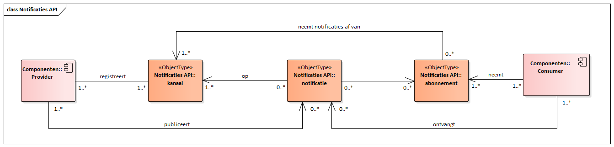

Deze API maakt het mogelijk notificaties te ontvangen waarop de consumer is geabonneerd.

## Gegevensmodel

[{:width="1200px"}](../notificaties/Notificaties API.png "Notificaties gegevensmodel - klik voor groot")

## Specificatie van de Notificaties API

* API specificatie (OAS3) in
  [ReDoc](https://redocly.github.io/redoc/?url=https://raw.githubusercontent.com/VNG-Realisatie/gemma-zaken/master/api-specificatie/nrc/consumer-api/openapi.yaml),
  [Swagger](https://petstore.swagger.io/?url=https://raw.githubusercontent.com/VNG-Realisatie/gemma-zaken/master/api-specificatie/nrc/consumer-api/openapi.yaml) of
  [YAML](../../../../api-specificatie/nrc/consumer-api/openapi.yaml)

## Specificatie van gedrag

Buiten de OAS-specificatie zijn er geen aanvullende eisen waaraan de consumer moet voldoen.
