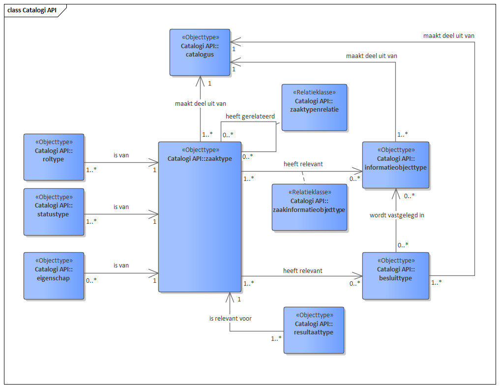

API voor opslag en ontsluiting van zaaktype-catalogi, zaaktypen en onderliggende typen.

De API ondersteunt het opslaan en naar andere applicaties ontsluiten van zaaktype-catalogi met zaaktypen. Deze gegevens kunnen door applicaties worden gebruikt om voor zaken van een bepaald type de juiste gegevens (statustypen, resultaattypen, informatieobjecttypen, etc.) te bepalen. Applicaties die gebruik maken van deze zaaktypegegevens zijn bijvoorbeeld een zaakafhandelcomponent, een VTH-applicatie of een subsidie-applicatie. Opslag van zaaktypegegevens vindt plaats conform het informatiemodel ZTC.

## Gegevensmodel

## Specificatie van de Catalogi API

* [Referentie-implementatie Catalogi API](https://catalogi-api.vng.cloud)
* API specificatie (OAS3) in
  [ReDoc](https://catalogi-api.vng.cloud/api/v1/schema/),
  [Swagger](https://petstore.swagger.io/?url=https://catalogi-api.vng.cloud/api/v1/schema/openapi.yaml),
  [YAML](https://catalogi-api.vng.cloud/api/v1/schema/openapi.yaml) of
  [JSON](https://catalogi-api.vng.cloud/api/v1/schema/openapi.json)

## Specificatie van gedrag

Zaaktypecatalogi (ZTC) MOETEN aan twee aspecten voldoen:

* de ZTC `openapi.yaml` MOET volledig geïmplementeerd zijn.

* het run-time gedrag beschreven in deze standaard MOET correct geïmplementeerd
  zijn.

Het ZTC haalt informatie uit selectielijsten en de Gemeentelijke Selectielijst
2017. Deze gegevens worden ontsloten in de
[VNG-referentielijsten-API](https://referentielijsten-api.vng.cloud/api/v1/schema/). Op
korte termijn zal deze API gesplitst worden in een referentielijsten-API en de
selectielijst-API (waar deze nu nog 1 API is)
[#3 on Github](https://github.com/VNG-Realisatie/VNG-referentielijsten/issues/3).

## OpenAPI specificatie

Alle operaties beschreven in [`openapi.yaml`](../../../api-specificatie/ztc/1.0.x/openapi.yaml)
MOETEN ondersteund worden en tot hetzelfde resultaat leiden als de
referentie-implementatie van het ZTC.

Het is NIET TOEGESTAAN om gebruik te maken van operaties die niet beschreven
staan in deze OAS spec, of om uitbreidingen op operaties in welke vorm dan ook
toe te voegen.

### Run-time gedrag

Bepaalde gedrageningen kunnen niet in een OAS spec uitgedrukt worden omdat ze
businesslogica bevatten. Deze gedragingen zijn hieronder beschreven en MOETEN
zoals beschreven geïmplementeerd worden.

#### **<a name="ztc-001">Valideren van `Zaaktype` ([ztc-001](#ztc-001))</a>**

Het attribuut `Zaaktype.selectielijstProcestype` MOET een URL-verwijzing naar
de `Procestype` resource in de selectielijst-API zijn, indien ingevuld.

#### **<a name="ztc-002">Valideren van `Resultaattype` ([ztc-002](#ztc-002))</a>**

Het attribuut `Resultaattype.resultaattypeomschrijving` MOET een URL-verwijzing
naar de `Resultaattypeomschrijving` resource in de referentielijsten-API zijn.
Het ZTC MOET de waarde van `Resultaattypeomschrijving.omschrijving` ontsluiten
(uit de selectielijst) als alleen-lezen attribuut
`Resultaattype.omschrijvingGeneriek`.

Het attribuut `Resultaattype.selectielijstklasse` MOET een URL-verwijzing zijn
naar de `Resultaat` resource in de selectielijst-API. Tevens MOET dit
`resultaat` horen bij het `procestype` geconfigureerd op
`Resultaattype.zaaktype.selectielijstProcestype`.

Indien `Resultaattype.archiefnominatie` niet expliciet opgegeven wordt, dan
MOET het ZTC deze afleiden uit `Resultaat.waardering` van de
selectielijstklasse.

Indien `Resultaattype.archiefactietermijn` niet expliciet opgegeven wordt, dan
MOET het ZTC deze afleiding uit `Resultaat.bewaartermijn` van de
selectielijstklasse.

**`Resultaattype.brondatumArchiefprocedure`**

Het groepattribuut `Resultaattype.brondatumArchiefprocedure` parametriseert
het bepalen van de `brondatum` voor de `archiefactietermijn` van een zaak. Deze
parametrisering is aan validatieregels onderhevig:

* <a name="ztc-003">`Resultaattype.brondatumArchiefprocedure.afleidingswijze` ([ztc-003](#ztc-003))</a>:
    * afleidingswijze MOET `afgehandeld` zijn indien de selectielijstklasse
      als procestermijn `nihil` heeft
    * afleidingswijze MOET `termijn` zijn indien de selectielijstklasse
      als procestermijn `ingeschatte_bestaansduur_procesobject` heeft

* <a name="ztc-004">`Resultaattype.brondatumArchiefprocedure.datumkenmerk` ([ztc-004](#ztc-004))</a>
    * MOET een waarde hebben als de afleidingswijze `eigenschap`, `zaakobject`
      of `ander_datumkenmerk` is
    * MAG GEEN waarde hebben in de andere gevallen

* <a name="ztc-005">`Resultaattype.brondatumArchiefprocedure.einddatumBekend` ([ztc-005](#ztc-005))</a>
    * MAG GEEN waarde hebben indien de afleidingswijze `afgehandeld` of
      `termijn` is

* <a name="ztc-006">`Resultaattype.brondatumArchiefprocedure.objecttype` ([ztc-006](#ztc-006))</a>
    * MOET een waarde hebben als de afleidingswijze `zaakobject`
      of `ander_datumkenmerk` is
    * MAG GEEN waarde hebben in de andere gevallen

* <a name="ztc-007">`Resultaattype.brondatumArchiefprocedure.registratie` ([ztc-007](#ztc-007))</a>
    * MOET een waarde hebben indien de afleidingswijze `ander_datumkenmerk` is
    * MAG GEEN waarde hebben in de andere gevallen

* <a name="ztc-008">`Resultaattype.brondatumArchiefprocedure.procestermijn` ([ztc-008](#ztc-008))</a>
    * MOET een waarde hebben indien de afleidingswijze `termijn` is
    * MAG GEEN waarde hebben in de andere gevallen

Als er geen procestermijn gezet is (lege waarde), wat typisch het geval is als
de archiefactie `bewaren` betreft, dan MOETEN alle waardes voor de 
afleidingswijze mogelijk zijn. De procestermijn kan voor praktische redenen
geïnterpreteerd worden als de waarde 0.

#### Concepten

De resources `Zaaktype`, `InformatieObjecttype` en `Besluittype` bevatten het veld `concept`,
indien dit veld aangemerkt is als `true`, dan betreft het een niet-definitieve versie van
het objecttype. Deze versie mag niet buiten de Catalogi API gebruikt mag worden.
Dat betekent dat je geen zaken van een `ZaakType` dat niet definitief is, mag aanmaken.

Om de versie van een objecttype definitief te maken ("publiceren"), bestaat er een `publish` operatie.
Dit is de tegenhanger van het attribuut `concept`, dus na publiceren heeft `concept` de waarde `false`.

Bovendien gelden er beperkingen op verdere acties die uitgevoerd kunnen worden op dit objecttype en gerelateerde objecttype via de API.
* Beperkingen voor objecttypen met `concept=false` **<a name="ztc-009">([ztc-009](#ztc-009))</a>**:
    * Het objecttype mag NIET:
        * geheel bijgewerkt worden (PUT)
        * deels bijgewerkt worden (PATCH), m.u.v. het bijwerken van enkel het attribuut `eindeGeldigheid`
        * verwijderd worden (DELETE)

* Beperkingen voor objecttypen gerelateerd aan een objecttype met `concept=false` **<a name="ztc-010">([ztc-010](#ztc-010))</a>**:
    * Het objecttype mag NIET:
        * geheel bijgewerkt worden (PUT)
        * deels bijgewerkt worden (PATCH)
        * verwijderd worden (DELETE)
    * Voor `ZaakType-InformatieObjectType` gelden bovenstaande regels **(ztc-010)** alleen in het geval waarbij zowel het `ZaakType`
    als het `InformatieObjectType` `concept=False` hebben

* Beperkingen die gelden voor objecttypen die NIET gerelateerd zijn aan een objecttype met `concept=false` **<a name="ztc-011">([ztc-011](#ztc-011))</a>**:
    * Er mag GEEN nieuw objecttype aangemaakt worden met een relatie naar een objecttype met `concept=false` (create)
    * Er mag GEEN nieuwe relatie worden gelegd tussen een objecttype en een objecttype met `concept=false` (update, partial_update)
* Voor `ZaakType-InformatieObjectType` gelden bovenstaande regels **(ztc-011)** alleen in het geval waarbij zowel het `ZaakType`
als het `InformatieObjectType` `concept=False` hebben

#### Publiceren van `ZaakType` **<a name="ztc-012">([ztc-012](#ztc-012))</a>**

Een `ZaakType` mag alleen gepubliceerd worden als alle gerelateerde `BesluitType`n en `InformatieObjectType`n `concept=false`
hebben (dus gepubliceerd zijn). Als er geprobeerd wordt om een `ZaakType` te publiceren terwijl er relaties zijn met `BesluitType`n of `InformatieObjectType`n die `concept=true` hebben, dan dient er een HTTP 400 teruggegeven te worden door de API

#### <a name="ztc-013">Relaties tussen objecttypen ([ztc-013](#ztc-013))</a>

Het is NIET TOEGESTAAN dat objecttypen relaties hebben over verschillende catalogi
heen. Zelfs als de catalogi hetzelfde zijn maar op verschillende endpoints
worden aangeboden mogen de relaties niet door elkaar gelegd worden.

Voorbeeld: Een `Zaaktype` in `Catalogus` X mag geen `Statustype` hebben uit
`Catalogus` Y. Een `Zaaktype` in `Catalogus` X op endpoint `https://www.foo.bar/`
mag geen `Statustype` hebben uit `Catalogus` X op endpoint
`https://www.example.com`.

#### HTTP-Caching

    <strong>Nieuw in versie 1.1.0</strong>

De Catalogi API moet HTTP-Caching ondersteunen op basis van de `ETag` header. In
de API spec staat beschreven voor welke resources dit van toepassing is.

De `ETag` MOET worden berekend op de JSON-weergave van de resource.
Verschillende, maar equivalente weergaves (bijvoorbeeld dezelfde API ontsloten
wel/niet via NLX) MOETEN verschillende waarden voor de `ETag` hebben.

Indien de consumer een `HEAD` verzoek uitvoert op deze resources, dan MOET de
provider antwoorden met dezelfde headers als bij een normale `GET`, dus
inclusief de `ETag` header. Er MAG GEEN response body voorkomen.

Indien de consumer gebruik maakt van de `If-None-Match` header, met één of
meerdere waarden voor de `ETag`, dan MOET de provider antwoorden met een
`HTTP 304` bericht indien de huidige `ETag` waarde van de resource hierin
voorkomt. Als de huidige `ETag` waarde hier niet in voorkomt, dan MOET de
provider een normale `HTTP 200` response sturen.

## Overige documentatie

* [Informatiemodel Zaaktypen (ImZTC)](https://www.gemmaonline.nl/index.php/Informatiemodel_Zaaktypen_(ImZTC))
