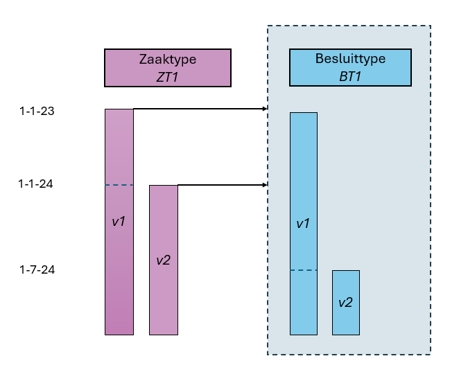
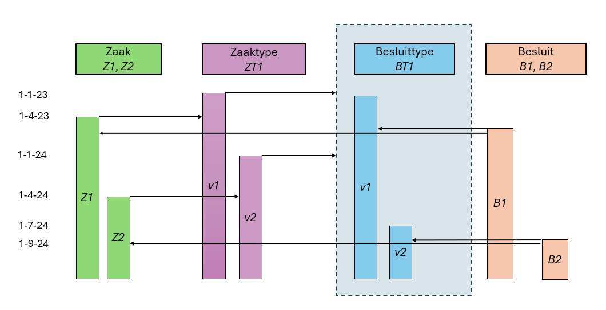

# Historiemodel in de Catalogi API

## Inleiding

Omdat van een Zaak, Informatieobject of Besluit altijd de bijbehorende definities moeten kunnen worden opgevraagd zoals die waren 
ten tijde van het aanmaken van die Zaak, Informatieobject of Besluit is bij het ontwikkelingen van de ZWG standaard gekozen voor 
het maken van nieuwe resources wanneer een type-definitie aangepast moet worden. Deze keuze, hoewel begrijpelijk gezien de tijd 
en kennis, heeft geleid tot een afwijking van gangbaar gedrag van API's. Het automatische versiebeheer in de Catalogi API wijkt af van 
dat van de overige API's: De resources in de Catalogi API zijn dus versies van de betreffende resources. "Zaaktype" moet gelezen worden 
als "Versie van een Zaaktype", "Informatieobjecttype" is een "Versie van een Informatieobjecttype", "Besluittype" is een "Versie van een Besluittype" etc.
Dit begrip is essentieel om de Catalogi API en het historiemodel te begrijpen en correct toe te kunnen passen.

Concreet betekent dit dat wanneer van een Zaaktype een nieuwe versie gemaakt wordt een nieuwe resource wordt aangemaakt met
een eigen identifier (UUID) en eigen waarden. Ditzelfde geldt voor Informatieobjecttype en Besluittype.

Nadeel hiervan is echter dat de relaties tussen de verschillende definities gelegd worden middels urls. Deze urls bevatten de UUID
en wanneer een nieuwe versie van een definitie gemaakt wordt moeten ook alle definities die naar de gewijzigde definitie verwijzen
aangepast worden. Dit wordt al snel een ingewikkelde kluwen van definities die lastig te beheren is.

Daarom is in Catalogi API 1.3.0 het zogenaamde historiemodel ingevoerd.

Het historiemodel moet een aantal doelen invullen:
1. Het beheer van de ZTC eenvoudiger maken.
2. Het gebruik van de ZTC door vak-/taakspecifieke applicaties (TSA's) ongewijzigd te laten

[](catalogi_history.png "Historiemodel Catalogi API ImZTC versie 2.2 - klik voor groot")

## Theorie van het historiemodel

### Hoofdtypen en gerelateerde objecttypen

Het historiemodel kent de volgende uitgangspunten:

* Er bestaan drie hoofdtypen: 
	- Zaaktype
	- Informatieobjecttype
	- Besluittype  

	Deze drie hoofdtypen zijn in bovenstaande afbeelding weergegeven in de kleuren groen (Zaaktype met gerelateerde objecttypen), blauw (Informatieobjecttype) en rood (Besluittype).

* Elk hoofdtype kent een eigen lifecycle en kan onafhankelijk van de andere hoofdtypen doorontwikkeld worden. De uitzonderingen hierop zijn het aanmaken en beëindigen van het hoofdobjecttype.

* Elk hoofdtype kan één of meer gerelateerde objecttypen hebben. Dit zijn in feite groepsattributen en deze zijn hard, 1 op 1, gekoppeld aan een versie van het hoofdobjecttype. Bij wijzigingen van het hoofdobjecttype worden ook nieuwe versies van de gerelateerde objecttypen gemaakt en vice versa.

### Datumgeldigheid
Doordat versies van Zaaktype, Informatieobjecttype en Besluittype niet meer 1 op 1 aan elkaar gekoppeld zijn is het noodzakelijk te weten op welke datum de situatie van de gevraagde objecttypen en hun relaties getoond moeten worden. Met behulp van de (optionele) parameter datumGeldigheid kan de hele constellatie zoals geldig op die specifieke datum opgevraagd worden. Wanneer de datumGeldigheid niet expliciet meegegeven wordt geeft het antwoord de huidige constellatie, dus de situatie op het moment van aanroepen, weer.

Een versie van een Zaaktype, Informatieobjecttype of Besluittype kan ook opgevraagd worden door de identificatie (zaaktype.identificatie,
informatieobjecttype.omschrijving of besluittype.omschrijving) en de gewenste datumGeldigheid mee te geven. In situaties waarin wel de identificatie van een objecttype bekend is maar niet de exacte UUID of url is het dan toch mogelijk de correcte versie op te vragen.

De datumGeldigheid is vanuit de zaak geredeneerd de registratiedatum van de zaak.


### Gerelateerde objecttypen van Zaaktype
Bij een versie van een Zaaktype kan slechts één versie van onderstaande gerelateerde objecttypen worden vastgelegd. 

Zaaktype kent de volgende gerelateerde objecttypen:
- Statustype
- Roltype
- Eigenschappen
- Zaakobjecttype
- ResultaatType
- ZaaktypeInformatieobjecttype


### Relatie Zaaktype heeft relevant Informatieobjecttype
- De relatie Zaaktype heeft relevant Informatieobjecttype wordt gelegd vanuit Zaaktype naar Informatieobjecttype.
- De relatie Zaaktype heeft relevant Informatieobjecttype wordt gelegd door in ZaaktypeInformatieobjecttype te verwijzen naar het zaaktype via zaaktype.url en naar het Informatieobjecttype via informatieobjecttype.omschrijving.
Op deze manier is aan één versie van een zaaktype versie-onafhankelijk een Informatieobjecttype gekoppeld. Bij een nieuwe versie van het Informatieobjecttype hoeft de relatie niet aangepast te worden. Het leggen of wijzigen 
(doorknippen) van de relatie is een wijziging (dus nieuwe versie) van het zaaktype en betekent ook een nieuwe versie van het zaakinformatieobjecttype.
- Bij het opvragen van een versie van een Zaaktype worden op basis van de huidige datum de op dat moment geldige gerelateerde Informatieobjecttypen weergegeven.


### Relatie Zaaktype heeft relevant Besluittype
- De relatie Zaaktype heeft relevant Besluittype wordt gelegd vanuit Zaaktype naar Besluittype.
- De relatie Zaaktype heeft relevant Besluittype wordt gelegd door in Zaaktype.besluittypen een array met Besluittype.omschrijving-en op te nemen. Idealiter zou de relatie gelegd worden met een relatieklasse zoals ZaaktypeInformatieobjecttype maar dat is helaas niet het geval. Ook hier is de relatie tussen (versie van een) Zaaktype en Besluittype onafhankelijk van de versie van het Besluittype.
- Bij het opvragen van een versie van een Zaaktype worden op basis van de huidige datum de op dat moment geldige gerelateerde Besluittypen weergegeven.


### Is Catalogi API 1.3.x backwards compatible of niet
Op grond van bovenstaande beschrijvingen lijkt Catalogi API versie 1.3.x niet backwards compatible met versie 1.2.x. Voor een deel is dit zo. Namelijk de component waarmee de Zaaktype catalogus (ZTC) beheerd wordt
zal anders werken. Echter, omdat de ZTC beheercomponent een onderdeel is van het product ZTC is dit geen probleem. Immers, bij een nieuwe versie van een ZTC registercomponent hoort ook een nieuwe versie van de 
ZTC beheercomponent.

Consumer applicaties als taakspecifieke applicaties (TSA) of vakapplicaties kunnen nog steeds op de hun bekende wijze de ZTC raadplegen. Een TSA heeft immers alleen leesrechten op een ZTC, schrijven gebeurt alleen door de ZTC beheercomponent. Om de mogelijkheden van de laatste geïmplementeerde versie van de standaard ten volle te benutten is het noodzakelijk om de meest recente versie van de bij het registercomponent horende beheercomponent te gebruiken.

Grof gezegd zijn de GET operaties (GET Resource, GET List en HEAD) backwards compatible. De overige schrijf operaties (POST, PUT, PATCH, DELETE) zijn niet backwards compatible maar slechts door een beperkte set consumer applicaties te gebruiken.

Om deze redenen is besloten versie 1.3.x backwards compatible te laten zijn met eerdere versies. 


## Historiemodel toegepast op Zaaktype en Besluittype
[](zt_bt.png "Historiemodel Zaaktype en Besluittype - klik voor groot")

In dit voorbeeld is de eerste versie v1 van zaaktype ZT1 [gepubliceerd](./index#concepten) op 1 januari 2023. Deze versie van het Zaaktype is via het attribuut "Besluittype.omschrijving" gekoppeld met besluittype BT1. Op het moment van verwijzing bestond alleen versie v1 van het besluittype BT1. 

Op 1 januari 2024 wordt versie v2 van het zaaktype ZT1  gepubliceerd welke tevens wordt gekoppeld aan besluittype BT1.

Op 1 juli 2024 wordt versie v2 van het besluittype BT1 gepubliceerd. Door de losse koppeling (via "Besluittype.omschrijving" in plaats van "Besluittype.url") kunnen beide versies van zaaktype ZT1 (v1 en v2) beiden gebruik maken van besluittype v2 hoewel deze later gepubliceerd is.

Het stippelijntje in de v1 versie van zaaktype ZT1 stelt de "eindeGeldigheid" voor: dat is de datum één dag voor de "beginGeldigheid" van het nieuwe zaaktype (v2 in dit geval). Het attribuut "eindeGeldigheid" is hier niet de eindgeldigheid van het zaaktype zelf want dat blijft altijd geldig voor het zaaktype waaraaan het gekoppeld is. Maar het is wel de eindgeldigheid voor nieuwe zaken die eraan gekoppeld kunnen worden. Dus na deze eindgeldigheid mogen er geen nieuwe zaken meer aan het zaaktype gekoppeld worden.

Hetzelfde verhaal voor het stippellijntje in het besluittype v1 van besluittype BT1. Met als toevoeging dat hier voor de "eindeGeldigheid" geldt dat zowel nieuwe besluiten als nieuwe zaaktypen niet meer gerelateerd mogen worden na de eindgeldigheid van het betreffende besluittype.

Om het voorbeeld concreter te maken is in onderstaand plaatje de situatie uitgebreid met "echte" zaken en besluiten die aan zaaktype ZT1 en besluittype BT1 gekoppeld zijn. Op het moment dat zaak Z2 op 1-4-2024 gekoppeld werd aan zaaktype ZT1 bestond er nog geen versie v2 van het besluittype BT1. Pas later op 1-7-2024 werd deze BT1.v2 versie aangemaakt en op 1-9-2024 werd het besluit B2 gekoppeld aan besluittype BT1.v2 en zaak Z2.

[](zt_bt_z_bv02.png "Klik voor groot")


In de volgende secties gaan we met concrete ZGW-berichten de bovenstaande situatie reconstrueren. Voor het gemak beperken we ons tot alleen de zaaktype ZT1 en besluittype BT1 en laten we de zaken, Z1 en Z2, en besluiten, B1 en B2, die gebruik maken van deze typen buiten beschouwing.


###  Maak het besluittype "BT1" versie 1 aan
`POST {{ztc_url}}/besluittypen`

Request:
```
{
   	"omschrijving": "BT1",
	"beginGeldigheid" : "2023-01-01",
	"toelichting": "Dit is versie 1 van BT1",
   	...
}
```

Response:
```
{
   	"url" : "{{ztc_url}}/besluittypen/{{uuid_bt1_v1}}",
   	"omschrijving": "ZT1",
	"beginGeldigheid": "2023-01-01",
	"eindeGeldigheid": null,
	"toelichting": "Dit is versie 1 van BT1",
	...
	"concept": true
}
```

### Publiceer het besluittype
`POST {{ztc_url}}/besluittypen/{{uuid_bt1_v1}}/publish`

Response:
```
{
   	"url" : "{{ztc_url}}/besluittypen/{{uuid_bt1_v1}}",
   	"omschrijving": "ZT1",
	"beginGeldigheid": "2023-01-01",
	"eindeGeldigheid": null,
	"toelichting": "Dit is versie 1 van BT1",
	...
	"concept": false
}
```

### Maak het zaaktype "ZT1" versie 1 aan en relateer het aan besluittype "BT1"
`POST {{ztc_url}}/zaaktypen`

Request:
```
{
	"identificatie": "ZT1",
	"beginGeldigheid": "2023-01-01",
	"toelichting": "Dit is versie 1 van ZT1",	
	...	
	"besluittypen": [ "BT1" ],
	...
}
```

Response:
```
{
	"url" : "{{ztc_url}}/zaaktypen/{{uuid_zt1_v1}}",
	"identificatie": "ZT1",
	"beginGeldigheid" : "2023-01-01",	
	"eindeGeldigheid": null,
	"toelichting": "Dit is versie 1 van ZT1",
	...
	"besluittypen" : [ "{{ztc_url}}/besluittypen/{{uuid_bt1_v1}}" ],
	...
	"concept": true
}
```

### Publiceer het zaaktype
`POST {{ztc_url}}/zaaktypen/{{uuid_zt1_v1}}/publish`

Response:
```
{
	"url" : "{{ztc_url}}/zaaktypen/{{uuid_zt1_v1}}",
	"identificatie": "ZT1",
	"beginGeldigheid" : "2023-01-01",
	"eindeGeldigheid": null,	
	"toelichting": "Dit is versie 1 van ZT1",
	...
	"besluittypen" : [ "{{ztc_url}}/besluittypen/{{uuid_bt1_v1}}" ],
	...
	"concept": false
}
```

### Maak versie 2 van zaaktype "ZT1" aan en relateer het aan besluittype "BT1"
`POST {{ztc_url}}/zaaktypen`

Request:
```
{
	"identificatie": "ZT1",
	"beginGeldigheid": "2024-01-01",
	"toelichting": "Dit is versie 2 van ZT1",
	...	
	"besluittypen": [ "BT1" ],
	...
}
```

Response:
```
{
	"url" : "{{ztc_url}}/zaaktypen/{{uuid_zt1_v2}}",
	"identificatie": "ZT1",
	"beginGeldigheid" : "2024-01-01",	
	"eindeGeldigheid": null,
	"toelichting": "Dit is versie 2 van ZT1",
	...
	"besluittypen" : [ "{{ztc_url}}/besluittypen/{{uuid_bt1_v1}}" ],
	...
	"concept": true
}
```

### Geef versie 1 van het zaaktype een eindegeldigheid

Er kunnen niet twee zaaktypen tegelijk geldig zijn. Dus we geven het oude zaaktype een eindegeldigheid van 1 dag voor de begingeldigheid van het nieuwe zaaktype.

`PATCH {{ztc_url}}/zaaktypen/{{uuid_zt1_v1}}`


Response:
```
{
	"url" : "{{ztc_url}}/zaaktypen/{{uuid_zt1_v1}}",
	"identificatie": "ZT1",
	"beginGeldigheid": "2023-01-01",
	"eindeGeldigheid": "2023-12-31",
	...
	"besluittypen" : [ "{{ztc_url}}/besluittypen/{{uuid_bt1_v1}}" ],
	...
	"concept": true
}
```


### Publiceer zaaktype versie v2
`POST {{ztc_url}}/zaaktypen/{{uuid_zt1_v2}}/publish`

Response:
```
{
	"url" : "{{ztc_url}}/zaaktypen/{{uuid_zt1_v2}}",
	"identificatie": "ZT1",
	"beginGeldigheid" : "2024-01-01",	
	...
	"besluittypen" : [ "{{ztc_url}}/besluittypen/{{uuid_bt1_v1}}" ],
	...
	"concept": false
}
```


###  Maak een concept besluittype v2 aan
`POST /besluittypen`

Request:
```
{
   	"omschrijving": "BT1",
	"beginGeldigheid" : "2024-07-01",
	"toelichting": "Dit is versie 2 van BT1",
   	...
}
```

Response:
```
{
   	"url" : "{{ztc_url}}/besluittypen/{{uuid_bt1_v2}}",
   	"omschrijving": "Besluit genomen",
	"beginGeldigheid": "2024-07-01",
	"toelichting": "Dit is versie 2 van BT1",
	...
	"concept": true
}
```

### Publiceer besluittype versie v2
`POST /besluittypen/besluit-genomen-v2/publish`

Response:
```
{
   	"url" : "{{ztc_url}}/besluittypen/{{uuid_bt1_v2}}",
   	"omschrijving": "Besluit genomen",
	"beginGeldigheid": "2024-07-01",
	"toelichting": "Dit is versie 2 van BT1",
	...
	"concept": false
}
```

### Bevraag alle versies van zaaktype ZT1

`GET {{ztc_url}}/zaaktypen?identificatie=ZT1`

```
{
    "count": 2,
    "next": null,
    "previous": null,
    "results": [
		{
			"url" : "{{ztc_url}}/zaaktypen/{{uuid_zt1_v1}}",
			"identificatie": "ZT1",
			"beginGeldigheid": "2023-01-01",
			"eindeGeldigheid": "2023-12-31",
			"toelichting": "Dit is versie 1 van ZT1",
			...
			"besluittypen" : [ "{{ztc_url}}/besluittypen/{{uuid_bt1_v2}}" ],
			...
			"concept": false
		},	
		{
			"url" : "{{ztc_url}}/zaaktypen/{{uuid_zt1_v2}}",
			"identificatie": "ZT1",
			"beginGeldigheid" : "2024-01-01",	
			"eindeGeldigheid": null,
			"toelichting": "Dit is versie 2 van ZT1",
			...
			"besluittypen" : [ "{{ztc_url}}/besluittypen/{{uuid_bt1_v2}}" ],
			...
			"concept": false
		}
	]
}
```
In de bovenstaande query is geen parameter datumGeldigheid meegegeven en daarom krijgen we alle versies van het zaaktype Z1 terug inclusief de versie(s) die niet meer geldig zijn. Voor gerelateerde objecten in het responsbericht worden alleen de versies geretourneerd die geldig zijn op de datum waarop de query is uitgevoerd. In dit geval is de query uitgevoerd op 12-6-2025 en krijgen we versie 2 van het besluittype BT1 terug. Als we dezelfde query op 1-4-2024 hadden uitgevoerd dan was versie 1 van het besluittype BT1 weergegeven.


###  Bevraag zaaktype ZT1 op 1-4-2023 (voor de creatie van versie v2 van het zaaktype)

`GET {{ztc_url}}/zaaktypen?identificatie=ZT1&datumGeldigheid=2023-04-01`

```
{
    "count": 1,
    "next": null,
    "previous": null,
    "results": [
		{
			"url" : "{{ztc_url}}/zaaktypen/{{uuid_zt1_v1}}",
			"identificatie": "ZT1",
			"beginGeldigheid" : "2023-01-01",	
			"eindeGeldigheid": "2023-12-31",
			"toelichting": "Dit is versie 1 van ZT1",
			...
			"besluittypen" : [ "{{ztc_url}}/besluittypen/{{uuid_bt1_v1}}" ],
			...
			"concept": false
		}
	]
}
```


###  Bevraag zaaktype ZT1 op 1-4-2024 (na de creatie van v2 van het zaaktype)

`GET {{ztc_url}}/zaaktypen?identificatie=ZT1&datumGeldigheid=2024-04-01`

```
{
    "count": 1,
    "next": null,
    "previous": null,
    "results": [
		{
			"url" : "{{ztc_url}}/zaaktypen/{{uuid_zt1_v2}}",
			"identificatie": "ZT1",
			"beginGeldigheid" : "2024-01-01",	
			"eindeGeldigheid": null,
			"toelichting": "Dit is versie 2 van ZT1",
			...
			"besluittypen" : [ "{{ztc_url}}/besluittypen/{{uuid_bt1_v1}}" ],
			...
			"concept": false
		}
	]
}
```


###  Bevraag zaaktype ZT1 op 1-10-2024 (na de creatie van de tweede versie van besluittype BT1 op 1-7-2024)
`GET {{ztc_url}}/zaaktypen?identificatie=ZT1?datumGeldigheid=2024-10-01`

```
{
    "count": 1,
    "next": null,
    "previous": null,
    "results": [
		{
			"url" : "{{ztc_url}}/zaaktypen/{{uuid_zt1_v2}}",
			"identificatie": "ZT1",
			"beginGeldigheid" : "2024-01-01",	
			"toelichting": "Dit is versie 2 van ZT1",
			...
			"besluittypen" : [ "{{ztc_url}}/besluittypen/{{uuid_bt1_v2}}" ],
			...
			"concept": false
		}
	]
}
```

In dit geval wordt versie v2 van het besluittype teruggegeven in plaats van versie v1. Immers op 1-10-2024 is de v1 versie van het besluittype niet meer geldig.


