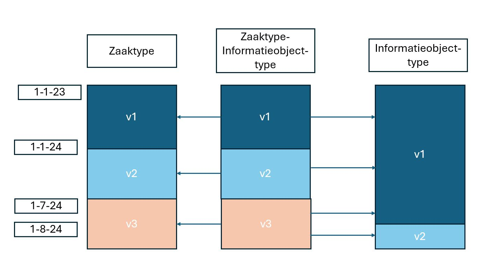
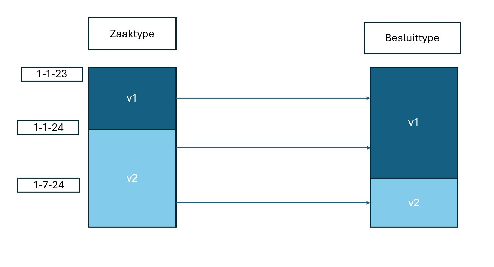

# Historiemodel in de Catalogi API

## Inleiding

Omdat van een Zaak, Informatieobject of Besluit altijd de bijbehorende definities moeten kunnen worden opgevraagd zoals die waren 
ten tijde van het aanmaken van die Zaak, Informatieobject of Besluit is bij het ontwikkelingen van de ZWG standaard gekozen voor 
het maken van nieuwe resources wanneer een type-definitie aangepast moet worden. Deze keuze, hoewel begrijpelijk gezien de tijd 
en kennis, heeft geleid tot een afwijking van gangbaar gedrag van API's. Het automatische versiebeheer in de Catalogi API wijkt af van 
dat van de overige API's: De resources in de Catalogi API zijn dus versies van de betreffende resources. "Zaaktype" moet gelezen worden 
als "Versie van een Zaaktype", "Informatieobjecttype" is een "Versie van een Informatieobjecttype", "Besluittype" is een "Versie van een Besluittype" etc.
Dit begrip is essentieel om de Catalogi API en het historiemodel te begrijpen en correct toe te kunnen passen.

Concreet betekent dit dat wanneer van een Zaaktype een nieuwe versie gemaakt wordt een nieuwe resource wordt aangemaakt met
een eigen identifier (UUID) en eigen waarden. Ditzelfde geldt voor Informatieobjecttype en Besluittype.

Nadeel hiervan is echter dat de relaties tussen de verschillende definities gelegd worden middels urls. Deze urls bevatten de UUID
en wanneer een nieuwe versie van een definitie gemaakt wordt moeten ook alle definities die naar de gewijzigde definitie verwijzen
aangepast worden. Dit wordt al snel een ingewikkelde kluwen van definities die lastg te beheren is.

Daarom is in Catalogi API 1.3.0 het zogenaamde historiemodel ingevoerd.

Het historiemodel moet een aantal doelen invullen:
1. Het beheer van de ZTC eenvoudiger maken.
2. Het gebruik van de ZTC door vak-/taakspecifieke applicaties (TSA's) ongewijzigd te laten

[](catalogi_history.png "Historiemodel Catalogi API ImZTC versie 2.2 - klik voor groot")

## Uitgangspunten

### Hoofdtypen en gerelateerde objecttypen

Het historiemodel kent de volgende uitgangspunten:

* Er bestaan drie hoofdtypen: 
	- Zaaktype
	- Informatieobjecttype
	- Besluittype  

	Deze drie hoofdtypen zijn in bovenstaande afbeelding weergegeven in de kleuren groen (Zaaktype met gerelateerde objecttypen), blauw (Informatieobjecttype) en rood (Besluittype).

* Elk hoofdtype kent een eigen lifecycle en kan onafhankelijk van de andere hoofdtypen doorontwikkeld worden. De uitzonderingen hierop zijn het aanmaken en beëindigen van het hoofdobjecttype.

* Elk hoofdtype kan één of meer gerelateerde objecttypen hebben. Dit zijn in feite groepsattributen en deze zijn hard, 1 op 1, gekoppeld aan een versie van het hoofdobjecttype. Bij wijzigingen van het hoofdobjecttype worden ook nieuwe versies van de gerelateerde objecttypen gemaakt en vice versa.

### Datumgeldigheid
Doordat versies van Zaaktype, Informatieobjecttype en Besluittype niet meer 1 op 1 aan elkaar gekoppeld zijn is het noodzakelijk te weten op welke datum de situatie van de gevraagde objecttypen en hun relaties getoond moeten worden. Met behulp van de (optionele) parameter datumGeldigheid kan de hele constellatie zoals geldig op die specifieke datum opgevraagd worden. Wanneer de datumGeldigheid niet expliciet meegegeven wordt geeft het antwoord de huidige constellatie, dus de situatie op het moment van aanroepen, weer.

Een versie van een Zaaktype, Informatieobjecttype of Besluittype kan ook opgevraagd worden door de identificatie (zaaktype.identificatie,
informatieobjecttype.omschrijving of besluittype.omschrijving) en de gewenste datumGeldigheid mee te geven. In situaties waarin wel de identificatie van een objecttype bekend is maar niet de exacte UUID of url is het dan toch mogelijk de correcte versie op te vragen.

De datumGeldigheid is vanuit de zaak geredeneerd de registratiedatum van de zaak.


### Gerelateerde objecttypen van Zaaktype
Bij een versie van een Zaaktype kan slechts één (1) versie van onderstaande gerelateerde objecttypen worden vastgelegd. 

Zaaktype kent de volgende gerelateerde objecttypen:
- Statustype
- Roltype
- Eigenschappen
- Zaakobjecttype
- ResultaatType
- ZaaktypeInformatieobjecttype


### Relatie Zaaktype heeft relevant Informatieobjecttype
- De relatie Zaaktype heeft relevant Informatieobjecttype wordt gelegd vanuit Zaaktype naar Informatieobjecttype.
- De relatie Zaaktype heeft relevant Informatieobjecttype wordt gelegd door in ZaaktypeInformatieobjecttype te verwijzen naar het zaaktype via zaaktype.url en naar het Informatieobjecttype via informatieobjecttype.omschrijving.
Op deze manier is aan één versie van een zaaktype versie-onafhankelijk een Informatieobjecttype gekoppeld. Bij een nieuwe versie van het Informatieobjecttype hoeft de relatie niet aangepast te worden. Het leggen of wijzigen 
(doorknippen) van de relatie is een wijziging (dus nieuwe versie) van het zaaktype en betekent ook een nieuwe versie van het zaakinformatieobjecttype.
- Bij het opvragen van een versie van een Zaaktype worden op basis van de datumGeldigheid de op dat moment geldige gerelateerde Informatieobjecttypen weergegeven.


### Relatie Zaaktype heeft relevant Besluittype
- De relatie Zaaktype heeft relevant Besluittype wordt gelegd vanuit Zaaktype naar Besluittype
- De relatie Zaaktype heeft relevant Besluittype wordt gelegd door in Zaaktype.besluittypen een array met Besluittype.omschrijving-en op te nemen. Idealiter zou de relatie gelegd worden met een relatieklasse zoals ZaaktypeInformatieobjecttype maar dat is helaas niet het geval. Ook hier is de relatie tussen (versie van een) Zaaktype en Besluittype onafhankelijk van de versie van het Besluittype.
- Bij het opvragen van een versie van een Zaaktype worden op basis van de datumGeldigheid de op dat moment geldige gerelateerde Besluittypen weergegeven.


## Is Catalogi API 1.3.x backwards compatible of niet
Op grond van bovenstaande beschrijvingen lijkt Catalogi API versie 1.3.x niet backwards compatible met versie 1.2.x. Voor een deel is dit zo. Namelijk de component waarmee de Zaaktype catalogus (ZTC) beheerd wordt
zal anders werken. Echter, omdat de ZTC beheercomponent een onderdeel is van het product ZTC is dit geen probleem. Immers, bij een nieuwe versie van een ZTC registercomponent hoort ook een nieuwe versie van de 
ZTC beheercomponent.

Consumer applicaties als taakspecifieke applicaties (TSA) of vakapplicaties kunnen nog steeds op de hun bekende wijze de ZTC raadplegen. Een TSA heeft immers alleen leesrechten op een ZTC, schrijven gebeurt alleen door de ZTC beheercomponent. Om de mogelijkheden van de laatste geïmplementeerde versie van de standaard ten volle te benutten is het noodzakelijk om de meest recente versie van de bij het registercomponent horende beheercomponent te gebruiken.

Grof gezegd zijn de GET operaties (GET Resource, GET List en HEAD) backwards compatible. De overige schrijf operaties (POST, PUT, PATCH, DELETE) zijn niet backwards compatible maar slechts door een beperkte set consumer applicaties te gebruiken.

Om deze redenen is besloten versie 1.3.x backwards compatible te laten zijn met eerdere versies. 

## Voorbeelden

###  Voorbeeld 1: Historiemodel toegepast op Zaaktype en Informatiemodeltype
[](hm_zt_iot.jpg "Historiemodel Zaaktype en Informatieobjecttype - klik voor groot")

In dit voorbeeld is van een Zaaktype versie 1 [gepubliceerd](./index#concepten) op 1 januari 2023. Deze versie van het Zaaktype verwijst via Zaaktype-Informatieobjecttype versie 1 naar Informatieobjecttype versie 1. Op 1 januari 2024 wordt versie 2 van het Zaaktype gepubliceerd waardoor ook een nieuwe versie van het Zaaktype-Informatieobjecttype wordt gemaakt. Het Informatieobjecttype wordt niet gewijzigd dus Zaaktype-Informatieobjecttype versie 2 verwijst nog steeds naar Informatieobject versie 1. 

Op 1 juli 2024 worden versie 3 van het Zaaktype en bijbehorend Zaaktype-Informatieobjecttype gepubliceerd. Versie 1 van het Informatieobjecttype is nog steeds geldig. Wanneer op 1 augustus 2024  versie 2 van het Informatieobjecttype wordt gepubliceerd blijven versie 3 van het Zaaktype en Zaaktype-Informatieobjecttype geldig en hoeft hiervan geen nieuwe versie te worden gepubliceerd. Op basis van de datumGeldigheid worden de juiste versies van het Zaaktype en Informatieobjecttype gecombineerd door de API.


### Voorbeeld 2: Historiemodel toegepast op Zaaktype en Besluittype
[](hm_zt_bt.jpg "Historiemodel Zaaktype en Besluittype - klik voor groot")

In dit voorbeeld is van een Zaaktype versie 1 [gepubliceerd](./index#concepten) op 1 januari 2023. Deze versie van het Zaaktype verwijst rechtstreeks via de Besluittype.omschrijving naar Besluittype versie 1. Op 1 januari 2024 wordt versie 2 van het Zaaktype gepubliceerd welke nog steeds via de Besluittype.omschrijving naar Besluittype versie 1 verwijst. 

Op 1 juli 2024 wordt versie 2 van het Besluittype gepubliceerd. Door de losse koppeling via Besluittype.omschrijving is het niet nodig om een nieuwe versie van het Zaaktype te maken. Op basis van de datumGeldigheid worden de juiste versies van het Zaaktype 
en Besluittype gecombineerd door de API.

## Voorbeelden API aanroepen

De hierboven beschreven theorie ziet er in berichten als volgt uit. NB. Dit is een leidraad om eigen berichten vorm te geven. Alleen de voor het historiemodel relevante delen van de berichten staan beschreven. Dat betekent dat verplichte attributen die niet voor het historiemodel relevant zijn weggelaten zijn. De beschreven berichten zijn dus niet 1 op 1 toepasbaar! Ook het publiceren van concept versies wordt buiten beschouwing gelaten.


### 1 Maak Besluittype aan
`POST /besluittypen`

Request:
```json
{
   	"omschrijving": "Besluit genomen",
	"beginGeldigheid" : "2024-03-01",
   	...
}
```

Response:
```json
{
   	"url" : "http://ztc.example.com/besluittypen/1/v1",
   	"omschrijving": "Besluit genomen",
	"beginGeldigheid" : "2024-03-01",
   	...
}
```


### 2 Maak Zaaktype aan
`POST /zaaktypen`

Request:
```json
{
	"identificatie": "Vergunningsaanvraag",
	"beginGeldigheid" : "2024-03-01",	
	...
	"besluittypen" : [ "Besluit genomen" ],
	...
}
```

Response:
```json
{
	"url" : "http://ztc.example.com/zaaktypen/1/v1",
	"identificatie": "Vergunningsaanvraag",
	"beginGeldigheid" : "2024-03-01",	
	...
	"besluittypen" : [ "http://ztc.example.com/besluittypen/1/v1" ],
	...
	
}
```

NB. de gerelateerde objecten Roltypen, Statustypen, ResultaatTypen, Eigenschappen, Zaakobjecttypen moeten ook aangemaakt worden maar worden niet beschreven.

### 3 maak Informatieobjecttype aan
`POST /informatieobjecttypen`

Requestbody:
```json
{
	"identificatie": "Paspoort",
	"beginGeldigheid" : "2024-03-01",	
	...
}
```

Response:
```json
{
	"url" : "http://ztc.example.com/informatieobjecttypen/1/v1",
	"identificatie": "Paspoort",
	"beginGeldigheid" : "2024-03-01",	
	...
}
```

### 4 Leg relatie tussen Zaaktype en Informatieobjecttype
`POST /zaaktype-informatieobjecttypen`

Request:
```json
{
  "zaaktype": "http://ztc.example.com/zaaktypen/1/v1",
  "informatieobjecttype": "Paspoort",
   ...
}
```

Response:
```json
{
  "url": "http://ztc.example.com/informatieobjecttypen/1/v1",
  "zaaktype": "http://ztc.example.com/zaaktypen/1/v1",
  "zaaktypeIdentificatie": "Vergunningsaanvraag",
  "informatieobjecttype": "Paspoort",
  ...
}
```

### 5 Vraag Zaaktype op
`GET http://ztc.example.com/zaaktypen/1/v1`

```json
{
	"url" : "http://ztc.example.com/zaaktypen/1/v1",
	"identificatie": "Vergunningsaanvraag",
	"beginGeldigheid" : "2024-03-01",	
	"informatieobjecttypen": [ "http://ztc.example.com/informatieobjecttypen/1/v1" ],
	"besluittypen" : [ "http://ztc.example.com/besluittypen/1/v1" ],
	...
}
```

### 6 maak een nieuwe versie van het Informatieobjecttype
`POST /informatieobjecttypen`

Request:
```json
{
	"identificatie": "Paspoort",
	"beginGeldigheid" : "2025-02-28",
	...
}
```

Response:
```json
{
	"url" : "http://ztc.example.com/informatieobjecttypen/1/v2",
	"identificatie": "Paspoort",
	"beginGeldigheid" : "2025-02-28",
	...
}
```


### 7 Vraag Zaaktype nogmaals op
`GET http://ztc.example.com/zaaktypen/1/v1`

```json
{
	"url" : "http://ztc.example.com/zaaktypen/1/v1",
	"identificatie": "Vergunningsaanvraag",
	"beginGeldigheid" : "2024-03-01",	
	"informatieobjecttypen": [ "http://ztc.example.com/informatieobjecttypen/1/v2" ], 
	"besluittypen" : [ "http://ztc.example.com/besluittypen/1/v1" ],
	...
}
```

**NB** In de bovenstaande response wordt nu de nieuwe `v2` versie van het informatieobjecttype teruggegeven.


### 8 Vraag Zaaktype op in oude situatie
`GET http://ztc.example.com/zaaktypen/1/v1?datumGeldigheid=31-12-2024`

of equivalent

`GET http://ztc.example.com/zaaktypen?identificatie=Vergunningsaanvraag&datumGeldigheid=31-12-2024`


```json
{
	"url" : "http://ztc.example.com/zaaktypen/1/v1",
	"identificatie": "Vergunningsaanvraag",
	"beginGeldigheid" : "2024-03-01",	
	...
	"informatieobjecttypen": [ "http://ztc.example.com/informatieobjecttypen/1/v1" ], 
	"besluittypen" : [ "http://ztc.example.com/besluittypen/1/v1" ],
	...
}
```

**NB** In de bovenstaande response wordt nu de oude `v1` versie van het informatieobjecttype teruggegeven vanwege de `datumGeldigheid="31-12-2024` query parameter.

# Gedetailleerde API aanroepen

<!--
## Voorbeeld 1: Historiemodel toegepast op Zaaktype en Informatiemodeltype

### Maak Zaaktype versie v1 aan
`POST /zaaktypen`

Request:
```json
{
	"identificatie": "Vergunningsaanvraag",
	"beginGeldigheid" : "2023-01-01",	
	...
}
```

Response:
```json
{
	"url" : "http://ztc.example.com/zaaktypen/1/v1",
	"identificatie": "Vergunningsaanvraag",
	"beginGeldigheid" : "2023-01-01",	
	...	
}
```

### Maak Informatieobjecttype versie v1 aan
`POST /informatieobjecttypen`

Requestbody:
```json
{
	"identificatie": "Paspoort",
	"beginGeldigheid" : "2023-01-01",	
	...
}
```

Response:
```json
{
	"url" : "http://ztc.example.com/informatieobjecttypen/1/v1",
	"identificatie": "Paspoort",
	"beginGeldigheid" : "2023-01-01",	
	...
}
```

### Leg relatie tussen Zaaktype en Informatieobjecttype

`POST /zaaktype-informatieobjecttypen`

Request:
```json
{
  "zaaktype": "http://ztc.example.com/zaaktypen/1/v1",
  "informatieobjecttype": "Paspoort",
   ...
}
```

Response:
```json
{
  "url": "http://ztc.example.com/informatieobjecttypen/1/v1",
  "zaaktype": "http://ztc.example.com/zaaktypen/1/v1",
  "zaaktypeIdentificatie": "Vergunningsaanvraag",
  "informatieobjecttype": "Paspoort",
  ...
}
```
### Maak Zaaktype versie v2 aan

`POST /zaaktypen`

Request:
```json
{
	"identificatie": "Vergunningsaanvraag",
	"beginGeldigheid" : "2024-01-01",	
	...
}
```

Response:
```json
{
	"url" : "http://ztc.example.com/zaaktypen/1/v1",
	"identificatie": "Vergunningsaanvraag",
	"beginGeldigheid" : "2024-01-01",	
	...	
}
```
-->

## Voorbeeld 2: Historiemodel toegepast op Zaaktype en Besluittype

###  Maak een besluittype aan
`POST /besluittypen`

Request:
```json
{
   	"omschrijving": "Besluit genomen",
	"beginGeldigheid" : "2023-01-01",
   	...
}
```

Response:
```json
{
   	"url" : "http://ztc.example.com/besluittypen/bt111",
   	"omschrijving": "Besluit genomen",
	"beginGeldigheid": "2023-01-01",
	...
	"concept": True
}
```

### Publiceer besluittype versie v1
`POST /besluittypen/111/publish`

Response:
```json
{
   	"url" : "http://ztc.example.com/besluittypen/bt111",
   	"omschrijving": "Besluit genomen",
	"beginGeldigheid": "2023-01-01",
	...
	"concept": False
}
```

### Maak een zaaktype aan
`POST /zaaktypen`

Request:
```json
{
	"identificatie": "Vergunningsaanvraag",
	"beginGeldigheid": "2023-01-01",	
	...	
	"besluittypen": [ "Besluit genomen" ],
	...
}
```

Response:
```json
{
	"url" : "http://ztc.example.com/zaaktypen/zt111",
	"identificatie": "Vergunningsaanvraag",
	"beginGeldigheid" : "2023-01-01",	
	...
	"besluittypen" : [ "http://ztc.example.com/besluittypen/bt111" ],
	...
	"concept": True
}
```

### Publiceer zaaktype versie v1
`POST /zaaktypen/zt111/publish`

Response:
```json
{
	"url" : "http://ztc.example.com/zaaktypen/zt111",
	"identificatie": "Vergunningsaanvraag",
	"beginGeldigheid" : "2023-01-01",	
	...
	"besluittypen" : [ "http://ztc.example.com/besluittypen/bt111" ],
	...
	"concept": False
}
```


