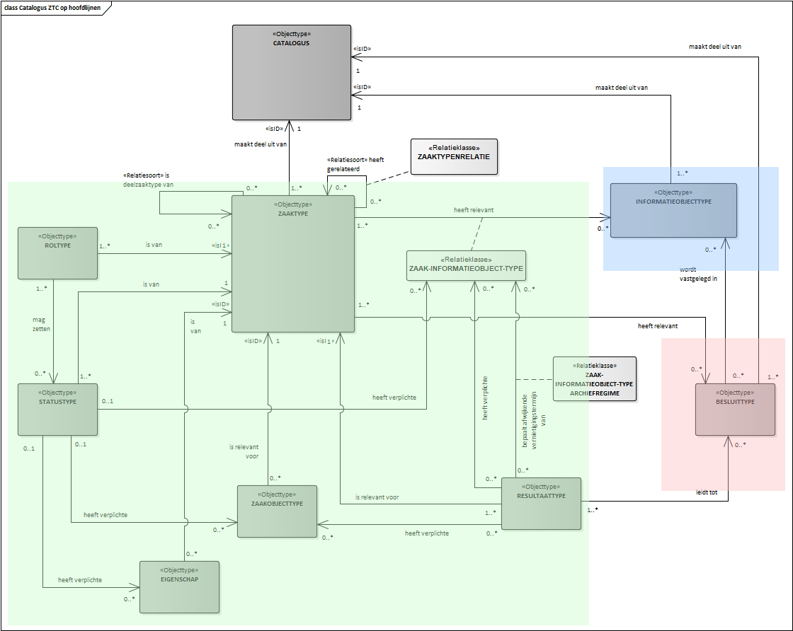

# Historiemodel in de Catalogi API

## Inleiding

Omdat van een Zaak, Informatieobject of Besluit altijd de bijbehorende definities moeten kunnen worden opgevraagd zoals die waren 
ten tijde van het aanmaken van die Zaak, Informatieobject of Besluit is bij het ontwikkelingen van de ZWG standaard gekozen voor 
het maken van nieuwe resources wanneer een type-definitie aangepast moet worden. Deze keuze, hoewel begrijpelijk gezien de tijd 
en kennis, heeft geleid tot een afwijking van gangbaar gedrag van API's. Het automatische versiebeheer in de Catalogi API wijkt af van 
dat van de overige API's: De resources in de Catalogi API zijn dus versies van de betreffende resources. "Zaaktype" moet gelezen worden 
als "Versie van een Zaaktype", "Informatieobjecttype" is een "Versie van een Informatieobjecttype", "Besluittype" is een "Versie van een Besluittype" etc.
Dit begrip is essentieel om de Catalogi API en het historiemodel te begrijpen en correct toe te kunnen passen.

Concreet betekent dit dat wanneer van een Zaaktype een nieuwe versie gemaakt wordt een nieuwe resource wordt aangemaakt met
een eigen identifier (UUID) en eigen waarden. Ditzelfde geldt voor Informatieobjecttype en Besluittype.

Nadeel hiervan is echter dat de relaties tussen de verschillende definities gelegd worden middels urls. Deze urls bevatten de UUID
en wanneer een nieuwe versie van een definitie gemaakt wordt moeten ook alle definities die naar de gewijzigde definitie verwijzen
aangepast worden. Dit wordt al snel een ingewikkelde kluwen van definities die lastig te beheren is.

Daarom is in Catalogi API 1.3.0 het zogenaamde historiemodel ingevoerd.

Het historiemodel moet een aantal doelen invullen:
1. Het beheer van de ZTC eenvoudiger maken.
2. Het gebruik van de ZTC door vak-/taakspecifieke applicaties (TSA's) ongewijzigd te laten

[](catalogi_history.png "Historiemodel Catalogi API ImZTC versie 2.2 - klik voor groot")

## Theorie van het historiemodel

### Hoofdtypen en gerelateerde objecttypen

Het historiemodel kent de volgende uitgangspunten:

* Er bestaan drie hoofdtypen: 
	- Zaaktype
	- Informatieobjecttype
	- Besluittype  

	Deze drie hoofdtypen zijn in bovenstaande afbeelding weergegeven in de kleuren groen (Zaaktype met gerelateerde objecttypen), blauw (Informatieobjecttype) en rood (Besluittype).

* Elk hoofdtype kent een eigen lifecycle en kan onafhankelijk van de andere hoofdtypen doorontwikkeld worden. De uitzonderingen hierop zijn het aanmaken en beëindigen van het hoofdobjecttype.

* Elk hoofdtype kan één of meer gerelateerde objecttypen hebben. Dit zijn in feite groepsattributen en deze zijn hard, 1 op 1, gekoppeld aan een versie van het hoofdobjecttype. Bij wijzigingen van het hoofdobjecttype worden ook nieuwe versies van de gerelateerde objecttypen gemaakt en vice versa.

### Datumgeldigheid
Doordat versies van Zaaktype, Informatieobjecttype en Besluittype niet meer 1 op 1 aan elkaar gekoppeld zijn is het noodzakelijk te weten op welke datum de situatie van de gevraagde objecttypen en hun relaties getoond moeten worden. Met behulp van de (optionele) parameter datumGeldigheid kan de hele constellatie zoals geldig op die specifieke datum opgevraagd worden. Wanneer de datumGeldigheid niet expliciet meegegeven wordt geeft het antwoord de huidige constellatie, dus de situatie op het moment van aanroepen, weer.

Een versie van een Zaaktype, Informatieobjecttype of Besluittype kan ook opgevraagd worden door de identificatie (zaaktype.identificatie,
informatieobjecttype.omschrijving of besluittype.omschrijving) en de gewenste datumGeldigheid mee te geven. In situaties waarin wel de identificatie van een objecttype bekend is maar niet de exacte UUID of url is het dan toch mogelijk de correcte versie op te vragen.

De datumGeldigheid is vanuit de zaak geredeneerd de registratiedatum van de zaak.


### Gerelateerde objecttypen van Zaaktype
Bij een versie van een Zaaktype kan slechts één (1) versie van onderstaande gerelateerde objecttypen worden vastgelegd. 

Zaaktype kent de volgende gerelateerde objecttypen:
- Statustype
- Roltype
- Eigenschappen
- Zaakobjecttype
- ResultaatType
- ZaaktypeInformatieobjecttype


### Relatie Zaaktype heeft relevant Informatieobjecttype
- De relatie Zaaktype heeft relevant Informatieobjecttype wordt gelegd vanuit Zaaktype naar Informatieobjecttype.
- De relatie Zaaktype heeft relevant Informatieobjecttype wordt gelegd door in ZaaktypeInformatieobjecttype te verwijzen naar het zaaktype via zaaktype.url en naar het Informatieobjecttype via informatieobjecttype.omschrijving.
Op deze manier is aan één versie van een zaaktype versie-onafhankelijk een Informatieobjecttype gekoppeld. Bij een nieuwe versie van het Informatieobjecttype hoeft de relatie niet aangepast te worden. Het leggen of wijzigen 
(doorknippen) van de relatie is een wijziging (dus nieuwe versie) van het zaaktype en betekent ook een nieuwe versie van het zaakinformatieobjecttype.
- Bij het opvragen van een versie van een Zaaktype worden op basis van de datumGeldigheid de op dat moment geldige gerelateerde Informatieobjecttypen weergegeven.


### Relatie Zaaktype heeft relevant Besluittype
- De relatie Zaaktype heeft relevant Besluittype wordt gelegd vanuit Zaaktype naar Besluittype
- De relatie Zaaktype heeft relevant Besluittype wordt gelegd door in Zaaktype.besluittypen een array met Besluittype.omschrijving-en op te nemen. Idealiter zou de relatie gelegd worden met een relatieklasse zoals ZaaktypeInformatieobjecttype maar dat is helaas niet het geval. Ook hier is de relatie tussen (versie van een) Zaaktype en Besluittype onafhankelijk van de versie van het Besluittype.
- Bij het opvragen van een versie van een Zaaktype worden op basis van de datumGeldigheid de op dat moment geldige gerelateerde Besluittypen weergegeven.


### Is Catalogi API 1.3.x backwards compatible of niet
Op grond van bovenstaande beschrijvingen lijkt Catalogi API versie 1.3.x niet backwards compatible met versie 1.2.x. Voor een deel is dit zo. Namelijk de component waarmee de Zaaktype catalogus (ZTC) beheerd wordt
zal anders werken. Echter, omdat de ZTC beheercomponent een onderdeel is van het product ZTC is dit geen probleem. Immers, bij een nieuwe versie van een ZTC registercomponent hoort ook een nieuwe versie van de 
ZTC beheercomponent.

Consumer applicaties als taakspecifieke applicaties (TSA) of vakapplicaties kunnen nog steeds op de hun bekende wijze de ZTC raadplegen. Een TSA heeft immers alleen leesrechten op een ZTC, schrijven gebeurt alleen door de ZTC beheercomponent. Om de mogelijkheden van de laatste geïmplementeerde versie van de standaard ten volle te benutten is het noodzakelijk om de meest recente versie van de bij het registercomponent horende beheercomponent te gebruiken.

Grof gezegd zijn de GET operaties (GET Resource, GET List en HEAD) backwards compatible. De overige schrijf operaties (POST, PUT, PATCH, DELETE) zijn niet backwards compatible maar slechts door een beperkte set consumer applicaties te gebruiken.

Om deze redenen is besloten versie 1.3.x backwards compatible te laten zijn met eerdere versies. 


## Historiemodel toegepast op Zaaktype en Besluittype
[](zt_bt.png "Historiemodel Zaaktype en Besluittype - klik voor groot")

In dit voorbeeld is de eerste versie v1 van zaaktype ZT1 [gepubliceerd](./index#concepten) op 1 januari 2023. Deze versie van het Zaaktype is via het attribuut "Besluittype.omschrijving" gekoppeld met besluittype BT1. Op het moment van verwijzing bestaat alleen versie v1 van het besluittype BT1. 

Op 1 januari 2024 wordt versie v2 van het zaaktype ZT1  gepubliceerd welke ook wordt gekoppeld aan besluittype BT1.

Op 1 juli 2024 wordt versie v2 van het besluittype BT1 gepubliceerd. Door de losse koppeling (via "Besluittype.omschrijving" in plaats van "Besluittype.url") kunnen beide versies van zaaktype ZT1 (v1 en v2) beiden gebruik maken van besluittype v2 hoewel deze later gepubliceerd is.

To do:
 - leg de stippellijn uit.


###  Maak het besluittype "BT1" versie 1 aan
`POST {{ztc_url}}/besluittypen`

Request:
```
{
   	"omschrijving": "BT1",
	"beginGeldigheid" : "2023-01-01",
	"toelichting": "Dit is versie 1 van BT1",
   	...
}
```

Response:
```
{
   	"url" : "{{ztc_url}}/besluittypen/{{uuid_bt1_v1}}",
   	"omschrijving": "ZT1",
	"beginGeldigheid": "2023-01-01",
	"eindeGeldigheid": null,
	"toelichting": "Dit is versie 1 van BT1",
	...
	"concept": true
}
```

### Publiceer het besluittype
`POST {{ztc_url}}/besluittypen/{{uuid_bt1_v1}}/publish`

Response:
```
{
   	"url" : "{{ztc_url}}/besluittypen/{{uuid_bt1_v1}}",
   	"omschrijving": "ZT1",
	"beginGeldigheid": "2023-01-01",
	"eindeGeldigheid": null,
	"toelichting": "Dit is versie 1 van BT1",
	...
	"concept": false
}
```

### Maak het zaaktype "ZT1" versie 1 aan en relateer het aan besluittype "BT1"
`POST {{ztc_url}}/zaaktypen`

Request:
```
{
	"identificatie": "ZT1",
	"beginGeldigheid": "2023-01-01",
	"toelichting": "Dit is versie 1 van ZT1",	
	...	
	"besluittypen": [ "BT1" ],
	...
}
```

Response:
```
{
	"url" : "{{ztc_url}}/zaaktypen/{{uuid_zt1_v1}}",
	"identificatie": "ZT1",
	"beginGeldigheid" : "2023-01-01",	
	"eindeGeldigheid": null,
	"toelichting": "Dit is versie 1 van ZT1",
	...
	"besluittypen" : [ "{{ztc_url}}/besluittypen/{{uuid_bt1_v1}}" ],
	...
	"concept": true
}
```

### Publiceer het zaaktype
`POST {{ztc_url}}/zaaktypen/{{uuid_zt1_v1}}/publish`

Response:
```
{
	"url" : "{{ztc_url}}/zaaktypen/{{uuid_zt1_v1}}",
	"identificatie": "ZT1",
	"beginGeldigheid" : "2023-01-01",
	"eindeGeldigheid": null,	
	"toelichting": "Dit is versie 1 van ZT1",
	...
	"besluittypen" : [ "{{ztc_url}}/besluittypen/{{uuid_bt1_v1}}" ],
	...
	"concept": false
}
```

### Maak versie 2 van zaaktype "ZT1" aan en relateer het aan besluittype "BT1"
`POST {{ztc_url}}/zaaktypen`

Request:
```
{
	"identificatie": "ZT1",
	"beginGeldigheid": "2024-01-01",
	"toelichting": "Dit is versie 2 van ZT1",
	...	
	"besluittypen": [ "BT1" ],
	...
}
```

Response:
```
{
	"url" : "{{ztc_url}}/zaaktypen/{{uuid_zt1_v2}}",
	"identificatie": "ZT1",
	"beginGeldigheid" : "2024-01-01",	
	"eindeGeldigheid": null,
	"toelichting": "Dit is versie 2 van ZT1",
	...
	"besluittypen" : [ "{{ztc_url}}/besluittypen/{{uuid_bt1_v1}}" ],
	...
	"concept": true
}
```

### Geef versie 1 van het zaaktype een eindegeldigheid

Er kunnen niet twee zaaktypen tegelijk geldig zijn. Dus we geven het oude zaaktype een eindegeldigheid van 1 dag voor de begingeldigheid van het nieuwe zaaktype.

`PATCH {{ztc_url}}/zaaktypen/{{uuid_zt1_v1}}`


Response:
```
{
	"url" : "{{ztc_url}}/zaaktypen/{{uuid_zt1_v1}}",
	"identificatie": "ZT1",
	"beginGeldigheid": "2023-01-01",
	"eindeGeldigheid": "2023-12-31",
	...
	"besluittypen" : [ "{{ztc_url}}/besluittypen/{{uuid_bt1_v1}}" ],
	...
	"concept": true
}
```


### Publiceer zaaktype versie v2
`POST {{ztc_url}}/zaaktypen/{{uuid_zt1_v2}}/publish`

Response:
```
{
	"url" : "{{ztc_url}}/zaaktypen/{{uuid_zt1_v2}}",
	"identificatie": "ZT1",
	"beginGeldigheid" : "2024-01-01",	
	...
	"besluittypen" : [ "{{ztc_url}}/besluittypen/{{uuid_bt1_v1}}" ],
	...
	"concept": false
}
```


###  Maak een concept besluittype v2 aan
`POST /besluittypen`

Request:
```
{
   	"omschrijving": "BT1",
	"beginGeldigheid" : "2024-07-01",
	"toelichting": "Dit is versie 2 van BT1",
   	...
}
```

Response:
```
{
   	"url" : "{{ztc_url}}/besluittypen/{{uuid_bt1_v2}}",
   	"omschrijving": "Besluit genomen",
	"beginGeldigheid": "2024-07-01",
	"toelichting": "Dit is versie 2 van BT1",
	...
	"concept": true
}
```

### Publiceer besluittype versie v2
`POST /besluittypen/besluit-genomen-v2/publish`

Response:
```
{
   	"url" : "{{ztc_url}}/besluittypen/{{uuid_bt1_v2}}",
   	"omschrijving": "Besluit genomen",
	"beginGeldigheid": "2024-07-01",
	"toelichting": "Dit is versie 2 van BT1",
	...
	"concept": false
}
```

### Bevraag alle versies van zaaktype "zt1"

`GET {{ztc_url}}/zaaktypen?identificatie=ZT1`

```
{
    "count": 2,
    "next": null,
    "previous": null,
    "results": [
		{
			"url" : "{{ztc_url}}/zaaktypen/{{uuid_zt1_v1}}",
			"identificatie": "ZT1",
			"beginGeldigheid": "2023-01-01",
			"eindeGeldigheid": "2023-12-31",
			"toelichting": "Dit is versie 1 van ZT1",
			...
			"besluittypen" : [ "{{ztc_url}}/besluittypen/{{uuid_bt1_v1}}" ],
			...
			"concept": false
		},	
		{
			"url" : "{{ztc_url}}/zaaktypen/{{uuid_zt1_v2}}",
			"identificatie": "ZT1",
			"beginGeldigheid" : "2024-01-01",	
			"toelichting": "Dit is versie 2 van ZT1",
			...
			"besluittypen" : [ 
				"{{ztc_url}}/besluittypen/{{uuid_bt1_v1}}",
				"{{ztc_url}}/besluittypen/{{uuid_bt1_v2}}"
			],
			...
			"concept": false
		}
	]
}
```

###  Bevraag "ZT1" op 1-4-2024

`GET {{ztc_url}}/zaaktypen?identificatie=ZT1&datumGeldigheid=2024-04-01`

```
{
    "count": 1,
    "next": null,
    "previous": null,
    "results": [
		{
			"url" : "{{ztc_url}}/zaaktypen/{{uuid_zt1_v2}}",
			"identificatie": "ZT1",
			"beginGeldigheid" : "2024-01-01",	
			"toelichting": "Dit is versie 2 van ZT1",
			...
			"besluittypen" : [ "{{ztc_url}}/besluittypen/{{uuid_bt1_v1}}" ],
			...
			"concept": false
		}
	]
}
```


###  Bevraag "ZT1" op 1-10-2024 (na de creatie van de tweede versie van "BT1" op 1-7-2024)
`GET {{ztc_url}}/zaaktypen?identificatie=ZT1?datumGeldigheid=2024-10-01`

```
{
    "count": 1,
    "next": null,
    "previous": null,
    "results": [
		{
			"url" : "{{ztc_url}}/zaaktypen/{{uuid_zt1_v2}}",
			"identificatie": "ZT1",
			"beginGeldigheid" : "2024-01-01",	
			"toelichting": "Dit is versie 2 van ZT1",
			...
			"besluittypen" : [ "{{ztc_url}}/besluittypen/{{uuid_bt1_v2}}" ],
			...
			"concept": false
		}
	]
}
```

In dit geval wordt versie v2 van het besluittype teruggegeven in plaats van versie v1.

<!--
To do:

- Uitzoeken of je in Oneground gepubliceerde zaaktypen kunt deleten. Nu kan ik geen identificatienamen zoals  "ZT1" hergebruiken. Bovendien kun je niet een scriptje opnieuw draaien (erg vervelend). Je wilt namelijk te tests kunnen opruimen automatisch.
- Uitzoeken of je typen kunt corrigeren. Ik heb die rechten blijkbaar niet.
- Nieuwe release Catalogi API is not niet mogelijk als er nog zoveel vragen zijn. Zie de uitstaande vraag naar Johannes in de email
- We kunnen Oneground of OpenZaak gebruiken als referentie-implementatie van onze testscripts en de gevallen mocken waar ze niet voldoen aan de standaard.
- We de betekenis van de velden: versiedatum, beginObject, eindObject.
- Bestudeer de issues over gevallen waarin eindGeldigheid < beginGeldigheid
- Gebruik expand voor leesbaarheid in de voorbeeld berichten. O nee helaas zit die nog niet in de ztc.
- Moet de eindgeldigheid van de vorige versie van het object niet worden aangepast als er een nieuwe versie van bijv. een zaaktype wordt aangemaakt?
- Want anders krijg je gaten in de aansluiting van geldigheden in de opeenvolgende versies. Je krijgt dan een lege gerelateerde.
- Kijk hoe versiedatum wordt gebruikt in de postman collectie van Johannes.
- Is het de bedoeling dat er gaten kunnen zitten in de geldigheidsperioden? Dit bepaalt ook of je de eindGeldigheid zetten kunt automatiseren?
- Johannes heeft een ander beeld bij één van de diagrammen. Dit moet opgelost worden
- Expand toevoegen aan deze voorbeeldberichten voor de duidelijkheid!
- Mag je versies met verlopen geldigheid nog aanpassen? Blijkbaar wel in Oneground
- Mag je beginGeldigheid in de toekomst zetten?
- eindGeldigheid vorig record moet 1 dag voor beginGeldigheid huidig record staan. Is dit ergens beschreven?
- Speelt de huidige tijd en datum een rol in de semantiek?
- Bila met Johannes:
  - Zaken kunnen recenter zijn dan de eindGeldigheid van het zaaktype waaraan ze verbonden zijn
    - Eigenlijk zouden zaken en zaaktypen ook loosly coupled moeten zijn. Dus niet verbinden via url maar via identifier.
  - Versies van zaaktypen, besluittypen, etc.  pinnen op een url lijkt een design fout.
  - Issue #2474 gaat over deze problematiek volgens JB.
  - Je mag oude versies corrigeren zolang het maar toevoegingen zijn.
  - Als het geen toevoegingen zijn moet je een nieuwe versie aanmaken van het zaaktype etc. Maar waarom maak je niet gewoon een nieuw zaaktype aan en werk je zonder versies?
  - Nieuwe versies aanmaken van Besluittypen komt nauwelijks voor volgens Johannes, wel Informatieobjecttypen.
  - Vraag voor JB. Waarom zou je het concept versie voor zaaktypen willen hebben? Zaken hebben namelijk ook geen versies?
- Zaaktypen en Besluittypen  worden niet gekoppeld via koppelresource maar Zaaktypen en Informatieobjecttypen wel -> inconsistent.
- Moet een "GET all" op zaaktypen niet gewoon de Besluitomschrijvingen teruggeven in plaats van urls van de besluiten.
- Speelt eindGeldigheid uberhaupt wel een rol want waarom mag je nieuwe zaken niet aan oude versies van zaaktypen koppelen???? Zijn hier business rules voor? Checkt Oneground daarop? Kan ik zelf uitvinden in  Oneground
- Plaatje in dit verhaal aanpassen conform nieuwe plaatje in Powerpoint met paralelle versie-balken
- In de repons moet bij het koppelen van een zaaktype aan een besluittype  in de repons de omschrijving van het besluittype terugkomen en niet de url('s). Change in de OAS!!! Johannes eens? We maken de urls depricated.
- Breid de tutorial uit met zaken en besluiten waaraan de types gekoppeld zijn.
- Wel of niet gebruik van cross resource voor koppelen zaaktypen en informatieobjecten? Niet consistent met besluittypen!!!
- Bij het aanmaken van een nieuwe versie van een zaaktype, wil je eigenlijk een duplicate functie in de API!
- Bij het maken van een nieuwe versie van een zaaktype wil je een fout herstellen, maar ga je dan ook alle zaaktypen die aan het foute zaaktype verbonden waren koppelen aan de nieuwe versie van het zaaktype. Als je dat niet doet wat voor zin heeft het dan. De wijziging is dan waarschijnlijk geen correctie maar een materiele wijziging die alleen gebruikt zal worden door nieuwe aan te maken zaken. Dus de versionering is alleen maar een groupering van zaaktypen die bij elkaar horen.
- Besluiten kun je vanuit de zaken api opvragen als sub resource: /zaken/{uuid}/besluiten
  - Ik vraag me af of je deze ook kunt expanden?
- Als je een zaaktype opvraagt wat moet er dan in het veld "zaaktype.besluittypen" zitten?
  - Een lijst van strings met de omschrijvingen. Kun je daarop expanden?
  - Een lijst met urls met alle besluittypen inclusief hun versies
  - Lijst met urls met alleeen de laatste versie van de besluittypen
  - Eigenlijk wil je meerdere lijsten terugkrijgen:
    - De lijst met besluittypen versies die door de zaak gebruikt zijn om besluiten te koppelen
    - De lijst met besluittypen versies die geldig zijn om nieuwe besluiten mee te maken. 
- Toekomstige zaaktypen maken de semantiek lastiger en dan heb je echt de paraemter datumgeldigheid nodig
- Versies van Besluittypen begrijp ik want dan kun je een zaaktype losjes koppelen aan nieuwe besluittypen. Maar versies van zaaktypen begrijp ik niet. Er wordt toch nergens losjes gekoppeld aan zaaktypen.
- Wat gaat er mis als je geen versies van zaaktypen en besluittypen hebt.
- Wordt de parameter datumGeldigheid ook gebruikt met historische waarden dus niet alleen met vandaag?
- Zie ook de vragen in de chat: De query parameter /besluittypen?zaaktypen=ZT1 met als waarde een zaaktype identificatie lijkt me niet logisch. Vanuit een zaak gezien ken je alleen de zaaktype url  en wil je daarop bevragen om de besluittypen die voor de zaak in kwestie relevant zijn op te vragen.
- Door de versies die gegroepeerd zijn door een identificatie of omschrijving veld wil je kunnen expanden/drillen. Maar zo is expand nog niet ingericht.
- Welke versie van het besluittype wordt teruggegeven als er een toekomstige besluittype is klaargezet? De nu geldige of de laatste (het toekomstige besluittype). JB antwoord: de nu geldige.
- Misschien eindeGeldigheid toch niet zo slecht dat weet je wanneer ze niet meer geldig waren voor gebruik. Ook voor versies van zaaktypen is dat van belang.
- Johannes is het eens om de reponse op de bevraging van het zaaktype uit te breiden met extra attributen:
  - "geldigeBesluittypen": alleen de geldige die nu gebruikt mogen worden
  - "besluittypen": alle versies
  - "besluittypenOmschrijvingen": een lijst met omschrijvingen. Het zou leuk zijn als je zou kunnen expanden op de omschrijvingen.

-->


