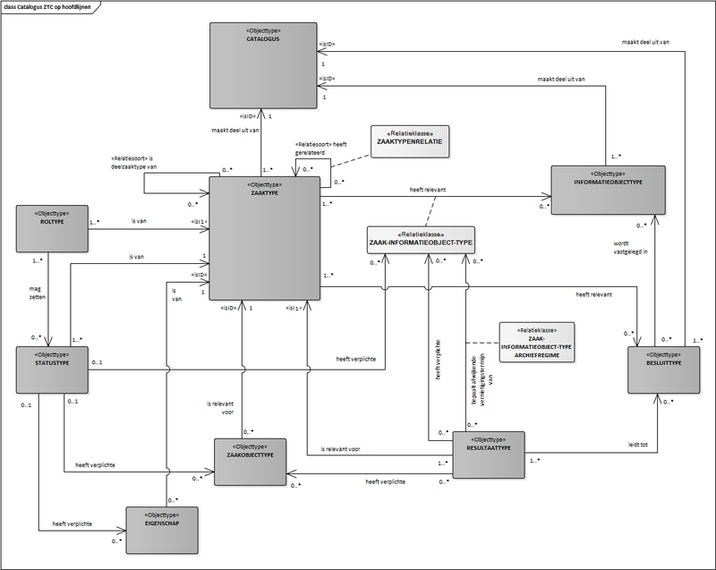

# Catalogi API

API voor opslag en ontsluiting van zaaktype-catalogi, zaaktypen en onderliggende typen.

De API ondersteunt het opslaan en naar andere applicaties ontsluiten van zaaktype-catalogi met zaaktypen. Deze gegevens kunnen door applicaties worden gebruikt om voor zaken van een bepaald type de juiste gegevens (statustypen, resultaattypen, informatieobjecttypen, etc.) te bepalen. Applicaties die gebruik maken van deze zaaktypegegevens zijn bijvoorbeeld een zaakafhandelcomponent, een VTH-applicatie of een subsidie-applicatie. Opslag van zaaktypegegevens vindt plaats conform het informatiemodel ZTC.

## Gegevensmodel
De Catalogi API implementeert het informaitemodel ImZTC versie 2.2. Voor meer informatie over het ImZTC versie 2.2 zie [GEMMA Online](https://www.gemmaonline.nl/index.php/ImZTC_2.2_in_ontwikkeling)

## Specificatie van de Catalogi API

[Referentie-implementatie Catalogi API](https://catalogi-api.vng.cloud)

### Release Notes
De [release notes](./release_notes.md) van de versies staan beschreven op deze [pagina](./release_notes.md).

### Known Issues
De [known issues](./known_issues.md) van de versies staan beschreven op deze [pagina](./known_issues.md).

### Releases

<!-- 1.3.2 (draft)   | 20-10-2025    | <a href="https://redocly.github.io/redoc/?url=https://raw.githubusercontent.com/VNG-Realisatie/gemma-zaken/full_expand_jekyll/api-specificatie/ztc/1.3.x/1.3.2/openapi.yaml" target="_blank" rel="noopener noreferrer">ReDoc (open in nieuw venster)</a> -->

| Versie         | Familie   | Release datum     | Open API Specificatie                                            | Gedrag en regels                                       |
|:---------------|:---------:|:----------------- |:---------------------------------------------------------------- |:-------------------------------------------------------|
| 1.3.2 (draft)  | zgw 1.6   | nader te bepalen  | [ReDoc][catalogi-1.3.2-redoc], [Swagger][catalogi-1.3.2-swagger] | [spec 1.0.0 - 1.3.2](ztc/1.3.x/1.3.2/specification.md) |
| 1.3.1          | -         | 26-09-2023        | [ReDoc][catalogi-1.3.1-redoc], [Swagger][catalogi-1.3.1-swagger] | [spec 1.0.0 - 1.3.1](#specificatie-van-gedrag)         |
| 1.2.1          | -         | 26-09-2023        | [ReDoc][catalogi-1.2.1-redoc], [Swagger][catalogi-1.2.1-swagger] | [spec 1.0.0 - 1.3.1](#specificatie-van-gedrag)         |
| 1.3.0          | -         | 22-08-2023        | [ReDoc][catalogi-1.3.0-redoc], [Swagger][catalogi-1.3.0-swagger] | [spec 1.0.0 - 1.3.1](#specificatie-van-gedrag)         |
| 1.2.0          | -         | 19-12-2022        | [ReDoc][catalogi-1.2.0-redoc], [Swagger][catalogi-1.2.0-swagger] | [spec 1.0.0 - 1.3.1](#specificatie-van-gedrag)         |
| 1.1.0          | -         | 24-05-2021        | [ReDoc][catalogi-1.1.0-redoc], [Swagger][catalogi-1.1.0-swagger] | [spec 1.0.0 - 1.3.1](#specificatie-van-gedrag)         |
| 1.0.0          | -         | 2019-11-18        | [ReDoc][catalogi-1.0.0-redoc], [Swagger][catalogi-1.0.0-swagger] | [spec 1.0.0 - 1.3.1](#specificatie-van-gedrag)         |

[catalogi-1.0.1-redoc]: ./redoc-1.0.1
[catalogi-1.0.1-swagger]: ./swagger-ui-1.0.1
[catalogi-1.0.1-diff]: https://github.com/VNG-Realisatie/catalogi-api/compare/1.0.0...1.0.1?diff=split#diff-3dc0f8f7373b32ea3bf5eabe02993f9a

[catalogi-1.0.0-redoc]: ./redoc-1.0.0
[catalogi-1.0.0-swagger]: ./swagger-ui-1.0.0

[catalogi-1.1.0-redoc]: ./redoc-1.1.0
[catalogi-1.1.0-swagger]: ./swagger-ui-1.1.0
[catalogi-1.1.0-diff]: https://github.com/VNG-Realisatie/catalogi-api/compare/stable/1.0.x...stable/1.1.x

[catalogi-1.2.0-redoc]: ./redoc-1.2.0
[catalogi-1.2.0-swagger]: ./swagger-ui-1.2.0
[catalogi-1.2.0-diff]: https://github.com/VNG-Realisatie/catalogi-api/compare/stable/1.1.x...stable/1.2.x

[catalogi-1.3.0-redoc]: ./redoc-1.3.0
[catalogi-1.3.0-swagger]: ./swagger-ui-1.3.0
 
[catalogi-1.2.1-redoc]: ./redoc-1.2.1
[catalogi-1.2.1-swagger]: ./swagger-ui-1.2.1

[catalogi-1.3.1-redoc]: ./redoc-1.3.1
[catalogi-1.3.1-swagger]: ./swagger-ui-1.3.1

[catalogi-1.3.2-redoc]: ./redoc-1.3.2
<!-- [catalogi-1.3.2-redoc]: https://redocly.github.io/redoc/?url=https://raw.githubusercontent.com/VNG-Realisatie/gemma-zaken/full_expand_jekyll/api-specificatie/ztc/1.3.x/1.3.2/openapi.yaml -->
[catalogi-1.3.2-swagger]: ./swagger-ui-1.3.2

## Specificatie van gedrag

Zaaktypecatalogi (ZTC) MOETEN aan twee aspecten voldoen:

* de ZTC [`openapi.yaml`](../../../api-specificatie/ztc/current_version/openapi.yaml) MOET volledig geïmplementeerd zijn.

* het run-time gedrag beschreven in deze standaard MOET correct geïmplementeerd
  zijn.

Het ZTC haalt informatie uit selectielijsten en de Gemeentelijke Selectielijst
2017. Deze gegevens worden ontsloten in de
[VNG-referentielijsten-API][referentielijsten-1.0.0-redoc]. Op
korte termijn zal deze API gesplitst worden in een referentielijsten-API en de
selectielijst-API (waar deze nu nog 1 API is)
[#3 on Github](https://github.com/VNG-Realisatie/VNG-referentielijsten/issues/3).

[referentielijsten-1.0.0-redoc]: https://redocly.github.io/redoc/?url=https://raw.githubusercontent.com/VNG-Realisatie/VNG-referentielijsten/master/src/openapi.yaml

## OpenAPI specificatie

Alle operaties beschreven in [`openapi.yaml`](../../../api-specificatie/ztc/current_version/openapi.yaml)
MOETEN ondersteund worden en tot hetzelfde resultaat leiden als de
referentie-implementatie van het ZTC.

Het is NIET TOEGESTAAN om gebruik te maken van operaties die niet beschreven
staan in deze OAS spec, of om uitbreidingen op operaties in welke vorm dan ook
toe te voegen.

### Run-time gedrag

Bepaalde gedrageningen kunnen niet in een OAS spec uitgedrukt worden omdat ze
businesslogica bevatten. Deze gedragingen zijn hieronder beschreven en MOETEN
zoals beschreven geïmplementeerd worden.

#### **<a name="ztc-001">Valideren van `Zaaktype` ([ztc-001](#ztc-001))</a>**

Het attribuut `Zaaktype.selectielijstProcestype` MOET een URL-verwijzing naar
de `Procestype` resource in de selectielijst-API zijn, indien ingevuld.

#### **<a name="ztc-002">Valideren van `Resultaattype` ([ztc-002](#ztc-002))</a>**

Het attribuut `Resultaattype.resultaattypeomschrijving` MOET een URL-verwijzing
naar de `Resultaattypeomschrijving` resource in de referentielijsten-API zijn.
Het ZTC MOET de waarde van `Resultaattypeomschrijving.omschrijving` ontsluiten
(uit de selectielijst) als alleen-lezen attribuut
`Resultaattype.omschrijvingGeneriek`.

Het attribuut `Resultaattype.selectielijstklasse` MOET een URL-verwijzing zijn
naar de `Resultaat` resource in de selectielijst-API. Tevens MOET dit
`resultaat` horen bij het `procestype` geconfigureerd op
`Resultaattype.zaaktype.selectielijstProcestype`.

Indien `Resultaattype.archiefnominatie` niet expliciet opgegeven wordt, dan
MOET het ZTC deze afleiden uit `Resultaat.waardering` van de
selectielijstklasse.

Indien `Resultaattype.archiefactietermijn` niet expliciet opgegeven wordt, dan
MOET het ZTC deze afleiding uit `Resultaat.bewaartermijn` van de
selectielijstklasse.

**`Resultaattype.brondatumArchiefprocedure`**

Het groepattribuut `Resultaattype.brondatumArchiefprocedure` parametriseert
het bepalen van de `brondatum` voor de `archiefactietermijn` van een zaak. Deze
parametrisering is aan validatieregels onderhevig:

* <a name="ztc-003">`Resultaattype.brondatumArchiefprocedure.afleidingswijze` ([ztc-003](#ztc-003))</a>:
    * afleidingswijze MOET `afgehandeld` zijn indien de selectielijstklasse
      als procestermijn `nihil` heeft
    * afleidingswijze MOET `termijn` zijn indien de selectielijstklasse
      als procestermijn `ingeschatte_bestaansduur_procesobject` heeft

* <a name="ztc-004">`Resultaattype.brondatumArchiefprocedure.datumkenmerk` ([ztc-004](#ztc-004))</a>
    * MOET een waarde hebben als de afleidingswijze `eigenschap`, `zaakobject`
      of `ander_datumkenmerk` is
    * MAG GEEN waarde hebben in de andere gevallen

* <a name="ztc-005">`Resultaattype.brondatumArchiefprocedure.einddatumBekend` ([ztc-005](#ztc-005))</a>
    * MAG GEEN waarde hebben indien de afleidingswijze `afgehandeld` of
      `termijn` is

* <a name="ztc-006">`Resultaattype.brondatumArchiefprocedure.objecttype` ([ztc-006](#ztc-006))</a>
    * MOET een waarde hebben als de afleidingswijze `zaakobject`
      of `ander_datumkenmerk` is
    * MAG GEEN waarde hebben in de andere gevallen

* <a name="ztc-007">`Resultaattype.brondatumArchiefprocedure.registratie` ([ztc-007](#ztc-007))</a>
    * MOET een waarde hebben indien de afleidingswijze `ander_datumkenmerk` is
    * MAG GEEN waarde hebben in de andere gevallen

* <a name="ztc-008">`Resultaattype.brondatumArchiefprocedure.procestermijn` ([ztc-008](#ztc-008))</a>
    * MOET een waarde hebben indien de afleidingswijze `termijn` is
    * MAG GEEN waarde hebben in de andere gevallen

Als er geen procestermijn gezet is (lege waarde), wat typisch het geval is als
de archiefactie `bewaren` betreft, dan MOETEN alle waardes voor de 
afleidingswijze mogelijk zijn. De procestermijn kan voor praktische redenen
geïnterpreteerd worden als de waarde 0.

#### Concepten

De resources `Zaaktype`, `InformatieObjecttype` en `Besluittype` bevatten het veld `concept`,
indien dit veld aangemerkt is als `true`, dan betreft het een niet-definitieve versie van
het objecttype. Deze versie mag niet buiten de Catalogi API gebruikt mag worden.
Dat betekent dat je geen zaken van een `ZaakType` dat niet definitief is, mag aanmaken.

Om de versie van een objecttype definitief te maken ("publiceren"), bestaat er een `publish` operatie.
Dit is de tegenhanger van het attribuut `concept`, dus na publiceren heeft `concept` de waarde `false`. De datum beginGeldigheid is reeds gezet bij het aanmaken en/of het eventueel aanpassen van de concept versie en bepaalt vanaf het moment van publiceren vanaf welke datum objecten van de gepubliceerde versie aangemaakt mogen worden. 

Het is dus mogelijk om een nieuwe versie van bijvoorbeeld een zaaktype aan te maken en deze te publiceren met een datum beginGeldigheid in de toekomst. Een dergelijke versie van een zaaktype kan dan niet meer gewijzigd worden (tenzij met een <a name="correctie">([correctie](#correctie))</a>) dus het verdient aanbeveling dit tot een minimum te beperken.. Daarnaast is het van belang de datum eindGeldigheid van de voorgaande versie van het object te zetten met een waarde die 1 dag minder is dan de datum beginGeldigeid van de gepubliceerde versie.

Bovendien gelden er beperkingen op verdere acties die uitgevoerd kunnen worden op dit objecttype en gerelateerde objecttype via de API.
* Beperkingen voor objecttypen met `concept=false` **<a name="ztc-009">([ztc-009](#ztc-009))</a>**:
    * Het objecttype mag NIET:
        * geheel bijgewerkt worden (PUT), m.u.v een <a name="correctie">([correctie](#correctie))</a>
        * deels bijgewerkt worden (PATCH), m.u.v. het bijwerken van enkel het attribuut `eindeGeldigheid` of een <a name="correctie">([correctie](#correctie))</a>
        * verwijderd worden (DELETE)

* <strong>Aangepast in versie 1.2.0</strong> Beperkingen voor de volgende objecttypen: Roltype, Statustype, Eigenschap, Zaaktype-Informatieobjecttype, Resultaattype en Zaakobjecttype **<a name="ztc-010">([ztc-010](#ztc-010))</a>**. Als een van deze objecttypen, aangeduid met `x`, gerelateerd is aan een `zaaktype` met `concept=false`, dan mag objecttype `x` NIET:

    * aangemaakt worden (POST) met uitzondering van een <a name="correctie">[correctie](#correctie)</a>.
    * geheel bijgewerkt worden (PUT) met uitzondering van een <a name="correctie">[correctie](#correctie)</a>.
    * deels bijgewerkt worden (PATCH) met uitzondering van een <a name="correctie">[correctie](#correctie)</a>.
    * verwijderd worden (DELETE).

* 
        <strong>Aangepast in versie 1.3.0</strong> ~~Beperkingen die gelden voor objecttypen die NIET gerelateerd zijn aan een objecttype met `concept=false` **<a name="ztc-011">([ztc-011](#ztc-011))</a>**:~~

    * ~~Er mag GEEN nieuw objecttype aangemaakt worden met een relatie naar een objecttype met `concept=false` (create)~~
    * ~~Er mag GEEN nieuwe relatie worden gelegd tussen een objecttype en een objecttype met `concept=false` (update, partial_update)~~
    * ~~Voor `ZaakType-InformatieObjectType` gelden bovenstaande regels **(ztc-011)** alleen in het geval waarbij zowel het `ZaakType` als het `InformatieObjectType` `concept=False` hebben~~

    <strong>Nieuw in versie 1.3.0</strong>
 
 

    <strong>Regels ztc-011a, ztc-011b en ztc-011c zijn komen te vervallen in versie 1.3.2</strong>
 

Vanwege de aard van de Catalogi API wordt onderscheid gemaakt tussen `lees consumers` en `schrijf consuners`. Onderstaande regels (ztc-11a, ztc-11b en ztc-11c) zijn van toepassing voor zgn `schrijf consumers`. Met een `schrijf consumer` wordt de beheer module voor de Zaaktype Catalogus bedoeld.

De volgende regels gelden voor Zaaktype en daaraan gerelateerde objecttypen Statustypen, Roltypen, Eigenschappen, Zaakobjecttypen, ResultaatTypen en ZaaktypeInformatieobjecttypen. Dit betreft het groene gedeelte in bovenstaande afbeelding.  **<a name="ztc-011a">([ztc-011a](#ztc-011a))</a>**: 

- Een wijziging in één van de genoemde typen (Zaaktype of gerelateerde objecttypen) leidt tot een nieuwe versie van het Zaaktype **en** de gerelateerde objecttypen. 
- Er mag GEEN nieuw objecttype van bovengenoemde typen aangemaakt worden met een relatie naar een objecttype van bovengenoemde typen met `concept=false` (create)
- Er mag GEEN nieuwe relatie worden gelegd tussen een objecttype van bovengenoemde typen en een objecttype van bovengenoemde typen met `concept=false` (update, partial_update)
- Relaties tussen Zaaktype en Besluittype worden gelegd in het Zaaktype middels de besluittype.omschrijving en deze zijn versie-onafhankelijk. Om deze relatie te verwijderen dient een nieuwe versie van het Zaaktype en gerelateerde typen gemaakt te worden.
- Er mogen WEL relaties gelegd worden van een Zaaktype naar een Besluittype of Informatieobjecttype met `concept=false`. Hiervoor dient een nieuw(e versie van een) Zaaktype met gerelateerde typen gemaakt te worden.
- Relaties tussen Resultaatype en Besluittype worden gelegd in het Resultaatype middels de besluittype.omschrijving en deze zijn versie-onafhankelijk. Om deze relatie te verwijderen dient een nieuwe versie van het Zaaktype, Resultaattype en overige gerelateerde typen gemaakt te worden.

De volgende regels gelden voor Besluittype. Dit betreft het rode gedeelte in bovenstaande afbeelding.  **<a name="ztc-011b">([ztc-011b](#ztc-011b))</a>**:

- Relaties tussen Besluittype en Informatieobjecttype worden gelegd in het Besluittype middels de Informatieobjecttype.omschrijving en deze zijn versie-onafhankelijk. Om een relatie te verwijderen dient een nieuwe versie vna het Besluittype gemaakt te worden.
- Een wijziging in een Besluittype leidt NIET tot een nieuwe versie van een gerelateerd Zaaktype of Informatieobjecttype.
- Een wijziging in een Zaaktype of Besluittype leidt NIET tot een nieuwe versie van een gerelateerd Besluittype.
    
De volgende regels gelden voor Informatieobjecttype. Dit betreft het blauwe gedeelte in bovenstaande afbeelding. **<a name="ztc-011c">([ztc-011c](#ztc-011c))</a>**:

- Relaties tussen Zaaktype en Informatieobjecttype worden, via ZaaktypInformatieobjecttype, gelegd door de informatieobjecttype.omschrijving op te nemen in het ZaaktypInformatieobjecttype. 
- Relaties tussen Informatieobjecttype en Besluittype worden gelegd door de informatieobjecttype.omschrijving op te nemen in het Besluittype. 
- Het is WEL toegestaan relaties naar een Informatieobjecttype met `concept=false` aan te maken vanuit een ZaaktypeInformatieobjecttype of Besluittype.

 

    <strong>Regel ztc-012 is komen te vervallen in versie 1.3.2</strong>
 

#### <a name="ztc-012">~~Publiceren van ZaakType~~ ([ztc-012](#ztc-012))</a>

Een `ZaakType` mag alleen gepubliceerd worden als alle gerelateerde `BesluitType`n en `InformatieObjectType`n `concept=false`
hebben (dus gepubliceerd zijn). Als er geprobeerd wordt om een `ZaakType` te publiceren terwijl er relaties zijn met `BesluitType`n of `InformatieObjectType`n die `concept=true` hebben, dan dient er een HTTP 400 teruggegeven te worden door de API

 

    <strong>Regel ztc-013 is komen te vervallen in versie 1.3.2</strong>
 

#### <del><a name="ztc-013">Relaties tussen objecttypen ([ztc-013](#ztc-013))</a></del>

Het is NIET TOEGESTAAN dat objecttypen relaties hebben over verschillende catalogi
heen. Zelfs als de catalogi hetzelfde zijn maar op verschillende endpoints
worden aangeboden mogen de relaties niet door elkaar gelegd worden.

Voorbeeld: Een `Zaaktype` in `Catalogus` X mag geen `Statustype` hebben uit
`Catalogus` Y. Een `Zaaktype` in `Catalogus` X op endpoint `https://www.foo.bar/`
mag geen `Statustype` hebben uit `Catalogus` X op endpoint
`https://www.example.com`.

 

### Datum beginGeldigheid en eindGeldigheid

    <strong>Nieuw in versie 1.2.0</strong>

Ondanks dat een versie van Roltype, Statustype, Eigenschap, Zaakobjecttype en Resultaattype nog steeds één op één aan een versie van een Zaaktype gekoppeld zijn zijn de attributen beginGeldigheid en eindGeldigheid ook aan die objecttypen toegevoegd. Deze velden bevatten de afgeleide waarden van de beginGeldighied en eindGeldigheid van het bijbehorende Zaaktype.

De betekenis van de attributen is:
beginGeldigheid  : De datum waarop de versie van het object geldig is geworden
eindGeldigheid : De laatste datum waarop de versie van het object geldig is. 

De versie van het object is dus geldig van beginGeldigheid *tot en met* eindGeldigheid. 

Daarnaast kennen objecten ook nog de datumvelden *beginObject* en *eindObject*. Dit zijn respectievelijk de geboortedatum en overlijdensdatum van het object. Oftewel de datum waarop het object voor het eerst gebruikt kon worden en de datum waarom het object voor het laatst gebruikt kon worden.

Bij het aanmaken van een nieuwe versie van een Roltype, Statustype, ResultaatType, Eigenschap of Zaakobjecttype wordt een meegegeven beginGeldigheid gevalideerd tegen de beginGeldigheid en versieDatum van het bijbehorende Zaaktype. Deze MOETen overeenkomen. Wordt de beginGeldigheid niet meegegeven wordt de beginGeldigheid van het Zaaktype overgenomen.
 

    <strong>Nieuw in versie 1.3.2</strong>

#### <a name="ztc-016"> Gepubliceerde zaaktypen mogen geen overlappende geldigheidsperiode hebben ([ztc-016](#ztc-016))</a>

Gepubliceerde versies van zaaktypes met dezelfde identificatie mogen geen overlappende geldigheidsperiode hebben. De geldigheidsperiode is te definiëren als de reeks van datums waarvoor geldt dat de datum groter of gelijk is aan beginGeldigheid EN kleiner of gelijk aan eindGeldigheid, waarbij een lege waarde voor eindGeldigheid als de hoogst mogelijke waarde telt. 

### De url's die moeten worden teruggegeven van besluittypen, zaaktypen en informatieobjecttypen in GET-reponses

Vanaf versie 3.1 refereren zaaktypes (ZT), besluittypes (BT) en Informatieobjecttypes (IOT) naar elkaar middels benamingen (omschrijving of identificatie) in plaats van url's. In de GET op ZT, BT en IOT worden echter url's teruggegeven in plaats van benamingen, om deze operaties backwards compatible te houden.
De vraag is nu, welke url's precies moeten worden teruggegeven in de GET responses als er meerdere versies van een type zijn die aan de benaming voldoen.

We beginnen eerst met de definitie van het  attribuut `"besluittypen"` dat wordt geretourneerd in de response op `GET /zaaktypen`. We noteren dit als volgt:

- `GET /zaaktypen -> "besluittypen"`

Het veld `"besluittypen"` heeft als waarde een array van besluittypen. Elk besluittype is deze lijst moet voldoen aan de volgende eisen:

- zaaktype en besluittype zitten in dezelfde catalogus;
- het zaaktype heeft een relatie met het besluittype;
- het besluittype heeft concept=false;
- Begingeldigheid van besluittype <= de dag waarop de GET plaatsvindt;
- eindegeldigheid van besluittype is leeg of, indien gevuld, groter dan de dag waarop de GET-operatie wordt uitgevoerd. Met als aanvulling dat als datumGeldigheid als filter wordt meegegeven met de GET-operatie dan wordt die datum gebruikt in plaats van de dag waarop de GET plaatsvindt.

Een analoge definitie geldt voor de volgende geretourneerde attributen:

- `GET /zaaktypen -> "informatieobjecttypen"`
- `GET /zaaktypen -> "gerelateerdezaaktypen"`
- `GET /zaaktypen -> "deelzaaktypen"`
- `GET /zaaktype-informatieobjecttypen -> "informatieobjecttype"`
- `GET /besluittypen -> "informatieobjecttypen"`
- `GET /besluittypen -> "zaaktypen"`
- `GET /informatieobjecttypen -> "zaaktypen"`
- `GET /informatieobjecttypen -> "besluittypen"`

  
#### HTTP-Caching

    <strong>Nieuw in versie 1.1.0</strong>

De Catalogi API moet HTTP-Caching ondersteunen op basis van de `ETag` header. In
de API spec staat beschreven voor welke resources dit van toepassing is.

De `ETag` MOET worden berekend op de JSON-weergave van de resource.
Verschillende, maar equivalente weergaves (bijvoorbeeld dezelfde API ontsloten
wel/niet via NLX) MOETEN verschillende waarden voor de `ETag` hebben.

Indien de consumer een `HEAD` verzoek uitvoert op deze resources, dan MOET de
provider antwoorden met dezelfde headers als bij een normale `GET`, dus
inclusief de `ETag` header. Er MAG GEEN response body voorkomen.

Indien de consumer gebruik maakt van de `If-None-Match` header, met één of
meerdere waarden voor de `ETag`, dan MOET de provider antwoorden met een
`HTTP 304` bericht indien de huidige `ETag` waarde van de resource hierin
voorkomt. Als de huidige `ETag` waarde hier niet in voorkomt, dan MOET de
provider een normale `HTTP 200` response sturen.

#### <a name="correctie">([Correctie](#correctie))</a>

    <strong>Nieuw in versie 1.2.0</strong>

Het kan voorkomen dat een versie van een object in gebruik is en fouten bevat. Normaal gesproken moet dan van dat object een nieuwe versie gemaakt worden maar die wijzigingen hebben dan geen effect op zaken, informatieobjecten of besluiten die reeds aangemaakt zijn. Daarom is het mogelijk om onder bepaalde omstandigheden correcties aan te brengen. Dit kan dan met een expliciete scope: geforceerd-bijwerken.

De voorwaarden waaronder een correctie uitgevoerd mag worden zijn:
- De wijziging is een uitbreiding, bijvoorbeeld het toevoegen van een optioneel informatieobjecttype aan een zaaktype of een statustype aan het eind van de reeds geconfigureerde statustypen aan een zaaktype. Er mogen dus geen releaties of gerelateerde objecten verwijderd worden.
- De wijziging is een uitbreiding, bijvoorbeeld het toevoegen van een trefwoord aan een Informatieobjecttype
- Zaken van het zaaktype blijven nog steeds geldig en kunnen nog steeds afgehandeld worden. Met andere woorden, de afhandeling van deze zaken is nog steeds geldig.
- Besluiten van het Besluittype blijven nog steeds geldig.
- Informatieobjecten van het Informatieobjecttype blijven nog steeds geldig.

    <strong>Nieuw in versie 1.3.0</strong>

#### <a name="ztc-014">Leesrechten Zaken en Documenten ook voor Catalogi ([ztc-014](#ztc-014))</a>
Wanneer de ZRC of DRC met respectievelijk de scopes zaken.lezen of documenten.lezen de ZTC raadplegen moet de provider deze verzoeken behandelen alsof de scope catalogi.lezen gebruikt is.

    <strong>Nieuw in versie 1.3.2</strong>

#### <a name="ztc-015">Datumvelden bij het specificeren van eigenschappen ([ztc-015](#ztc-015))</a>

Als het attribuut `eigenschap.specificatie.formaat` de waarde `datum` heeft, dan moet er worden voldaan aan de volgende twee voorwaarden.

* Het attribuut `eigenschap.specificatie.lengte` is gelijk aan `8`.

* Het datumveld dat als eigenschap gedefinieerd is voldoet aan het formaat "YYYYMMDD", bijvoorbeeld `20220728` (in ISO-notatie `2022-07-28`).

Als het attribuut `eigenschap.specificatie.formaat` de waarde `datum-tijd` heeft, dan moet er worden voldaan aan de volgende twee voorwaarden.

* Het attribuut `eigenschap.specificatie.lengte` is gelijk aan `14`.

* Het datumtijdveld dat als eigenschap gedefinieerd is voldoet aan het formaat "YYYYMMDDhhmmss", bijvoorbeeld `20220728134022` (in ISO-notatie `2022-07-28T13:40:22`).

Let op: Bij het specificeren van custom eigenschappen voor een zaakobject wijkt het formaat van datumvelden af ten op zichte van de reguliere attributen van een zaakobject. In het reguliere geval wordt het standaard ISO-formaat gevolgd. In de toekomst hopen we deze inconsistentie op te lossen, maar voor nu hebben we te maken met deze legacy uit het [ImZTC](https://www.gemmaonline.nl/index.php/Imztc_2.1/doc/attribuutsoort/eigenschap.specificatie_van_eigenschap.lengte).

## Overige documentatie

* [Informatiemodel Zaaktypen (ImZTC)](https://www.gemmaonline.nl/index.php/Informatiemodel_Zaaktypen_(ImZTC))
