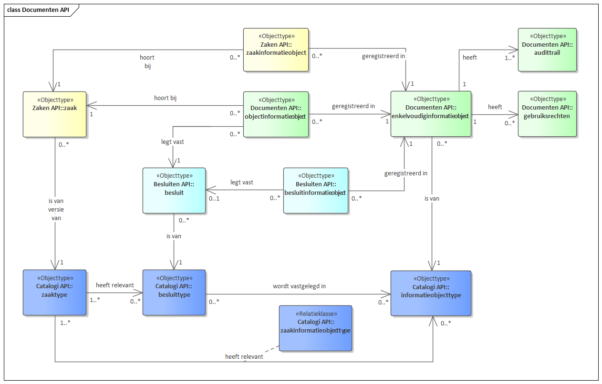

# Documenten API

API voor opslag en ontsluiting van documenten en daarbij behorende metadata.

De API ondersteunt het opslaan en naar andere applicaties ontsluiten van informatieobjecten (in de 'volksmond': documenten). De component slaat deze gestructureerd en voorzien van de benodigde metadata op en stelt applicaties in staat deze te wijzigen, te verwijderen en aan de hand van een aantal zoekcriteria op te vragen. Opslag vindt plaats conform het informatie-objecten-gedeelte van het RGBZ.

## Gegevensmodel

Een informatieobject is een generiekere term voor het veelgebruikte begrip document dat beperkter van reikwijdte is.

Een informatieobject kan van alles zijn, ongeacht aard en vorm: een tekstverwerkingsdocument, een papieren brief, een webpagina, een landkaart, een foto, een geluidsopname, een dataset, een blog, etc.

### Enkelvoudige en samengestelde informatieobjecten

Vooralsnog ondersteunt de Documenten API alleen enkelvoudige informatieobjecten. Een e-mail met drie bijlagen of een verzoek met bijbehorende CAD-tekening en Excel spreadsheet kan worden beschouwd als een samengesteld informatieobject. Mogelijk dat dit objecttype in de toekomst nog wordt toegevoegd aan deze API.

### Relatie met zaken en besluiten

Een informatieobject kan tot meer dan één zaak behoren en een zaak kan meer dan één informatieobjecten bevatten. De relatie tussen zaak en informatieobject is vastgelegd in zaakinformatieobject (Zaken API) en objectinformatieobject (Documenten API), waarbij zaakinformatieobject leidend is.

Een besluit kan vastgelegd zijn in een informatieobject. De relatie tussen besluit en informatieobject is vastgelegd in besluitinformatieobject (Besluiten API) en objectinformatieobject (Documenten API), waarbij besluitinformatieobject leidend is.

### Opslaan van bestanden
In versie 1.0.x van de API moet het bestand base64-encoded opgeslagen worden in het attribuut `inhoud`. De omvang mag 4GB groot zijn. Hou hierbij rekening met de overhead van base64, die, in worst-case scenario's, ongeveer 33% bedraagt . Dit betekent dat bij een limiet van 4GB het bestand maximaal ongeveer 3GB groot mag zijn.

Uploaden van bestanden

Binnen deze API bestaan een aantal endpoints die binaire data ontvangen, al dan niet base64-encoded. Webservers moeten op deze endpoints een minimale request body size van 4.0 GiB ondersteunen. Dit omvat de JSON van de metadata EN de base64-encoded bestandsdata. Hou hierbij rekening met de overhead van base64, die ongeveer 33% bedraagt in worst-case scenario's. Dit betekent dat bij een limiet van 4GB het bestand maximaal ongeveer 3GB groot mag zijn.

<span style="padding: 0.2em 0.5em; border: solid 1px #EEEEEE; border-radius: 3px; background: #DDDFFF;">
    <strong>Nieuw in versie 1.1.0</strong>
</span>

Bestanden kunnen groter zijn dan de hierboven genoemde 3GB. In dat geval is het mogelijk om het bestand in delen op te splitsen en in delen toe te voegen. Om dit te doen moet de consumer:

- Het INFORMATIEOBJECT aanmaken in de API, waarbij de totale bestandsgrootte meegestuurd wordt en de inhoud leeggelaten wordt. De API antwoordt met een lijst van BESTANDSDEELen, elk met een volgnummer en bestandsgrootte. De API lockt tegelijkertijd het INFORMATIEOBJECT.
- Het bestand opsplitsen: ieder BESTANDSDEEL moet de bestandsgrootte hebben zoals dit aangegeven werd in de response bij 1.
- Voor elk stuk van het bestand de binaire data naar de overeenkomstige BESTANDSDEEL-url gestuurd worden, samen met het lock ID.
- Het INFORMATIEOBJECT unlocken. De provider valideert op dat moment dat alle bestandsdelen correct opgestuurd werden, en voegt deze samen tot het resulterende bestand.
- Het bijwerken van een INFORMATIEOBJECT heeft een gelijkaardig verloop.

De 1.0.x manier van uploaden is ook beschikbaar voor kleine(re) bestanden die niet gesplitst hoeven te worden. Het is echter niet verplicht om deze manier te blijven gebruiken voor bestanden kleiner dan 3GB. Ook dan mag de hierboven beschreven manier met bestandsdelen gebruikt worden.

<span style="padding: 0.2em 0.5em; border: solid 1px #EEEEEE; border-radius: 3px; background: #DDDFFF;">
    <strong>Nieuw in versie 1.1.0</strong>
</span>
Afhankelijk van de omvang van het bestand wordt de inhoud van het informatieobject als volgt opgeslagen:
* omvang 0: het attribuut `inhoud` blijft leeg
* kleine omvang: in het attribuut `inhoud`.
* grote omvang: via aparte `bestandsdelen`

### Archief- en dossiervorming

Alle informatieobjecten van de zaak vormen het zaakarchief, de informatieobjecten en zaakkenmerken samen vormen het zaakdossier.

[](Documenten API.png "Documenten gegevensmodel - klik voor groot")

[](Documenten API 1.1.0.png "Documenten gegevensmodel - klik voor groot")

### Verzoekinformatieobjecten

<span style="padding: 0.2em 0.5em; border: solid 1px #EEEEEE; border-radius: 3px; background: #DDDFFF;">
    <strong>Nieuw in versie 1.1.0</strong>
</span>
Een verzoek kan onderbouwd worden met één of meer informatieobjecten. De relatie tussen verzoek en informatieobject is vastgelegd in verzoekinformatieobject (Verzoeken API) en objectinformatieobject (Documenten API), waarbij verzoekinformatieobject leidend is.

### Verzending

<span style="padding: 0.2em 0.5em; border: solid 1px #EEEEEE; border-radius: 3px; background: #DDDFFF;">
    <strong>Nieuw in versie 1.2.0</strong>
</span>
De relatie klasse Verzending legt vast aan welke Betrokkene een Informatieobject verzonden is of van welke Betrokkene een Informatieobject ontvangen is. Om altijd te kunnen achterhalen naar/van welk adres een Informatieobject verzonden of ontvangen is moet dit adres ook worden vastgelegd. Immers, wanneer alleen verwezen wordt naar het adres waarop iemand ingeschreven staat verandert dit gegeven wanneer deze persoon verhuist of de geregistreerde gegevens bijgewerkt worden. Door het adres vast te leggen in Verzending is altijd te achterhalen naar/van welk adres een Informatieobject verstuurd/ontvangen is. 

Een `Enkelvoudiginformatieobject` kan meer dan één maal verzonden worden maar een `Verzending` is altijd slechts naar één `adres`. De waarde van `aardrelatie` is dan `geadresseerde`. Onder een `adres` wordt verstaan één van onderstaande gegevens:

- binnenlandsCorrespondentieadres
- buitenlandsCorrespondentieadres
- correspondentiePostadres
- faxnummer
- emailadres
- mijnOverheid
- telefoonnummer

Het is dus **niet** mogelijk om in een `Verzending` bijvoorbeeld zowel een `emailadres` als `mijnOverheid` of een `correspondentiePostadres` aan te geven, dit zijn immers meerdere adressen. In dat geval dienen evenzovele `Verzendingen` aangemaakt te worden als er verschillende adressen gebruikt zijn. 

Een `Enkelvoudiginformatieobject` kan ook slechts van één adres ontvangen worden. De waarde van `aardrelatie` is dan `afzender`. Wanneer een Informatieobject ontvangen en geregistreerd wordt zal dit informatieobject als nieuw informatieobject geregistreerd worden. Daarom zal de relatie tussen een `Enkelvoudiginformatieobject` en een `Verzending` in geval van ontvangen (en er dus een afzender geregistreerd wordt) een 1 op 1 relatie zijn.

Het attribuut `richting` uit de relatieklasse ZaaktypeInformatieobjecttype en de attributen `ontvangstdatum` en `verzenddatum` uit Einkelvoudiginformatieobject zijn hiermee overbodig en deprecated geworden.


## Specificatie van de Documenten API

[Referentie-implementatie Documenten API](https://documenten-api.vng.cloud/)

### Releasenotes
De [releasenotes](./release_notes.md) van de versies staan beschreven op deze [pagina](./release_notes.md) 

### Releases

Versie   | Releasedatum | API specificatie
-------- | ------------- | ----------------
1.5.0†   | 14-03-2024    | [ReDoc][documenten-1.5.0-redoc], [Swagger][documenten-1.5.0-swagger]
1.4.3    | 27-10-2023    | [ReDoc][documenten-1.4.3-redoc], [Swagger][documenten-1.4.3-swagger]
1.4.2    | 26-09-2023    | [ReDoc][documenten-1.4.2-redoc], [Swagger][documenten-1.4.2-swagger]
1.3.2    | 26-09-2023    | [ReDoc][documenten-1.3.2-redoc], [Swagger][documenten-1.3.2-swagger]
1.2.5    | 26-09-2023    | [ReDoc][documenten-1.2.5-redoc], [Swagger][documenten-1.2.5-swagger]
1.4.1    | 29-08-2023    | [ReDoc][documenten-1.4.1-redoc], [Swagger][documenten-1.4.1-swagger]
1.3.1    | 29-08-2023    | [ReDoc][documenten-1.3.1-redoc], [Swagger][documenten-1.3.1-swagger]
1.2.4    | 29-08-2023    | [ReDoc][documenten-1.2.4-redoc], [Swagger][documenten-1.2.4-swagger]
1.4.0    | 22-08-2023    | [ReDoc][documenten-1.4.0-redoc], [Swagger][documenten-1.4.0-swagger]
1.3.0    | 29-03-2023    | [ReDoc][documenten-1.3.0-redoc], [Swagger][documenten-1.3.0-swagger], [Diff][documenten-1.3.0-diff]
1.2.0    | 19-12-2022    | [ReDoc][documenten-1.2.0-redoc], [Swagger][documenten-1.2.0-swagger], [Diff][documenten-1.2.0-diff]
1.1.0    | 24-05-2021    | [ReDoc][documenten-1.1.0-redoc], [Swagger][documenten-1.1.0-swagger], [YAML](documenten-1.1.0-YAML), [JSON](documenten-1.1.0-JSON), [Diff][documenten-1.1.0-diff]
1.0.1    | 2019-12-16    | [ReDoc][documenten-1.0.1-redoc], [Swagger][documenten-1.0.1-swagger], [YAML](documenten-1.0.1-YAML), [Diff][documenten-1.0.1-diff]
1.0.0    | 2019-11-18    | [ReDoc][documenten-1.0.0-redoc], [Swagger][documenten-1.0.0-swagger]

**†Let op: bij versie 1.5.0 is nog geen referentie-implementatie uitgebracht. Die volgt later in maart 2024.**

[documenten-1.5.0-redoc]: ./redoc-1.5.0
[documenten-1.5.0-swagger]: ./swagger-ui-1.5.0

[documenten-1.3.0-redoc]: redoc-1.3.0
[documenten-1.3.0-swagger]: swagger-ui-1.3.0
[documenten-1.3.0-diff]: https://github.com/VNG-Realisatie/documenten-api/compare/stable/1.2.x...stable/1.3.x

[documenten-1.4.0-redoc]: redoc-1.4.0
[documenten-1.4.0-swagger]: swagger-ui-1.4.0

[documenten-1.4.1-redoc]: redoc-1.4.1
[documenten-1.4.1-swagger]: swagger-ui-1.4.1
[documenten-1.3.1-redoc]: redoc-1.3.1
[documenten-1.3.1-swagger]: swagger-ui-1.3.1
[documenten-1.2.4-redoc]: redoc-1.2.4
[documenten-1.2.4-swagger]: swagger-ui-1.2.4

[documenten-1.4.3-redoc]: ./redoc-1.4.3
[documenten-1.4.3-swagger]: ./swagger-ui-1.4.3
[documenten-1.4.2-redoc]: ./redoc-1.4.2
[documenten-1.4.2-swagger]: ./swagger-ui-1.4.2
[documenten-1.3.2-redoc]: ./redoc-1.3.2
[documenten-1.3.2-swagger]: ./swagger-ui-1.3.2
[documenten-1.2.5-redoc]: ./redoc-1.2.5
[documenten-1.2.5-swagger]: ./swagger-ui-1.2.5

[documenten-1.0.1-redoc]: redoc-1.0.1
[documenten-1.0.1-swagger]: swagger-ui-1.0.1
[documenten-1.0.1-diff]: https://github.com/VNG-Realisatie/documenten-api/compare/1.0.0...1.0.1?diff=split#diff-3dc0f8f7373b32ea3bf5eabe02993f9a
[documenten-1.0.1-YAML](https://raw.githubusercontent.com/VNG-Realisatie/documenten-api/stable/1.0.x/src/openapi.yaml)

[documenten-1.0.0-redoc]: ./redoc-1.0.0
[documenten-1.0.0-swagger]: ./swagger-ui-1.0.0

[documenten-1.1.0-redoc]: redoc-1.1.0
[documenten-1.1.0-swagger]: swagger-ui-1.1.0
[documenten-1.1.0-diff]: https://github.com/VNG-Realisatie/documenten-api/compare/1.0.1...1.1.0?diff=split#diff-3dc0f8f7373b32ea3bf5eabe02993f9a
[documenten-1.1.0-YAML]: https://documenten-api.vng.cloud/api/v1/schema/openapi.yaml
[documenten-1.1.0-JSON]: https://documenten-api.vng.cloud/api/v1/schema/openapi.json

[documenten-1.2.0-redoc]: redoc-1.2.0
[documenten-1.2.0-swagger]: swagger-ui-1.2.0
[documenten-1.2.0-diff]: https://github.com/VNG-Realisatie/documenten-api/compare/1.1.0...1.2.0?diff=split#diff-3dc0f8f7373b32ea3bf5eabe02993f9a

## Specificatie van gedrag

Documenten APIsen (DRC) MOETEN aan twee aspecten voldoen:

* de DRC `openapi.yaml` MOET volledig geïmplementeerd zijn.

* het run-time gedrag beschreven in deze standaard MOET correct geïmplementeerd   zijn.

### OpenAPI specificatie

Alle operaties beschreven in [`openapi.yaml`](../../../api-specificatie/drc/current_version/openapi.yaml) MOETEN ondersteund worden en tot hetzelfde resultaat leiden als de referentie-implementatie van het DRC.

Het is NIET TOEGESTAAN om gebruik te maken van operaties die niet beschreven staan in deze OAS spec, of om uitbreidingen op operaties in welke vorm dan ook toe te voegen.

### Run-time gedrag

Bepaalde gedrageningen kunnen niet in een OAS spec uitgedrukt worden omdat ze businesslogica bevatten. Deze gedragingen zijn hieronder beschreven en MOETEN zoals beschreven geïmplementeerd worden.

<span style="padding: 0.2em 0.5em; border: solid 1px #EEEEEE; border-radius: 3px; background: #DDDFFF;">
    <strong>Gewijzigd in 1.3.0</strong>
</span>

#### **<a name="drc-001">Valideren `informatieobjecttype` op de `EnkelvoudigInformatieObject`-resource ([drc-001](#drc-001))</a>**

Bij het aanmaken (`enkelvoudiginformatieobject_create`) of bewerken (`enkelvoudiginformatieobject_update`, `enkelvoudiginformatieobject_partial_update`) MOET de URL-referentie naar het `informatieobjecttype` gevalideerd worden op het bestaan. Indien het ophalen van het informatieobjecttype niet (uiteindelijk) resulteert in een `HTTP 200` status code, MOET het DRC antwoorden met een `HTTP 400` foutbericht.

De provider MOET tevens valideren dat het opgehaalde informatieobjecttype een informatieobjecttype is conform de geldige Catalogi API specificatie.

<span style="padding: 0.2em 0.5em; border: solid 1px #EEEEEE; border-radius: 3px; background: #DDDFFF;">
    <strong>overgenomen uit de openapi.yaml</strong>
</span>

Daarnaast MOET de provider valideren dat het opgehaalde 'informatieobjecttype' 'concept = false' is. Indien het opgehaalde 'informatieobjecttype' niet 'concept = false' is MOET de DRC antwoorden met een `HTTP 400` foutbericht.

#### **<a name="drc-002">Valideren `object` op de `ObjectInformatieObject`-resource ([drc-002](#drc-002))</a>**

Bij het aanmaken (`objectinformatieobject_create`) MOET de URL-referentie naar het `object` gevalideerd worden op het bestaan. Indien het ophalen van het object niet (uiteindelijk) resulteert in een `HTTP 200` status code, MOET het DRC antwoorden met een `HTTP 400` foutbericht.

(TODO: valideren dat het van het type `object_type` is -> validatie aanscherpen)

#### **<a name="drc-003">Valideren uniciteit combinatie `object` en `informatieobject` op de `ObjectInformatieObject`-resource ([drc-003](#drc-003))</a>**

Er MOET gevalideerd worden dat de combinatie `object` en `informatieobject` niet eerder voorkomt. Indien deze al bestaat, dan MOET het DRC antwoorden met een `HTTP 400` foutbericht.

#### **<a name="drc-004">Valideren bestaan relatie tussen `object` en `informatieobject` in de bron ([drc-004](#drc-004))</a>**

Er MOET gevalideerd worden dat de relatie tussen het `object` en het `informatieobject` al bestaat in de bron van het `object`. De bron van het informatieobject is bekend door de eerdere validaties op deze URL. De API-spec van het bron register voorziet in query-parameters om het bestaan te kunnen valideren.

#### **<a name="drc-005">Statuswijzigingen van informatieobjecten ([drc-005](#drc-005))</a>**

Wanneer `InformatieObject.ontvangstdatum` een waarde heeft, dan zijn de waarden `in bewerking` en `ter vaststelling` voor `InformatieObject.status` NIET TOEGESTAAN. Indien een dergelijke status gezet is _voor_ de verzenddatum opgegeven wordt, dan moet de API een HTTP 400 foutbericht geven met `status` als veld in de `invalid-params`. De client MOET dan `ontvangstdatum` leeg laten of eerst de status wijzingen.

#### **<a name="drc-006">Gebruiksrechten op informatieobjecten ([drc-006](#drc-006))</a>**

Indien er geen gebruiksrechtenvoorwaarden van toepassing zijn op een informatieobject, dan moet `InformatieObject.indicatieGebruiksrechten` op de waarde `false` gezet worden. Indien de voorwaarden (nog) niet bekend zijn, dan moet de indicatie op `null` gezet worden.

Om de indicatie op `true` te zetten, MOET je de resource `Gebruiksrechten` aanmaken in de API. Providers MOETEN bij het aanmaken van gebruiksrechten voor een informatieobject de `indicatieGebruiksrechten` van dat informatieobject op `true` zetten.

Indien de laatste gebruiksrechten op een informatieobject verwijderd worden, dan MOET de indicatie weer op `null` gezet worden.

#### **<a name="drc-007">Vertrouwelijkheidaanduiding van een informatieobject ([drc-007](#drc-007))</a>**

Indien de client een `vertrouwelijkheidaanduiding` meegeeft bij het aanmaken of bewerken van een informatieobject, dan MOET de provider deze waarde toekennen. Indien de client deze niet expliciet toekent, dan MOET deze afgeleid worden uit `InformatieOject.InformatieObjectType.vertrouwelijkheidaanduiding`.

Een `InformatieOject` response van de provider MOET altijd een geldige waarde voor `vertrouwelijkheidaanduiding` bevatten. Een client MAG een waarde voor `vertrouwelijkheidaanduiding` meesturen.

#### Archiveren

**<a name="drc-008">Vernietigen van informatieobjecten ([drc-008](#drc-008))</a>**

Een `EnkelvoudigInformatieObject` MAG ALLEEN verwijderd worden indien er geen `ObjectInformatieObject`-en meer aan hangen. Indien er nog relaties zijn, dan MOET het DRC antwoorden met een `HTTP 400` foutbericht

Bij het verwijderen van een `EnkelvoudigInformatieObject` MOETEN het `EnkelvoudigInformatieObject` en gerelateerde objecten daadwerkelijk uit de opslag verwijderd worden. Zogenaamde "soft-deletes" zijn NIET TOEGESTAAN. Onder gerelateerde objecten wordt begrepen:
- `gebruiksrechten` - de gebruiksrechten die horen bij het `EnkelvoudigInformatieObject`.
- `audittrail` - de geschiedenis van het object.

#### **<a name="drc-009">Locken en unlocken van documenten ([drc-009](#drc-009))</a>**

Bij het bijwerken van `InformatieObject` (`enkelvoudiginformatieobject_update`, `enkelvoudiginformatieobject_partial_update`) MOET eerst een `lock` verkregen worden. De consumer voert de `enkelvoudiginformatieobject_lock` operatie uit, waarbij het DRC MOET antwoorden met een niet-te-raden `lockId`. Het DRC MOET vervolgens alle schrijf-operaties blokkeren tenzij het correcte `lockId` meegegeven is.

Het DRC MOET geforceerd unlocken toelaten door 'administrators'. Dit zijn applicaties die de scope `documenten.geforceerd-unlock` hebben. Deze consumers MOETEN het `lockId` weglaten indien ze geforceerd unlocken.

#### **<a name="drc-010">Bijwerken van documenten ([drc-010](#drc-010))</a>**
<span style="padding: 0.2em 0.5em; border: solid 1px #EEEEEE; border-radius: 3px; background: #DDDFFF;">
    <strong>overgenomen uit de openapi.yaml</strong>
</span>

Bij het werken wordt gevalideerd of:
- Een correcte lock waarde aanwezig is (zie ([drc-009](#drc-009))

<span style="padding: 0.2em 0.5em; border: solid 1px #EEEEEE; border-radius: 3px; background: #DDDFFF;">
    <strong>gewijzigd in 1.4.0</strong>
</span>

- ~~De status NIET definitief is~~

<span style="padding: 0.2em 0.5em; border: solid 1px #EEEEEE; border-radius: 3px; background: #DDDFFF;">
    <strong>gewijzigd in 1.3.0</strong>
</span>

- ~~Het informatieobjecttype niet gewijzigd wordt~~

Wanneer aan één of meer van deze voorwaarden niet wordt voldaan MOET het DRC antwoorden met een `HTTP 400` foutbericht. 

<span style="padding: 0.2em 0.5em; border: solid 1px #EEEEEE; border-radius: 3px; background: #DDDFFF;">
    <strong>toegevoegd in 1.4.0</strong>
</span>

#### **<a name="drc-011">Reikwijdte expand parameters ([drc-011](#drc-011))</a>**
Indien een verzoek één of meer expand parameters bevat MOET deze parameter alleen informatie uit de Documenten API of gerelateerde informatie uit de Catalogi API bevatten. Indien een expand parameter om informatie uit andere bronnen vraagt moet een foutmelding (http 406?) worden teruggegeven.

#### **<a name="drc-012">Diepte uitvoeren expand parameters ([drc-012](#drc-012))</a>**
Indien een verzoek één of meer expand parameters bevat MOET de expand niet dieper gaan dan maximaal 3 niveaus diep. Wanneer een consumer een diepere expand opgeeft MOET het antwoord maximaal de 3 niveaus diep gaan. Hiermee kan de volgende informatie in een response opgenomen worden:

```
Enkelvoudiginformatieobject
    ....
	informatieobjectype
        ...
		omschrijvingGeneriek
			informatieobjecttypeOmschrijvingGeneriek

```

#### **<a name="drc-013">Expand parameter onderdeel van opgevraagde resource ([drc-013](#drc-013))</a>**
Indien een verzoek één of meer expand parameters bevat MOET het attribuut onderdeel zijn van de opgevraagde resource. Indien een expand parameter geen geldig attribuut is van de opgevraagde resource moet een foutmelding (http 404) worden teruggegeven.

#### **<a name="drc-014">Gedrag bij fouten in expand parameters ([drc-014](#drc-014)</a>** 
Op een verzoek MOET een geldige response zoals deze opgevraagd is opleveren. Indien een verzoek één of meer expand parameters bevat MOET ook de te expanderen informatie opgehaald en teruggegeven kunnen worden. Indien geen geldige response kan worden teruggegeven moet een foutmelding (http 404) worden teruggegeven.


#### HTTP-Caching

<span style="padding: 0.2em 0.5em; border: solid 1px #EEEEEE; border-radius: 3px; background: #DDDFFF;">
    <strong>Nieuw in versie 1.1.0</strong>
</span>

De Documenten API moet HTTP-Caching ondersteunen op basis van de `ETag` header. In de API spec staat beschreven voor welke resources dit van toepassing is.

De `ETag` MOET worden berekend op de JSON-weergave van de resource. Verschillende, maar equivalente weergaves (bijvoorbeeld dezelfde API ontsloten wel/niet via NLX) MOETEN verschillende waarden voor de `ETag` hebben.

Indien de consumer een `HEAD` verzoek uitvooert op deze resources, dan MOET de provider antwoorden met dezelfde headers als bij een normale `GET`, dus inclusief de `ETag` header. Er MAG GEEN response body voorkomen.

Indien de consumer gebruik maakt van de `If-None-Match` header, met één of meerdere waarden voor de `ETag`, dan MOET de provider antwoorden met een `HTTP 304` bericht indien de huidige `ETag` waarde van de resource hierin voorkomt. Als de huidige `ETag` waarde hier niet in voorkomt, dan MOET de provider een normale `HTTP 200` response sturen.

## Overige documentatie

* [Referentiemodel Gemeentelijke Basisgegevens Zaken (RGBZ) 2.0](https://www.gemmaonline.nl/index.php/RGBZ_2.0_in_ontwikkeling)
