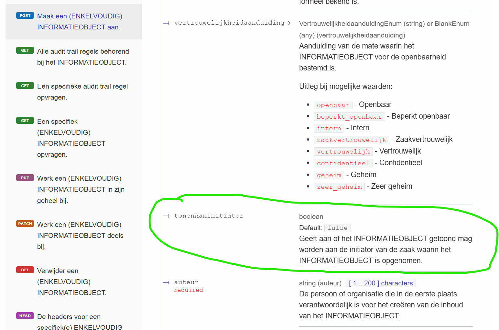

# Release Notes Documenten API

## Expand-mechanisme toegevoegd

In de vorige release van de ZGW API's was het expand-mechanisme alleen beschikbaar in de Zaken API. In de nieuwe release is dit mechanisme ook mogelijk gemaakt voor de hieronder genoemde andere API's in de ZGW-familie waaronder dus ook de Catalagi API.

- Documenten API

- Besluiten API

- Catalogi API

Net zoals bij de Zaken API is de expand gedefiniëerd op alle relevante endpoints en kan de expand tot willekeurige diepte worden uitgevoerd.

Gerelateerde issues:

- Ik wil graag dat de Expand overal wordt toegepast en niet alleen voor de ZRC #2507

- In de OAS van de Documenten API worden de geneste expands in het informatieobjecttype niet weergegeven. #2485

- DRC: is er nu wel of geen expand op objectinformatieobjecten? #2469

- ZRC 1.5/DRC 1.4 Expand op lijst documenten bij de zaak, [#2405](https://github.com/VNG-Realisatie/gemma-zaken/issues/2405)

- Documenten API: Als ontwikkelaar wil ik expand op ObjectInformatieObjecten [#2370](https://github.com/VNG-Realisatie/gemma-zaken/issues/2370)

## Veld voor bekendmaking aan initiatiefnemer toegevoegd

Gerelateerde issues:

- DRC: veld voor bekendmaking aan initiatiefnemer, [#2546](https://github.com/VNG-Realisatie/gemma-zaken/issues/2546)

## Trefwoorden toegevoegd aan PATCH-operatie

Trefwoorden zaten wel in de POST en PUT maar niet in de PATCH. Nu ook aan de PATCH toegevoegd (zie deze [commit](https://github.com/VNG-Realisatie/gemma-zaken/commit/fe9f85f039637a678986473df03a1e592c75e8aa)).

- DRC 1.5: PATCH op EIO heeft geen trefwoorden, [#2449](https://github.com/VNG-Realisatie/gemma-zaken/issues/2449)

## Verzenddatum niet meer verplicht bij uitgaande documenten

Bij uitgaande documenten is het niet meer verplicht om de verzenddatum op te geven, zie [commit](https://github.com/VNG-Realisatie/gemma-zaken/commit/943bad2199a4b942cd99fd8160c1a68f338e4dff).

Gerelateerde issues:

- DRC: Als zaakbehandelaar wil ik een uitgaand document opstellen met een geadresseerde, voordat ik de verzenddatum weet #2188