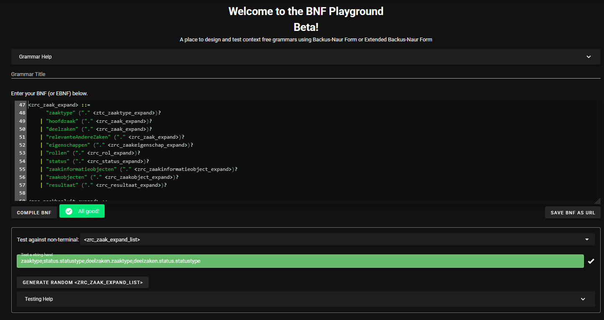

# Welke expand-paden zijn wel of niet toegestaan?

Een aantal versies geleden zijn de ZGW API's uitgebreid met het expand-mechanisme. Recentelijk is gebleken dat het niet voor iedereen duidelijk is welke expand-paden wel of niet zijn toegestaan. In principe zijn de paden af te leiden uit de respons-schema's van de OAS want daarin wordt gespecificeerd welke velden geëxpandeerd kunnen worden. Blijkbaar wordt daar niet in eerste instantie naar gekeken. Om het expand-mechanisme volledig duidelijk te krijgen gaan we in deze notitie de expand-paden direct specificeren bij de introductie van de query-parameter `expand` in het request schema van de call. Hierbij maken we gebruik van BNF, een bekend formalisme voor het beschrijven van context-vrije grammatica's. Op het web zijn diverse gratis tools te vinden om de BNF-grammatica's te valideren (bijvoorbeeld: https://bnfplayground.pauliankline.com/). 

We geven een voorbeeld ter illustratie. Hieronder een bevraging van de Zaken API waarin expand gebruikt.

`GET /zaken?expand=zaaktype,status.statustype,deelzaken.zaaktype,deelzaken.status.statustype`

In de onderstaande screenshot zien we dat de gebruikte expand-paden gevalideerd worden door de BNF-grammatica die we hebben gedefinieerd.

<!--  -->

<div style="text-align: center; padding-left: 20px; max-width: 100%;">
  
</div>


In de volgende sectie beschrijven we met BNF de expand-paden die zijn toegestaan in de huidige versies van de ZGW API's, de zogenaamde IST-situatie. Hierin hebben de expand-paden een maximale lengte van 3, met andere woorden: er kan niet dieper dan 3 niveau's geëxpandeerd worden. Bovendien is er geen (geneste) expand mogelijk binnen de objecten van de Catalogi API.

In de sectie daarna beschrijven we de gewenste situatie (SOLL). Hierin heeft de lengte van de expand-paden geen limiet, m.a.w. er kan tot de volledige diepte geëxpandeerd worden. Bovendien kan in de nieuwe situatie het expand-mechanisme direct worden toegepast op alle resources.  In de huidige situatie kunnen resources zoals `/rollen` of `/resultaten` alleen op indirecte wijze geëxpandeerd worden vanuit de `/zaken` resource. Straks kan het expand-mechsnisme ook direct worden toegepast op `/rollen` en `/resultaten`.

# De huidige situatie (IST)

De volledige bnf-grammatica van de exand paden die in deze sectie worden beschreven kan [hier](expand_ist.bnf) worden gedownload.

## Zaken API 

In de vigerende standaard van de ZGW API kunnen expands uitgevoerd worden op de volgende twee endpoints:

- `GET /zaken`
- `GET /zaken/{uuid}`

De expand-paden kunnen worden meegegeven door de query parameter `expand`. Bijvoorbeeld:

`GET /zaken?expand=zaaktype,status.statustype,deelzaken.zaaktype,deelzaken.status.statustype`

De syntax van de expand-parameter ziet er zo uit.

- `GET /zaken?expand=<zrc_zaak_expand_list>`
- `GET /zaken/{uuid}?expand=<zrc_zaak_expand_list>`

De lijst van expand-paden `<zrc_zaak_expand_list>` wordt gedefiniëerd door de onderstaande BNF-grammatica.

```ebnf
<zrc_zaak_expand_list> ::= 
      <zrc_zaak_expand> ("," <zrc_zaak_expand_list>)?

<zrc_zaak_expand> ::=
      <zrc_zaak_expand_diepte_1>
    | <zrc_zaak_expand_diepte_2>
    | <zrc_zaak_expand_diepte_3>

<zrc_zaak_expand_diepte_1> ::= 
      "zaaktype" 
    | "hoofdzaak" 
    | "deelzaken" 
    | "relevanteAndereZaken" 
    | "eigenschappen" 
    | "rollen" 
    | "status" 
    | "zaakinformatieobjecten" 
    | "zaakobjecten" 
    | "resultaat"

<zrc_zaak_expand_diepte_2> ::=
      "hoofdzaak." <zrc_zaak_expand_diepte_1> 
    | "deelzaken." <zrc_zaak_expand_diepte_1>
    | "relevanteAndereZaken." <zrc_zaak_expand_diepte_1>
    | "eigenschappen.eigenschap"
    | "rollen.roltype"
    | "rollen.statussen"
    | "status.statustype"
    | "status.gezetdoor"
    | "status.zaakinformatieobjecten"
    | "zaakinformatieobjecten.informatieobject"
    | "zaakinformatieobjecten.status"
    | "zaakobjecten.object"
    | "zaakobjecten.zaakobjecttype"
    | "resultaat.resultaattypen"

<zrc_zaak_expand_diepte_3> ::= 
      "hoofdzaak." <zrc_zaak_expand_diepte_2>
    | "deelzaken." <zrc_zaak_expand_diepte_2>
    | "relevanteAndereZaken." <zrc_zaak_expand_diepte_2>
    | "rollen.statussen.statustype"
    | "rollen.statussen.gezetdoor"
    | "rollen.statussen.zaakinformatieobjecten"
    | "status.gezetdoor.roltype"
    | "status.zaakinformatieobjecten.informatieobject"
    | "status.zaakinformatieobjecten.status"
    | "zaakinformatieobjecten.informatieobject.informatieobjecttype"
    | "zaakinformatieobjecten.status.statustype"
    | "zaakinformatieobjecten.status.gezetdoor"
    | "zaakinformatieobjecten.status.statustype"
    | "zaakinformatieobjecten.status.zaakinformatieobjecten"
```

## Expand-paden voor Documenten API

In de Documenten API kunnen de volgende expands worden uitgevoerd:

- `GET /enkelvoudiginformatieobjecten?expand=informatieobjecttype`
- `GET /enkelvoudiginformatieobjecten/{uuid}?expand=informatieobjecttype`
- `GET /gebruiksrechten?expand=informatieobject`
- `GET /gebruiksrechten/{uuid}?expand=informatieobject`  
- `GET /verzendingen?expand=informatieobject`  
- `GET /verzendingen/{uuid}?expand=informatieobject`  


Let op! In de OAS van Documenten API 1.4.3 zijn we vergeten een aantal expands op te nemen die er wel hadden moeten zijn:

- Op het endpoint `/objectinformatieobjecten` is ten onrechte nog geen expand gedefiniëerd. 
- Op de endpoints `/gebruiksrechten` en `/verzendingen` kun je niet genest expanden met het veld `informatieobjecttype`.

In de volgende versie van de OAS zouden minimaal de volgende expands aanwezig moeten zijn.

- `GET /enkelvoudiginformatieobjecten?expand=informatieobjecttype`
- `GET /enkelvoudiginformatieobjecten/{uuid}?expand=informatieobjecttype`
- `GET /objectinformatieobjecten?expand=<drc_informatieobject_expand>`  
- `GET /objectinformatieobjecten/{uuid}?expand=<drc_informatieobject_expand>`
- `GET /gebruiksrechten?expand=<drc_informatieobject_expand>`
- `GET /gebruiksrechten/{uuid}?expand=<drc_informatieobject_expand>`  
- `GET /verzendingen?expand=<drc_informatieobject_expand>`  
- `GET /verzendingen/{uuid}?expand=<drc_informatieobject_expand>`

```ebnf
<drc_informatieobject_expand> ::=
      "informatieobject" (".informatieobjecttype")?
```

## Expand-paden voor Besluiten API
In de huidige versie van de Besluiten API zijn geen expands gedefiniëerd, dit lijkt een ommissie te zijn. In de volgende versie zouden de volgende expands minimaal aanwezig horen te zijn:

- `GET /besluiten?expand=<brc_besluit_expand>`
- `GET /besluiten/{uuid}?expand=<brc_besluitinformatieobjecten_expand>`

```ebnf
<brc_besluit_expand> ::= 
      "besluittype"
    | "zaak"

<brc_besluitinformatieobjecten_expand> ::= 
      "informatieobject"
    | "besluit"
```

# De gewenste situatie (SOLL)

De volledige bnf-grammatica van de exand paden die in deze sectie worden beschreven kan [hier](expand_soll.bnf) worden gedownload.

## Zaken API

### Endpoints

| Endpoint                          |  Waarde `expand` query paramater              |
|----                               |---                                            |
| `/resultaten`                     |    `<zrc_resultaat_expand_list>`              |
| `/rollen`                         |    `<zrc_rol_expand_list>`                    |
| `/statusssen`                     |    `<zrc_status_expand_list>`                 |
| `/zaakinformatieobjecten`         |    `<zrc_zaakinformatieobject_expand_list>`   |
| `/zaakobjecten`                   |    `<zrc_zaakobject_expand_list>`             |
| `/zaken`                          |    `<zrc_zaak_expand_list>`                   |
| `/zaken/{uuid}/besluiten`         |    `<zrc_zaakbesluit_expand>`                 |
| `/zaken/{uuid}/zaakeigenschappen` |    `<zrc_zaakeigenschap_expand_list>`         |

### BNF-grammatica

```ebnf
<zrc_resultaat_expand_list> ::= 
      <zrc_resultaat_expand> ("," <zrc_resultaat_expand_list>)?

<zrc_rol_expand_list> ::= 
      <zrc_rol_expand> ("," <zrc_rol_expand_list>)?

<zrc_status_expand_list> ::= 
      <zrc_status_expand> ("," <zrc_status_expand_list>)?

<zrc_zaakinformatieobject_expand_list> ::= 
      <zrc_zaakinformatieobject_expand> ("," <zrc_zaakinformatieobject_expand_list>)?

<zrc_zaakobject_expand_list> ::= 
      <zrc_zaakobject_expand> ("," <zrc_zaakobject_expand_list>)?

<zrc_zaak_expand_list> ::= 
      <zrc_zaak_expand> ("," <zrc_zaak_expand_list>)?

<zrc_zaakeigenschap_expand_list> ::= 
      <zrc_zaakeigenschap_expand> ("," <zrc_zaakeigenschap_expand_list>)?

<zrc_resultaat_expand> ::=
      "zaak" ("." <zrc_zaak_expand>)?
    | "resultaattype" ("." <ztc_resultaattype_expand>)?

<zrc_rol_expand> ::=
      "zaak" ("." <zrc_zaak_expand>)?
    | "roltype" ("." <ztc_roltype_expand>)?
    | "statussen" ("." <zrc_status_expand>)?

<zrc_status_expand> ::=
      "zaak" ("." <zrc_zaak_expand>)?
    | "statustype" ("." <ztc_statustype_expand>)?
    | "gezetdoor" ("." <zrc_rol_expand>)?   
    | "zaakinformatieobjecten" ("." <zrc_zaakinformatieobject_expand>)?

<zrc_zaakinformatieobject_expand> ::=
      "informatieobject" ("." <drc_enkelvoudiginformatieobject_expand>)?
    | "zaak" ("." <zrc_zaak_expand>)?
    | "status" ("." <zrc_status_expand>)?

<zrc_zaakobject_expand> ::=
      "zaak" ("." <zrc_zaak_expand>)?
    | "object"
    | "zaakobjecttype" ("." <ztc_zaakobjecttype_expand>)?

<zrc_zaak_expand> ::= 
      "zaaktype" ("." <ztc_zaaktype_expand>)?
    | "hoofdzaak" ("." <zrc_zaak_expand>)?
    | "deelzaken" ("." <zrc_zaak_expand>)?
    | "relevanteAndereZaken" ("." <zrc_zaak_expand>)?
    | "eigenschappen" ("." <zrc_zaakeigenschap_expand>)?
    | "rollen" ("." <zrc_rol_expand>)?
    | "status" ("." <zrc_status_expand>)?
    | "zaakinformatieobjecten" ("." <zrc_zaakinformatieobject_expand>)?
    | "zaakobjecten" ("." <zrc_zaakobject_expand>)?
    | "resultaat" ("." <zrc_resultaat_expand>)?

<zrc_zaakbesluit_expand> ::=
      "besluit" ("." <brc_besluit_expand>)?   

<zrc_zaakeigenschap_expand> ::=
      "zaak" ("." <zrc_zaak_expand>)?
    | "eigenschap" ("." <ztc_eigenschap_expand>)?
```

## Catalogi API

| Endpoint                          |  Waarde `expand` query paramater                          |
|----                               |---                                                        |
| `/besluittypen`                   |    `<ztc_besluittype_expand_list>`                        |
| `/catalogussen`                   |    `<ztc_catalogus_expand_list>`                          |
| `/eigenschappen`                  |    `<ztc_eigenschap_expand_list>`                         |
| `/informatieobjecttypen`          |    `<ztc_informatieobjecttype_expand_list>`               |
| `/resultaattypen`                 |    `<ztc_resultaattype_expand_list>`                      |
| `/roltypen`                       |    `<ztc_roltype_expand_list>`                            |
| `/statustypen`                    |    `<ztc_statustype_expand>`                              |
| `/zaakobjecttypen`                |    `<ztc_zaakobjecttype_expand_list>`                     |
| `/zaaktype-informatieobjecttypen` |    `<ztc_zaaktype_informatieobjecttype_expand_list>`      |
| `/zaaktypen`                      |    `<ztc_zaaktype_expand_list>`                           |


```ebnf
<ztc_besluittype_expand_list> ::= 
      <ztc_besluittype_expand> ("," <ztc_besluittype_expand_list>)?

<ztc_catalogus_expand_list> ::= 
      <ztc_catalogus_expand> ("," <ztc_catalogus_expand_list>)?

<ztc_eigenschap_expand_list> ::= 
      <ztc_eigenschap_expand> ("," <ztc_eigenschap_expand_list>)?

<ztc_informatieobjecttype_expand_list> ::= 
      <ztc_informatieobjecttype_expand> ("," <ztc_informatieobjecttype_expand_list>)?

<ztc_resultaattype_expand_list> ::= 
      <ztc_resultaattype_expand> ("," <ztc_resultaattype_expand_list>)?

<ztc_roltype_expand_list> ::= 
      <ztc_roltype_expand> ("," <ztc_roltype_expand_list>)?

<ztc_statustype_expand_list> ::= 
      <ztc_statustype_expand> ("," <ztc_statustype_expand_list>)?

<ztc_zaakobjecttype_expand_list> ::= 
      <ztc_zaakobjecttype_expand> ("," <ztc_zaakobjecttype_expand_list>)?

<ztc_zaaktype_informatieobjecttype_expand_list> ::= 
      <ztc_zaaktype_informatieobjecttype_expand> ("," <ztc_zaaktype_informatieobjecttype_expand_list>)?

<ztc_zaaktype_expand_list> ::= 
      <ztc_zaaktype_expand> ("," <ztc_zaaktype_expand_list>)

<ztc_besluittype_expand> ::=
      "catalogus" ("." <ztc_catalogus_expand>)?
    | "zaaktypen" ("." <ztc_zaaktype_expand>)?
    | "informatieobjecttypen" ("." <ztc_informatieobjecttype_expand>)?
    | "resultaattypen" ("." <ztc_resultaattype_expand>)?

<ztc_catalogus_expand> ::=
      "zaaktypen" ("." <ztc_zaaktype_expand>)?
    | "besluittypen" ("." <ztc_besluittype_expand>)?
    | "informatieobjecttypen" ("." <ztc_informatieobjecttype_expand>)?

<ztc_eigenschap_expand> ::=
      "catalogus" ("." <ztc_catalogus_expand>)?
    | "zaaktype" ("." <ztc_zaaktype_expand>)?
    | "statustype" ("." <ztc_statustype_expand>)?

<ztc_informatieobjecttype_expand> ::=
      "catalogus" ("." <ztc_catalogus_expand>)?
    | "zaaktypen" ("." <ztc_zaaktype_expand>)?
    | "besluittypen" ("." <ztc_besluittype_expand>)?

<ztc_resultaattype_expand> ::=
      "zaaktype" ("." <ztc_zaaktype_expand>)?
    | "resultaattypeomschrijving"
    | "selectielijstklasse"
    | "catalogus" ("." <ztc_catalogus_expand>)?
    | "besluittypen" ("." <ztc_besluittype_expand>)?
    | "informatieobjecttypen" ("." <ztc_informatieobjecttype_expand>)?

<ztc_roltype_expand> ::=
      "zaaktype" ("." <ztc_zaaktype_expand>)?
    | "catalogus" ("." <ztc_catalogus_expand>)?

<ztc_statustype_expand> ::=
      "zaaktype" ("." <ztc_zaaktype_expand>)?
    | "catalogus" ("." <ztc_catalogus_expand>)?
    | "informatieobjecttypen" ("." <ztc_informatieobjecttype_expand>)?


<ztc_zaakobjecttype_expand> ::=
      "objecttype"
    | "zaaktype" ("." <ztc_zaaktype_expand>)?
    | "resultaattypen" ("." <ztc_resultaattype_expand>)?
    | "statustypen" ("." <ztc_statustype_expand>)?
    | "catalogus" ("." <ztc_catalogus_expand>)?

<ztc_zaaktype_informatieobjecttype_expand> ::=
      "zaaktype" ("." <ztc_zaaktype_expand>)?
    | "catalogus" ("." <ztc_catalogus_expand>)?
    | "informatieobjecttype" ("." <ztc_informatieobjecttype_expand>)?
    | "statustype" ("." <ztc_statustype_expand>)?

<ztc_zaaktype_expand> ::=
      "zaakobjecttypen" ("." <ztc_zaakobjecttype_expand>)? 
    | "catalogus" ("." <ztc_catalogus_expand>)?
    | "statustypen" ("." <ztc_statustype_expand>)?
    | "resultaattypen" ("." <ztc_resultaattype_expand>)?
    | "eigenschappen" ("." <ztc_eigenschap_expand>)?
    | "informatieobjecttypen" ("." <ztc_informatieobjecttype_expand>)?
    | "roltypen" ("." <ztc_roltype_expand>)?
    | "besluittypen" ("." <ztc_besluittype_expand>)?
    | "deelzaaktypen" ("." <ztc_zaaktype_expand>)?
    | "gerelateerdeZaaktypen" ("." <ztc_zaaktype_expand>)?
```

# Documenten API

| Endpoint                          |  Waarde `expand` query paramater                          |
|-----------------------------------|-----------------------------------------------------------|      
| `/enkelvoudiginformatieobjecten`  |    `<drc_enkelvoudiginformatieobject_expand_list>`        |
| `/gebruiksrechten`                |    `<drc_gebruiksrecht_expand>`                           |
| `/objectinformatieobjecten`       |    `<drc_objectinformatieobjecten_expand_list>`           |
| `/verzendingen`                   |    `<drc_verzendingen_expand_list>`                       |


```ebnf
<drc_enkelvoudiginformatieobject_expand_list> ::= 
      <drc_enkelvoudiginformatieobject_expand> ("," <drc_enkelvoudiginformatieobject_expand_list>)

<drc_gebruiksrecht_expand_list> ::= 
      <drc_gebruiksrecht_expand> ("," <drc_gebruiksrecht_expand_list>)

<drc_objectinformatieobject_expand_list> ::= 
      <drc_objectinformatieobject_expand> ("," <drc_objectinformatieobject_expand_list>)

<drc_verzending_expand_list> ::= 
      <drc_verzending_expand> ("," <drc_verzending_expand_list>)

<drc_enkelvoudiginformatieobject_expand> ::=
      "link"
    | "informatieobjecttype" ("." <ztc_informatieobjecttype_expand>)?
    | "bestanddelen"

<drc_gebruiksrecht_expand> ::=
    "informatieobject" ("." <drc_enkelvoudiginformatieobject_expand>)?

<drc_objectinformatieobject_expand> ::=
      "informatieobject" ("." <drc_enkelvoudiginformatieobject_expand>)?
    | "object" ( "." ( <zrc_zaak_expand> | <brc_besluit_expand> ) )?

<drc_verzending_expand> ::=
      "betrokkene" ("." <zrc_rol_expand>)?
    | "informatieobject" ("." <drc_enkelvoudiginformatieobject_expand>)?
    | "contactPersoon" ("." <zrc_rol_expand>)?
```

# Besluiten API

| Endpoint                          |  Waarde `expand` query paramater                          |
|-----------------------------------|-----------------------------------------------------------|      
| `/besluiten`                      |    `<brc_besluit_expand_list>`                            |
| `/besluitinformatieobjecten`      |    `<brc_besluitinformatieobject_expand_list>`            |


```ebnf
<brc_besluit_expand_list> ::= 
      <brc_besluit_expand> ("," <brc_besluit_expand_list>)?

<brc_besluitinformatieobject_expand_list> ::= 
      <brc_besluitinformatieobject_expand> ("," <brc_besluitinformatieobject_expand_list>)?

<brc_besluit_expand> ::= 
      "besluittype" ("." <ztc_besluittype_expand>)?
    | "zaak" ("." <zrc_zaak_expand>)?

<brc_besluitinformatieobject_expand> ::= 
      "informatieobject" ("." <drc_enkelvoudiginformatieobject_expand>)?
    | "besluit" ("." <brc_besluit_expand>)?
```

<!--
Opmerkingen:

```ebnf
<zaakobject> ::=
      "zaak" ("." <zaak>)?
    | "object" (* externe expand, nu nog niet in standaard? *)
    | "zaakobjecttype" ("." <zaakobjecttype>)?

<resultaat> ::=
      "zaak" ("." <zaak>)?
    | "object" (* externe expand *)
    | "resultaattype" ("." <resultaattype>)?

<zaakobjecttype> ::=
      "objecttype" (* externe expand, nu nog niet in scope*)
    | "zaaktype" ("." <zaaktype>)?
    | "resultaattypen" ("." <resultaattype>)?
    | "statustypen" ("." <statustype>)?
    | "catalogus" ("." <catalogus>)?

<zaakinformatieobject> ::=
      "informatieobject" ("." <enkelvoudiginformatieobject>)? (* Nu nog niet in scope, maar waarom? Staat niet in Excel en ook niet in OAS*)
    | "zaak" ("." <zaak>)?
    | "status" ("." <status>)?

<resultaattype> ::=
      "zaaktype" ("." <zaaktype>)?
    | "resultaattypeomschrijving" (* externe expand naar referentielijst, nu nog niet in scope *)
    | "selectielijstklasse" (* externe expand naar referentielijst, nu nog niet in scope *)
    | "catalogus" ("." <catalogus>)?
    | "besluittypen" ("." <besluittype>)?
    | "informatieobjecttypen" ("." <informatieobjecttype>)?

```

-->

<!--

# To do

- https://bnfparser.firebaseapp.com/ voor speciale BNF syntax en sandbox
- https://bnfplayground.pauliankline.com/
- Genereer een plaatje van de grammatica
- zou gaaf zijn als de bnf klikbaar is zodat je van de ene non-terminal naar de andere kunt springen. Misschien is het gegenereerde plaatje klikbaar?
- Productie-regels bnf opdelen per api, misschien ook naamgeving aanpassen, bijv <ztc_eigenschappen>, <zrc_zaak>
- Genereer een Python programma die alle onnodige recursiepaden signaleert, 
  - bijv. `catalogus.zaaktypen.catalogus`. 
  - Wat is het langste zinvolle pad zonder recursie. (bijv. `zaakinformatieobjecten.zaak.resultaat.resultaattype.informatieobjecttypen.zaaktypen.catalogus.zaaktypen.catalogus`)
  - Kun je een editor maken met intellisense voor de paden: na het intikken van de punt krijg je een lijstje met mogelijke geneste expands.
  - alle paden genereert zonder recursie
  - verdiepingssessie expand
- Comments moeten geannoteerd worden buiten de tekst
- Gebruik yacc en Python om zelf een parser te genereren met comments.
- Maar daar een API van en een ook een docker.
- In het voorbeeld met diepte 3 grammatica moet de "." losgetrokken worden
- Geef extra niet-context-vrije regels:
      - expand=zaaktype,zaaktype,status,status.statustype bevat allerlei overtolligheden etc.
      - De lijst mag niet langer zijn dan alle expand mogelijkheden
      - In de paden kunnen we een limiet stellen hoe vaak dezelfde stap herhaalt mag worden.

-->


