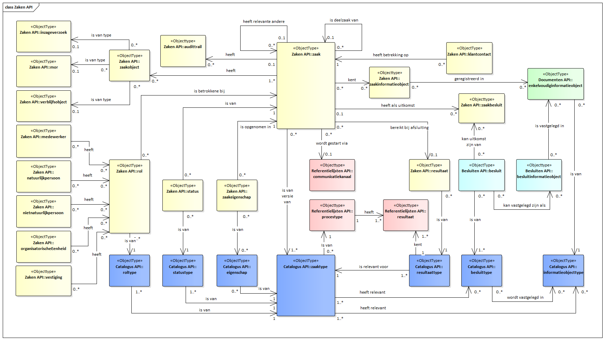
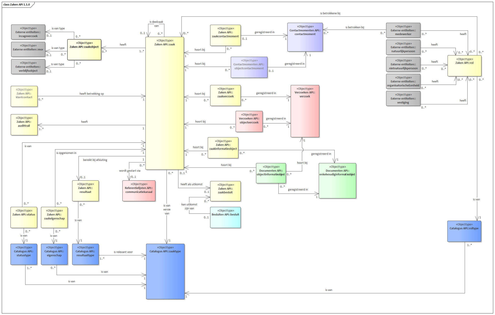

# Zaken API

API voor het opslaan en ontsluiten van zaakgegevens.

De API ondersteunt het opslaan en het naar andere applicaties ontsluiten van gegevens over alle gemeentelijke zaken, van elk type. Opslag vindt plaats conform het RGBZ waarin objecten, gegevens daarvan en onderlinge relaties zijn beschreven. Het bevat echter niet alle gegevens uit het RGBZ: documenten worden bijv. opgeslagen in de Documenten API, besluiten in de Besluiten API, etc. Vanuit zaken worden er dan ook relaties gelegd naar andere resources.

## Gegevensmodel

De zaak vormt de kern van het zaakgericht werken. De omvang en afbakening worden bepaald door het traject van (aan)vraag tot (passend) antwoord. Een zaak komt daarmee overeen met een bedrijfsproces.

### Hoofd- en deel-zaken

Als een product of dienst via verschillende bedrijfsprocessen tot stand komt, wordt gewerkt met deelzaken. De hoofdzaak coördineert dat alle deelzaken samen leiden tot het (passende) antwoord op de (aan)vraag van de initiator.

### Relevante andere zaken

Soms heeft de ene zaak betrekking op een andere zaak, zoals een bezwaarzaak die volgt op een vergunningzaak.

Aan elkaar gerelateerde zaken (met elk hun eigen bedrijfsproces/aanleiding) worden vastgelegd als AndereRelevanteZaak. Dit zijn zowel zaken binnen dezelfde organisatie als van verschillende organisaties.

### Zaakobject

Elke zaak heeft ergens betrekking op wat is vastgelegd met de relatie naar zaakobject.  De, bij de ontwikkeling van de API's gebruikte, zaakobjecten (mor,  verblijfsobject, ...) kunnen als resource of m.b.v. identificerende gegevens worden opgenomen bij het zaakobject. Aangezien nog niet kan worden aangenomen dat deze vanuit de bron beschikbaar zijn.

### Betrokken en rollen

Ook heeft elke zaak één of meer betrokkenen, die via hun rol aan de zaak gerelateerd zijn.
De verschillende typen betrokkenen (medewerker, natuurlijk persoon, niet natuurlijk persoon en organisatieonderdeel), zijn nu opgenomen in de ZakenAPI. Aangezien nog niet kan worden aangenomen dat deze vanuit de bron beschikbaar zijn.

### Relatie met besluiten en documenten

Een besluit kan een uitkomst zijn van een zaak van de zaakbehandelende organisatie. Besluit heeft dan ook een optionele relatie met de zaak waarvan het een uitkomst is. Deze relatie wordt in de Zaken API vastgelegd in zaakbesluit.
Een informatieobject kan tot meer dan één zaak behoren en een zaak kan meer dan één informatieobjecten bevatten. De relatie tussen zaak en informatieobject is vastgelegd in zaakinformatieobject (Zaken API) en objectinformatieobject (Documenten API), waarbij zaakinformatieobject leidend is.

### Zaakdossier

Een zaak, met eventuele deelzaken dan wel de verwijzing naar de hoofdzaak, alle kenmerken, alle daaraan gerelateerde Informatieobjecten en alle andere gerelateerde gegevens (via rol, zaakobject, etc.) vormen gezamenlijk het zaakdossier.

## Specificatie van de Zaken API

### Release Notes
De [release notes](./release_notes.md) van de versies staan beschreven op deze [pagina](./release_notes.md).

### Known Issues
De [known issues](./known_issues.md) van de versies staan beschreven op deze [pagina](./known_issues.md).

### Releases

[Referentie-implementatie Zaken API](https://zaken-api.vng.cloud/)

<!-- *In release Zaken API 1.5.0 is het expand mechanisme toegevoegd aan de standaard. Om redenen zoals omschreven in [deze pagina](../expand_patroon) is daarom Zaken API versie 1.2.1 komen te vervallen.* -->

| Versie    | Release datum | API specificatie | Specificatie van gedrag |
|-----------|---------------|------------------|--------------------------|
| <a name="version-1.7.0">1.7.0</a>   | Concept    | [ReDoc][zaken-1.7.0-redoc] | |
| <a name="version-1.6.0">1.6.0</a>   | 20-03-2026    | [ReDoc][zaken-1.6.0-redoc] | [spec 1.6.0](./zrc/1.6.x/1.6.0/specification.md)|
| <a name="version-1.5.1">1.5.1</a>   | 26-09-2023    | [ReDoc][zaken-1.5.1-redoc], [Swagger][zaken-1.5.1-swagger] | [spec 1.5.1](#specificatie-van-gedrag) |
| 1.4.1     | 26-09-2023    | [ReDoc][zaken-1.4.1-redoc], [Swagger][zaken-1.4.1-swagger] | [spec 1.4.1](#specificatie-van-gedrag) |
| 1.3.1     | 26-09-2022    | [ReDoc][zaken-1.3.1-redoc], [Swagger][zaken-1.3.1-swagger] | [spec 1.3.1](#specificatie-van-gedrag) |
| 1.5.0     | 22-08-2023    | [ReDoc][zaken-1.5.0-redoc], [Swagger][zaken-1.5.0-swagger], [YAML][zaken-1.5.0-yaml] | [spec 1.5.0](#specificatie-van-gedrag) |
| 1.4.0     | 21-03-2023    | [ReDoc][zaken-1.4.0-redoc], [Swagger][zaken-1.4.0-swagger], [YAML][zaken-1.4.0-yaml] | [spec 1.4.0](#specificatie-van-gedrag) |
| ~~1.2.1~~ | ~~21-12-2022~~ | VERVALLEN ~~[ReDoc][zaken-1.2.1-redoc], [Swagger][zaken-1.2.1-swagger]~~ |  |
| 1.3.0     | 19-12-2022    | [ReDoc][zaken-1.3.0-redoc], [Swagger][zaken-1.3.0-swagger], [Diff][zaken-1.3.0-diff] | [spec 1.3.0](#specificatie-van-gedrag) |
| 1.2.0     | 2021-08-31    | [ReDoc][zaken-1.2.0-redoc], [Swagger][zaken-1.2.0-swagger], [Diff][zaken-1.2.0-diff] | [spec 1.2.0](#specificatie-van-gedrag) |
| 1.1.0     | 24-05-2021    | [ReDoc][zaken-1.1.0-redoc], [Swagger][zaken-1.1.0-swagger], [Diff][zaken-1.1.0-diff] | [spec 1.1.0](#specificatie-van-gedrag) |
| 1.0.2     | 2020-06-12    | [ReDoc][zaken-1.0.2-redoc], [Swagger][zaken-1.0.2-swagger], [Diff][zaken-1.0.2-diff] | [spec 1.0.2](#specificatie-van-gedrag) |
| 1.0.1     | 2019-12-16    | [ReDoc][zaken-1.0.1-redoc], [Swagger][zaken-1.0.1-swagger], [Diff][zaken-1.0.1-diff] | [spec 1.0.1](#specificatie-van-gedrag)|
| 1.0.0     | 2019-11-18    | [ReDoc][zaken-1.0.0-redoc], [Swagger][zaken-1.0.0-swagger] | [spec 1.0.0](#specificatie-van-gedrag) |

[zaken-1.7.0-redoc]: redoc-1.7.0

[zaken-1.6.0-redoc]: redoc-1.6.0

[zaken-1.5.1-redoc]: redoc-1.5.1
[zaken-1.5.1-swagger]: swagger-ui-1.5.1
[zaken-1.4.1-redoc]: redoc-1.4.1
[zaken-1.4.1-swagger]: swagger-ui-1.4.1
[zaken-1.3.1-redoc]: redoc-1.3.1
[zaken-1.3.1-swagger]: swagger-ui-1.3.1

[zaken-1.0.2-redoc]: redoc-1.0.2
[zaken-1.0.2-swagger]: swagger-ui-1.0.2
[zaken-1.0.2-diff]: https://github.com/VNG-Realisatie/zaken-api/compare/1.0.1...1.0.2?diff=split#diff-3dc0f8f7373b32ea3bf5eabe02993f9a

[zaken-1.0.1-redoc]: redoc-1.0.1
[zaken-1.0.1-swagger]: swagger-ui-1.0.1
[zaken-1.0.1-diff]: https://github.com/VNG-Realisatie/zaken-api/compare/1.0.0...1.0.1?diff=split#diff-3dc0f8f7373b32ea3bf5eabe02993f9a

[zaken-1.0.0-redoc]: redoc-1.0.0
[zaken-1.0.0-swagger]: swagger-ui-1.0.0

[zaken-1.2.0-redoc]: redoc-1.2.0
[zaken-1.2.0-swagger]: swagger-ui-1.2.0
[zaken-1.2.0-diff]: https://github.com/VNG-Realisatie/zaken-api/compare/1.1.0...1.2.0?diff=split#diff-3dc0f8f7373b32ea3bf5eabe02993f9a

[zaken-1.2.1-redoc]: redoc-1.2.1
[zaken-1.2.1-swagger]: swagger-ui-1.2.1

[zaken-1.3.0-redoc]: redoc-1.3.0
[zaken-1.3.0-swagger]: swagger-ui-1.3.0
[zaken-1.3.0-diff]: https://github.com/VNG-Realisatie/zaken-api/compare/1.2.0...1.3.0?diff=split#diff-3dc0f8f7373b32ea3bf5eabe02993f9a

[zaken-1.1.0-redoc]: redoc-1.1.0
[zaken-1.1.0-swagger]: swagger-ui-1.1.0
[zaken-1.1.0-diff]: https://github.com/VNG-Realisatie/zaken-api/compare/1.0.2...1.1.0?diff=split#diff-3dc0f8f7373b32ea3bf5eabe02993f9a

[zaken-1.4.0-redoc]: redoc-1.4.0
[zaken-1.4.0-swagger]: swagger-ui-1.4.0
[zaken-1.4.0-yaml]: https://github.com/VNG-Realisatie/zaken-api/blob/stable/1.4.x/src/openapi.yaml

[zaken-1.5.0-redoc]: redoc-1.5.0
[zaken-1.5.0-swagger]: swagger-ui-1.5.0
[zaken-1.5.0-yaml]: https://github.com/VNG-Realisatie/zaken-api/blob/stable/1.5.x/src/openapi.yaml

## Overige documentatie

* [Referentiemodel Gemeentelijke Basisgegevens Zaken (RGBZ) 2.0](https://www.gemmaonline.nl/index.php/RGBZ_2.0_in_ontwikkeling)
* [Tutorial Archiveren](/ontwikkelaars/handleidingen-en-tutorials/archiveren)
