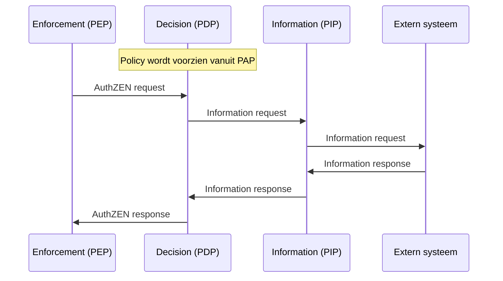

# Tutorial Intro

Dit is hallo vanuit de API's.

```mermaid
   graph TD;
        A-->B;
        A-->C;
        B-->D;
        C-->D;

```

:::info

Een diagram met dingen

```mermaid
sequenceDiagram
    participant PEP as Enforcement (PEP)
    participant PDP as Decision (PDP)
    participant PIP as Information (PIP)
    participant Extern systeem

    note over PDP: Policy wordt voorzien vanuit PAP

    PEP->>PDP: AuthZEN request
    PDP->>PIP: Information request
    PIP->>Extern systeem: Information request
    Extern systeem->>PIP: Information response
    PIP->>PDP: Information response
    PDP->>PEP: AuthZEN response
```

:::
