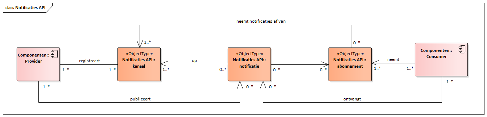

# Notificaties API voor consumers

Deze API maakt het mogelijk notificaties te ontvangen waarop de consumer is geabonneerd.

## Gegevensmodel

## Specificatie van de Notificaties API

* API specificatie (OAS3) in
  [ReDoc][notificaties-1.0.0-rc1-redoc],
  [Swagger][notificaties-1.0.0-rc1-swagger] of
  [YAML](../../../api-specificatie/nrc/consumer-api/openapi.yaml)

[notificaties-1.0.0-rc1-redoc]: redoc-1.0.0-rc1
[notificaties-1.0.0-rc1-swagger]: swagger-ui-1.0.0-rc1

## Specificatie van gedrag

Buiten de OAS-specificatie zijn er geen aanvullende eisen waaraan de consumer moet voldoen.
