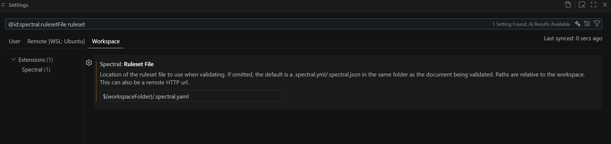

# Readme

Voorbeeld hoe je spectral aanroept in de cli:

```bash
spectral lint docs/standaard/zaken/zrc/1.7.x/1.7.0/openapi.yaml
```

Bevindingen:

- Er zit een bug in de linter van Spectral-extensie in vscode waardoor er toch nog interne meldingen doorsijpelen.
- Aanroepen van spectral met `npx` gaat niet goed. Je moet het echt lokaal installeren met `npm`. Anders werkt de or-functie niet.
- Je moet de [ ..., off] truuk uitvoeren in de `.spectral.yaml` configuratie file om interne meldingen te onderdrukken. In de linter van de extensie worden helaas nog niet alle interne meldingen onderdrukt.
- Deze setting is belangrijk om de linter van vscode werkend te krijgen (`${workspaceFolder}/.spectral.yaml`):

